# ZenUML

## Contents
- Participants and Annotators
- Aliases
- Messages (Sync, Async, Creation, Reply)
- Nesting
- Loops, Alt, Opt, Parallel
- Try/Catch/Finally

## Overview

ZenUML is an alternative sequence diagram syntax with a more programmatic feel. Uses different syntax from Mermaid's native sequence diagrams.

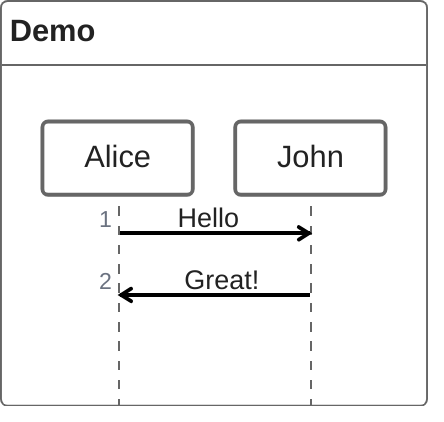

## Participants

### Implicit Declaration

Participants are created on first mention in messages.

### Explicit Declaration

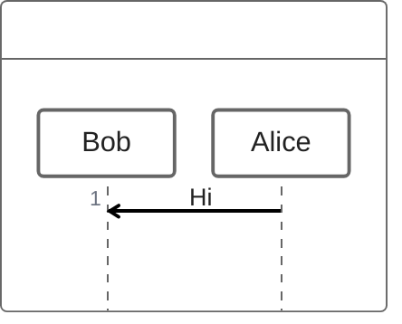

Order of declaration controls rendering order.

### Annotators

| Annotator | Symbol |
|---|---|
| `@Actor` | Stick figure |
| `@Database` | Database cylinder |
| `@Boundary` | Boundary symbol |
| `@Control` | Control symbol |
| `@Entity` | Entity symbol |
| `@Queue` | Queue symbol |
| `@Collections` | Collections symbol |

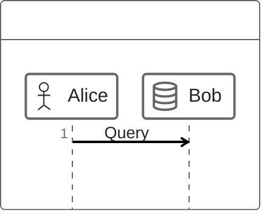

### Aliases

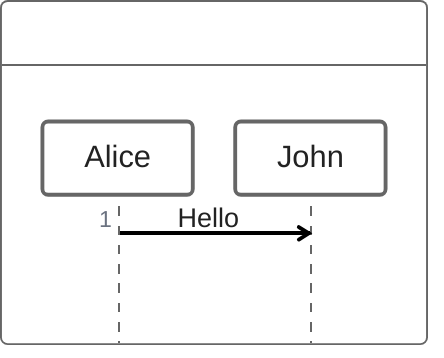

## Messages

### Sync Message (blocking)

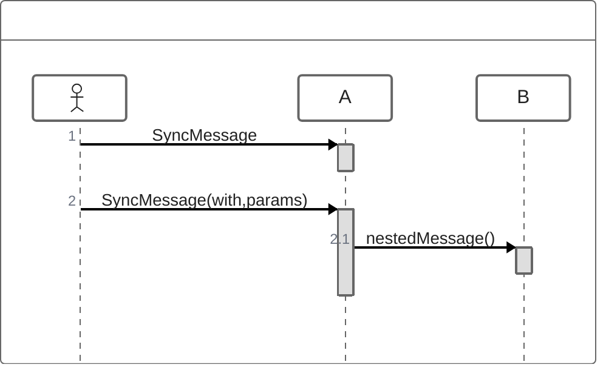

### Async Message

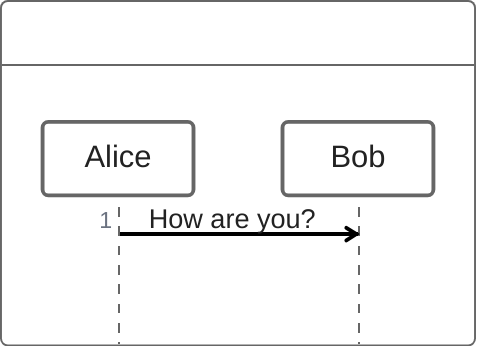

### Creation Message

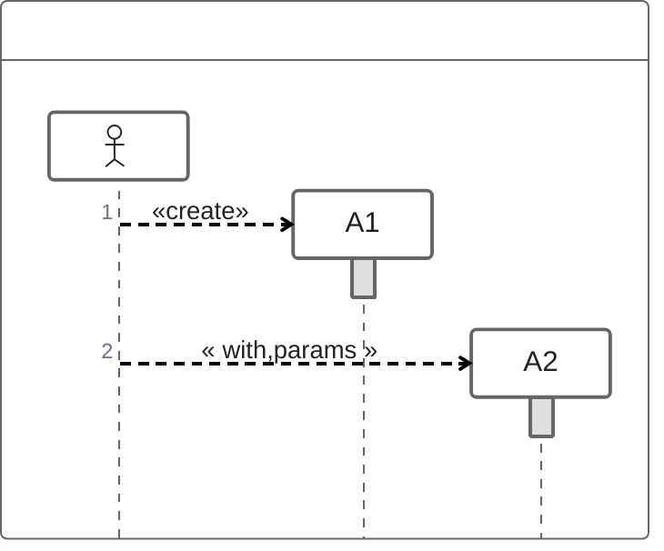

### Reply Message

Three ways to express replies:

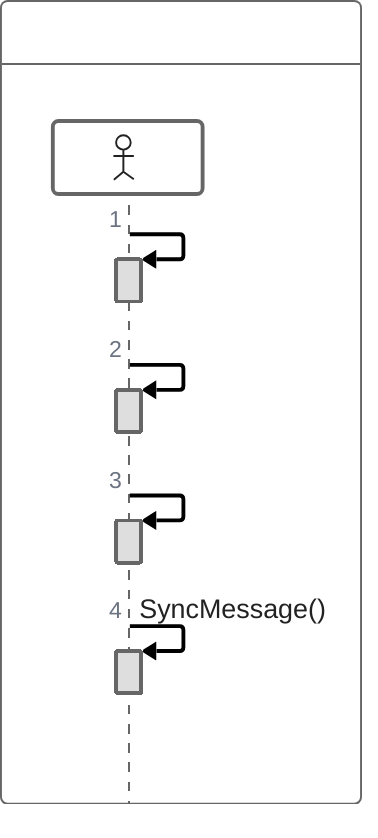

## Nesting

Use `{ }` blocks for nested calls:

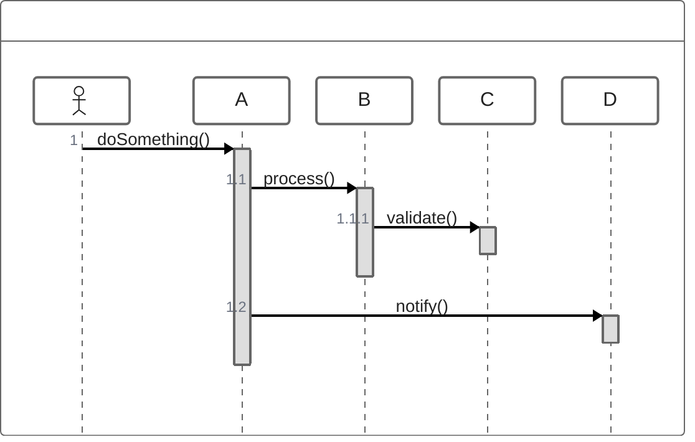

## Loops, Alt, Opt, Parallel

### Loop

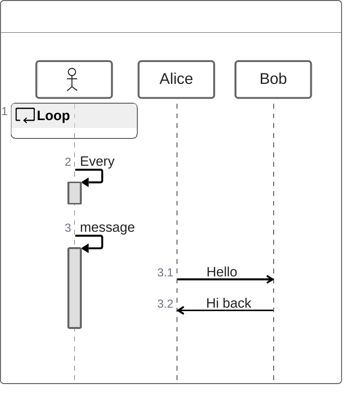

### Alt

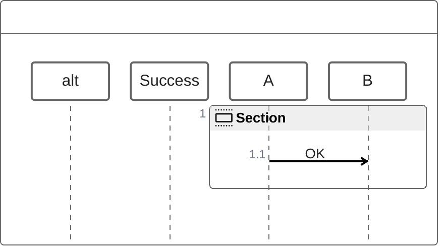

### Opt

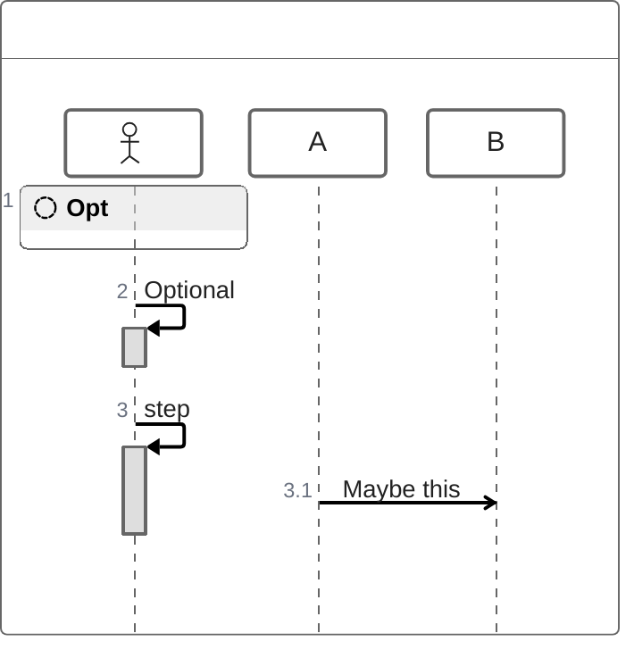

### Parallel

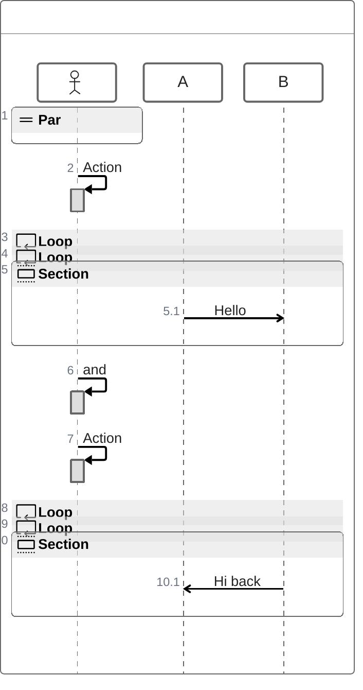

## Try/Catch/Finally

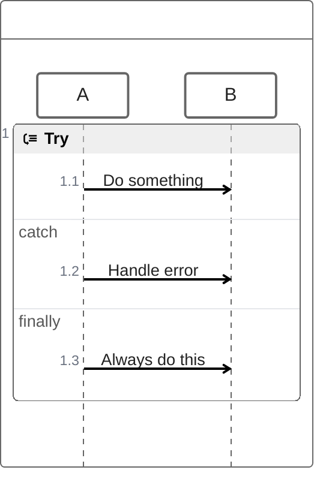
