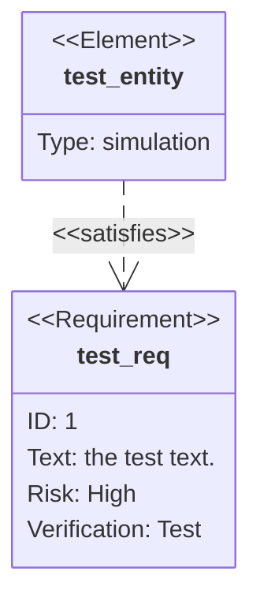
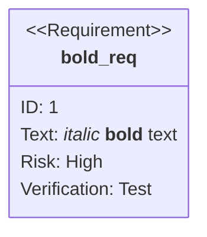
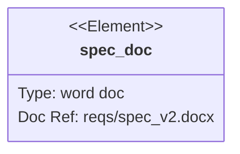

# Requirement Diagram

## Contents
- Requirements
- Elements
- Relationships
- Direction
- Styling

## Overview

Requirement diagrams visualize requirements and their connections following SysML v1.6 specifications.



## Requirements

### Syntax

```
<type> name {
    id: user_defined_id
    text: description text
    risk: <risk>
    verifymethod: <method>
}
```

### Types

| Type | Description |
|---|---|
| `requirement` | Generic requirement |
| `functionalRequirement` | Functional behavior |
| `interfaceRequirement` | Interface specification |
| `performanceRequirement` | Performance criteria |
| `physicalRequirement` | Physical constraint |
| `designConstraint` | Design limitation |

### Risk Levels

`Low`, `Medium`, `High`

### Verification Methods

`Analysis`, `Inspection`, `Test`, `Demonstration`

```mermaid
requirementDiagram
    functionalRequirement login {
        id: FR-001
        text: User can login with email and password.
        risk: high
        verifymethod: test
    }
```

### Markdown Formatting

Use quotes for markdown in names and text:



## Elements

Lightweight nodes connecting requirements to documents/artifacts:

```
element name {
    type: user_defined_type
    docref: user_defined_ref
}
```



## Relationships

Connect requirements and elements:

```
source - <type> -> destination
destination <- <type> - source
```

### Relationship Types

| Type | Description |
|---|---|
| `contains` | Hierarchical containment |
| `copies` | Duplicate of another |
| `derives` | Derived from source |
| `satisfies` | Element satisfies requirement |
| `verifies` | Element verifies requirement |
| `refines` | Refinement relationship |
| `traces` | Traceability link |

```mermaid
requirementDiagram
    requirement req1 { id: 1, text: Main req, risk: high, verifymethod: test }
    functionalRequirement req2 { id: 1.1, text: Sub req, risk: low, verifymethod: inspection }
    element doc1 { type: spec }

    req1 - contains -> req2
    doc1 - satisfies -> req1
    req2 - derives -> req1
```

## Direction

Set layout direction:

```mermaid
requirementDiagram
    direction LR
    requirement req1 { id: 1, text: test, risk: low, verifymethod: test }
```

Valid: `TB`, `BT`, `LR`, `RL`.

## Styling

Use `style` and `classDef`:

```mermaid
requirementDiagram
    requirement req1 { id: 1, text: test, risk: high, verifymethod: test }
    classDef critical fill:#f00,color:white
    class req1 critical
```
