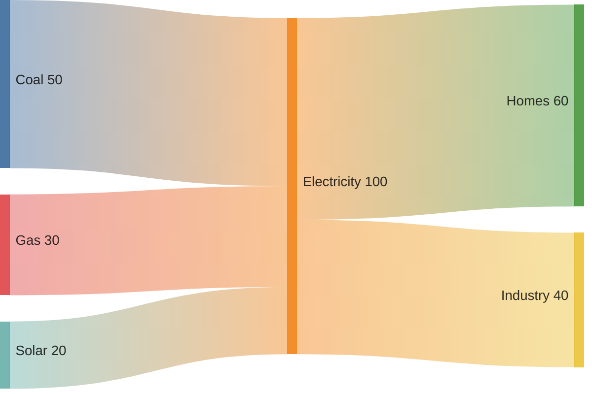
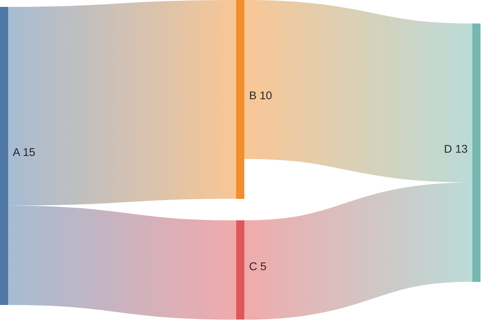
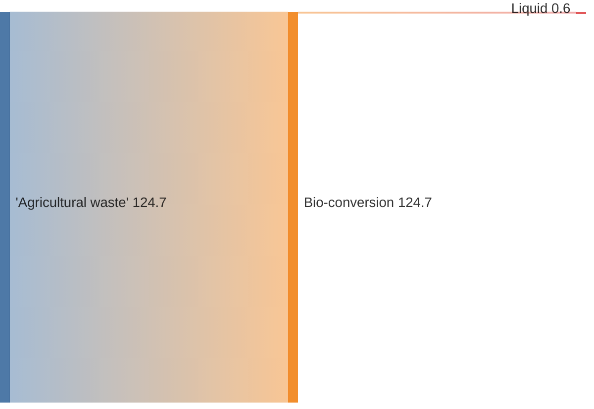
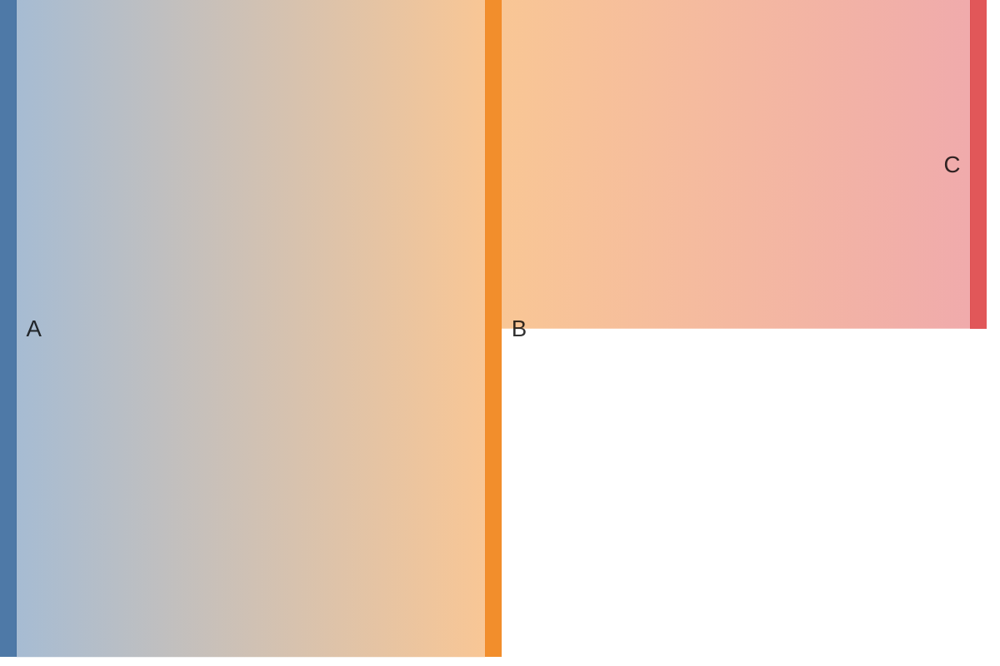

# Sankey Diagram

## Contents
- Syntax (CSV-like)
- Node Names with Commas
- Configuration

## Overview

Sankey diagrams visualize flows from one set of values to another. Available since v10.3.0. Experimental — syntax may change.

## Syntax

CSV-like format: `source,target,value`

Each line defines a link. Nodes are inferred from the source/target names.

### Node Names with Commas

Wrap names containing commas in single quotes:

## Configuration

| Option | Default | Description |
|---|---|---|
| `showValues` | true | Show flow values on links |
| `linkColor` | gradient | 'gradient', 'source', or 'target' |
| `nodeAlignment` | justify | Alignment: 'left', 'right', 'justify', 'center' |
