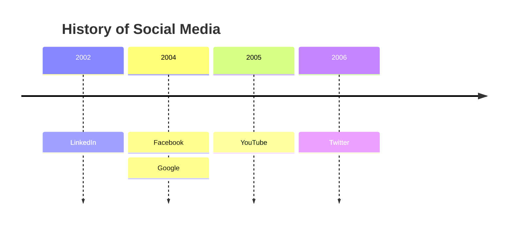
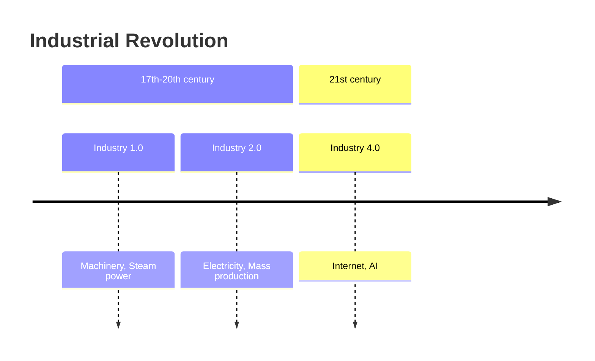
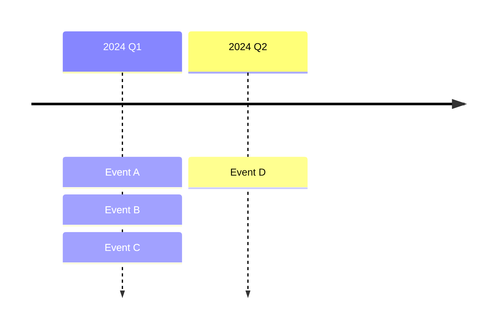
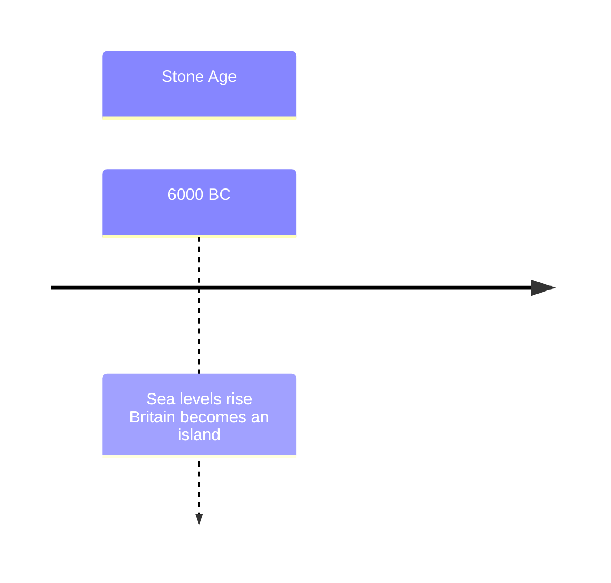
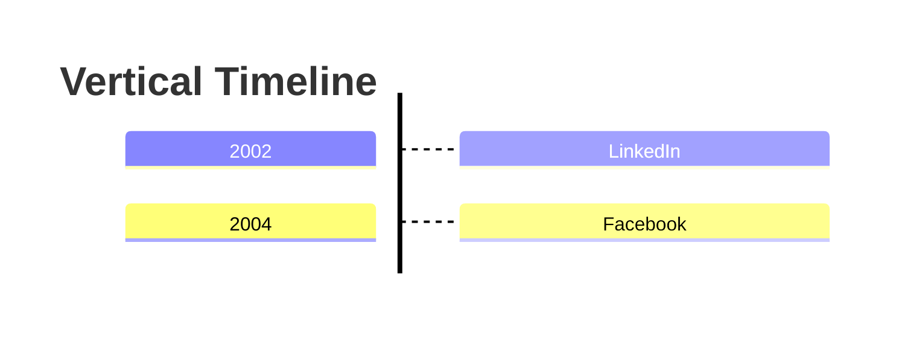

# Timeline Diagram

## Contents
- Basic Syntax
- Sections/Ages
- Multiple Events per Period
- Text Wrapping
- Direction (v11.14.0+)
- Styling and Themes

## Overview

Timelines illustrate chronological events. Experimental — syntax may change.



## Basic Syntax

Start with `timeline` keyword, optional `title`, then time periods with events:

```
{time period} : {event}
{time period} : {event} : {event}
```

Time periods and events are plain text (not limited to dates).

## Sections/Ages

Group time periods with `section`:



Sections share a color scheme for visual grouping.

## Multiple Events per Period

Same line or indented continuation:



## Text Wrapping

Long text auto-wraps. Use `<br>` for forced line breaks:



## Direction (v11.14.0+)

Set direction after `timeline` keyword:



Valid directions: `LR` (default), `TD`, `RL`, `BT`.

## Styling and Themes

Timelines follow the active theme. Use `classDef` for custom styling where supported.
