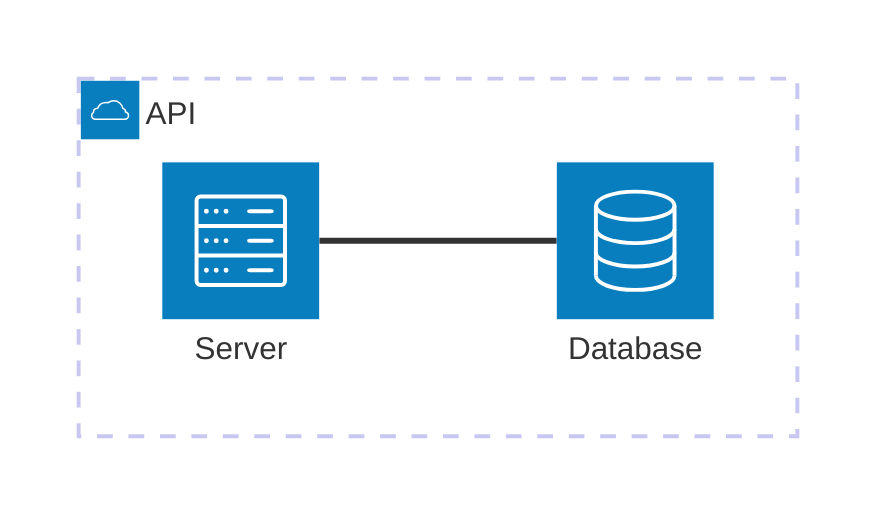
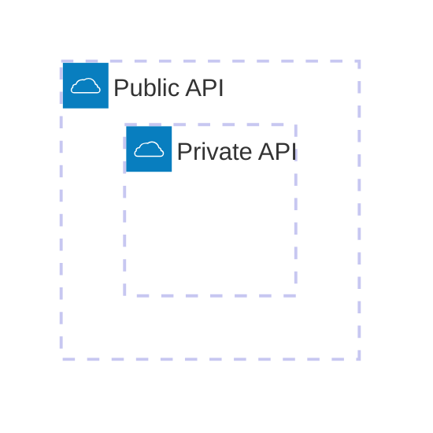
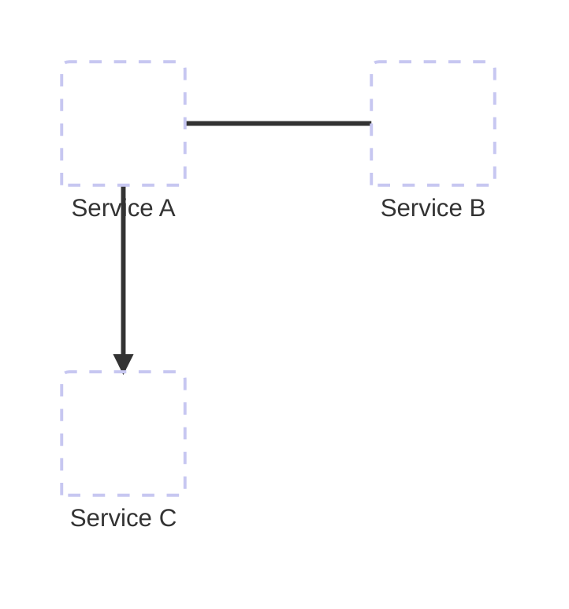
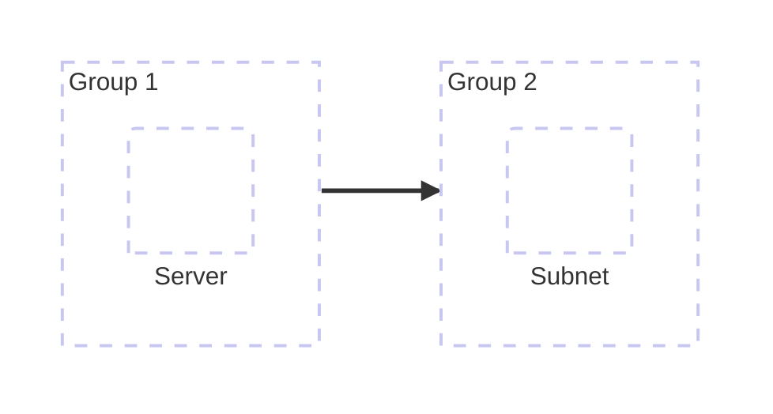

# Architecture Diagram

## Contents
- Groups
- Services
- Edges
- Junctions
- Icons
- Configuration

## Overview

Architecture diagrams visualize cloud and CI/CD service relationships. Available since v11.1.0.



## Groups

```
group {id}({icon})[{title}] (in {parent id})?
```



Groups can be nested using `in`.

## Services

```
service {id}({icon})[{title}] (in {parent id})?
```

```mermaid
architecture-beta
    service db(database)[Database] in private
    service cache(redis)[Cache] in private
```

## Edges

Connect services with directional edges:

```
{serviceId}:{T|B|L|R} {<}?--{>}? {T|B|L|R}:{serviceId}
```

| Connector | Description |
|---|---|
| `--` | Simple line |
| `-->` | Arrow on right |
| `<--` | Arrow on left |
| `<->` | Bidirectional arrows |



### Edges Out of Groups

Use `{group}` modifier:



## Junctions

4-way split nodes for complex connections:

```mermaid
architecture-beta
    service a[A]
    service b[B]
    service c[C]
    service d[D]
    junction j
    a:R -- L:j
    b:B -- T:j
    j:R -- L:c
    j:B -- T:d
```

## Icons

Built-in icon names used in `()`:

| Icon | Description |
|---|---|
| `cloud` | Cloud |
| `database` | Database |
| `server` | Server |
| `disk` | Storage/disk |
| `lock` | Security |
| `user` | User/person |
| `monitor` | Monitor/display |
| `network` | Network |
| `storage` | Storage |
| `redis` | Redis cache |

Custom icons via URL:


## Configuration

```mermaid
---
config:
  architecture:
    randomSeed: 42
---
architecture-beta
    service a[A]
    service b[B]
```

| Option | Default | Description |
|---|---|---|
| `randomSeed` | random | Seed for deterministic layout |
