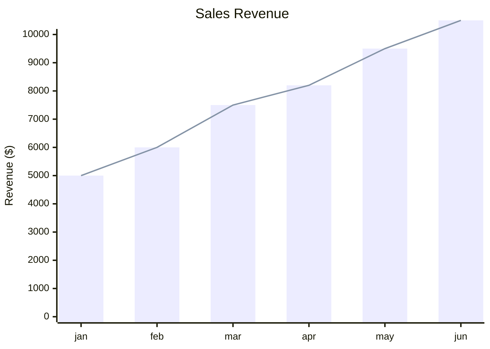
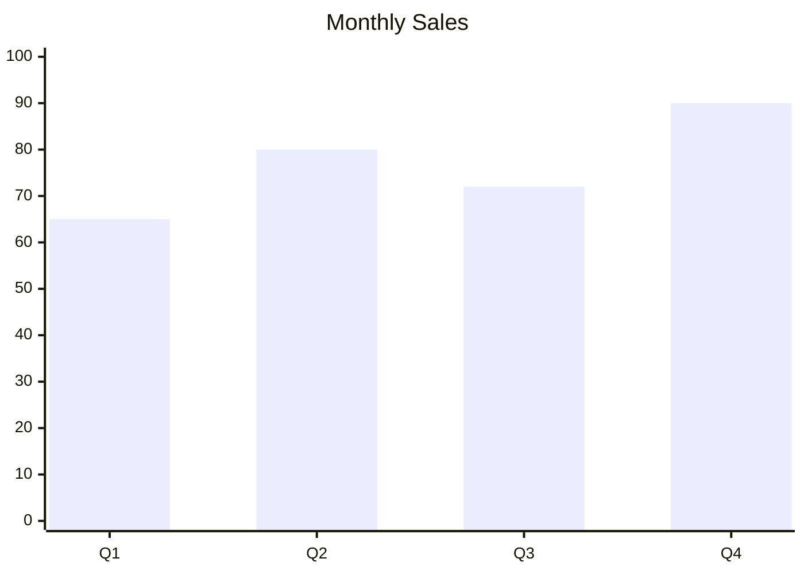
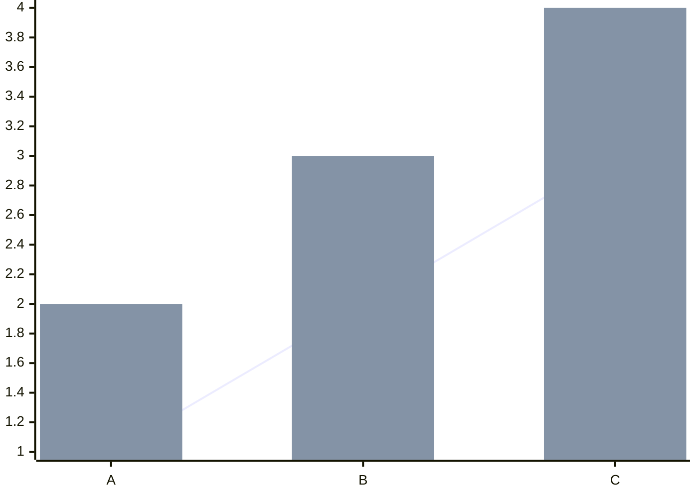
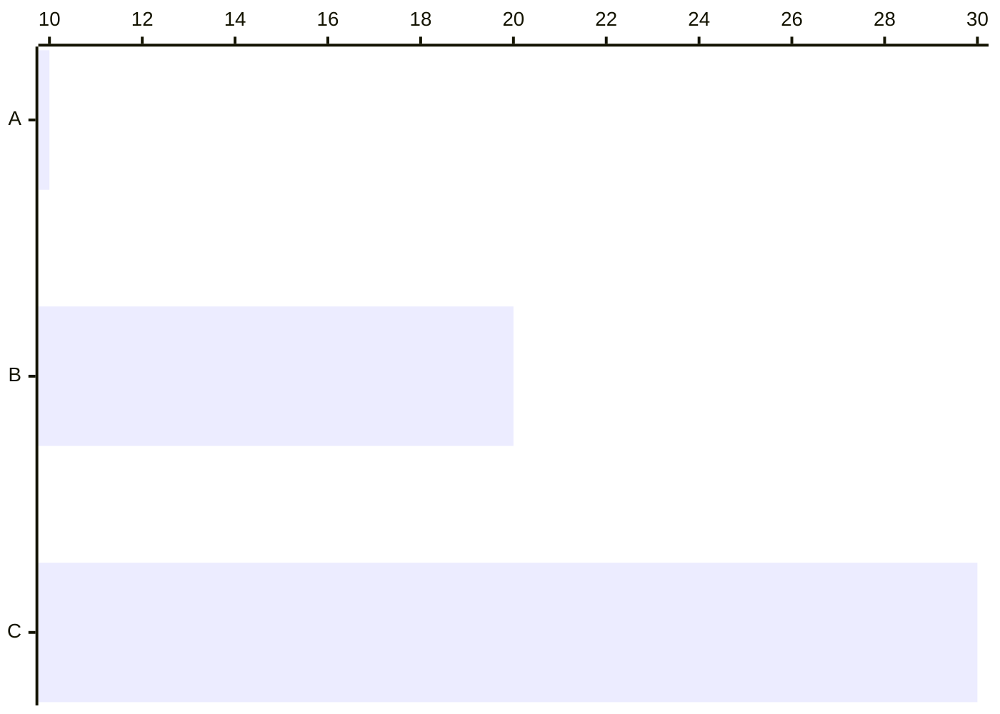
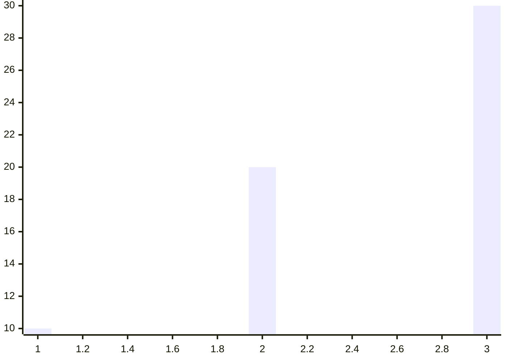
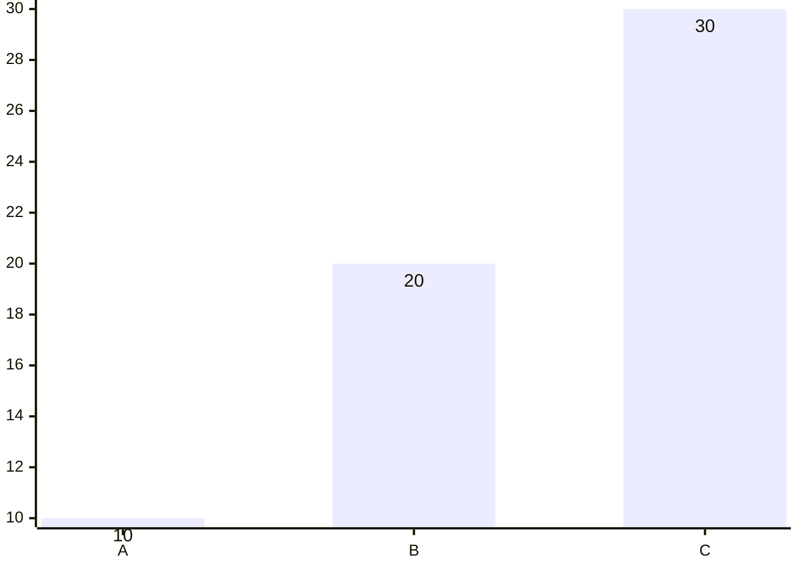
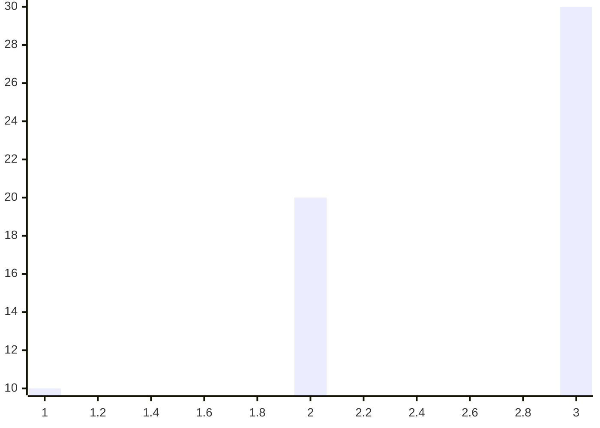

# XY Chart

## Contents
- Bar Charts
- Line Charts
- Axes Configuration
- Orientation
- Theme Variables
- Displaying Values on Bars (v11.14.0+)

## Overview

XY charts support bar and line charts with configurable axes.



## Bar Charts



## Line Charts

```mermaid
xychart
    title "Growth Trend"
    x-axis [2020, 2021, 2022, 2023]
    y-axis 0 --> 100
    line [20, 40, 65, 85]
```

Multiple series:



## Axes

### X-Axis

Categorical (text labels) or numeric range:

```
x-axis [cat1, cat2, cat3]    ' categorical
x-axis 0 --> 100             ' numeric range
```

### Y-Axis

Numeric range only:

```
y-axis "Label" 0 --> 100
y-axis "Label"        ' auto-range from data
```

Both axes are optional — Mermaid auto-generates ranges from data.

## Orientation



Valid: `vertical` (default), `horizontal`.

## Configuration



## Displaying Values on Bars (v11.14.0+)

Show data labels inside or outside bars:



## Theme Variables


