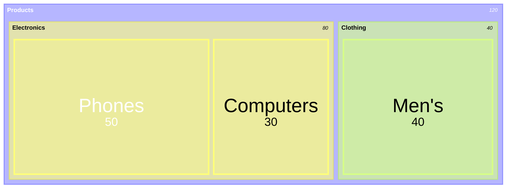
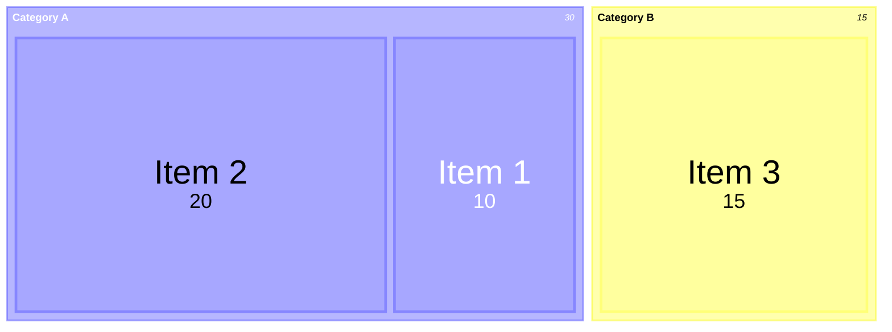
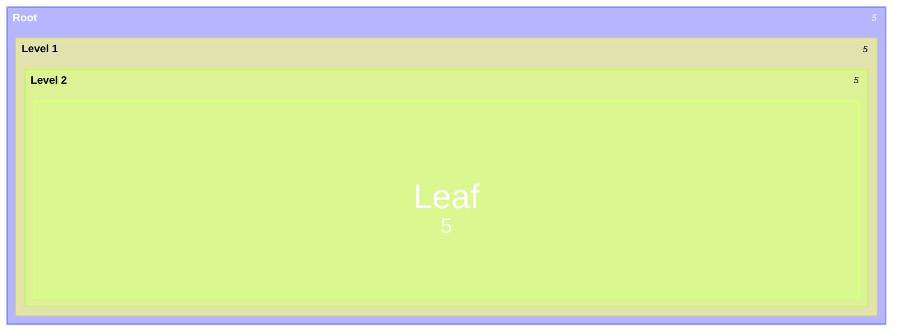
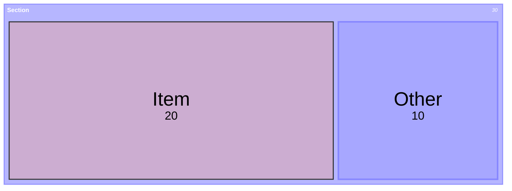
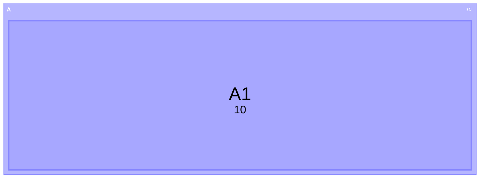

# Treemap Diagram

## Contents
- Basic Syntax
- Hierarchy via Indentation
- Styling (classDef)
- Configuration
- Limitations

## Overview

Treemaps display hierarchical data as nested rectangles, sized proportionally to values. Experimental — syntax may change.

## Basic Syntax

- **Section/parent nodes**: `"Name"` (no value)
- **Leaf nodes**: `"Name": value`
- **Hierarchy**: Indentation (spaces or tabs)
- **Styling**: `:::class` syntax

## Hierarchy via Indentation

Any depth is supported:

## Styling

Use `classDef` and `:::` operator:

## Configuration

## Limitations

- Beta feature — syntax may change
- No click events or interactivity
- Limited to rectangular layout
