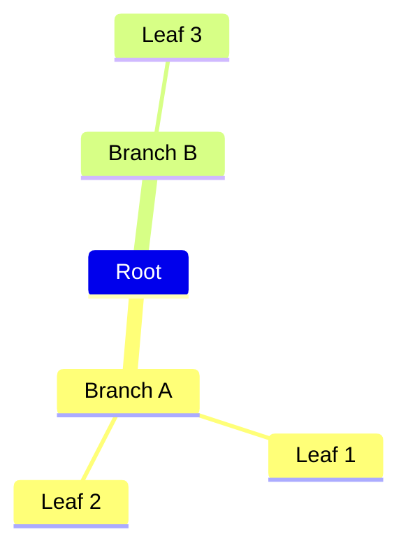
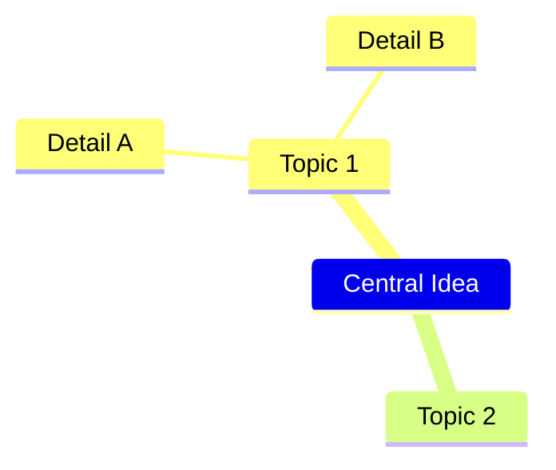
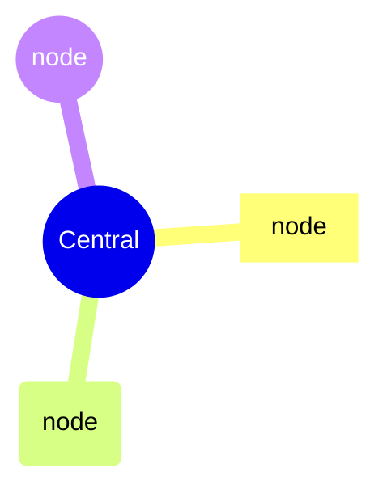
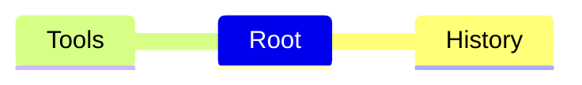
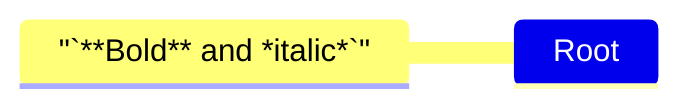

# Mindmap

## Contents
- Basic Syntax (Indentation)
- Node Shapes
- Icons
- Classes
- Markdown Strings
- Layouts

## Overview

Mindmaps organize information hierarchically around a central concept. Experimental.



## Basic Syntax

Hierarchy is defined by indentation (spaces or tabs). One root node at the leftmost level.



## Node Shapes

| Syntax | Shape |
|---|---|
| `id[text]` | Square |
| `id(text)` | Rounded square |
| `id((text))` | Circle |
| `id))text((` | Bang |
| `id)text(` | Cloud |
| `id[[text]]` | Parallelogram |
| `id{{text}}` | Double circle |
| `id[text` | Card (flat left) |



## Icons

Attach FontAwesome icons with `::icon()`:



Register icon packs programmatically (v11.7.0+).

## Classes

Use `classDef` and `:::` for styling:

```mermaid
mindmap
    Root
        Important:::highlight
        Normal

classDef highlight fill:#f96,stroke:#333
```

## Markdown Strings

Use backticks for formatted text (bold, italic, auto-wrap):



## Layouts

Mindmaps support different layout engines. Set via config:

```mermaid
---
config:
  layout: elk
---
mindmap
    Root
        A
            B
```
