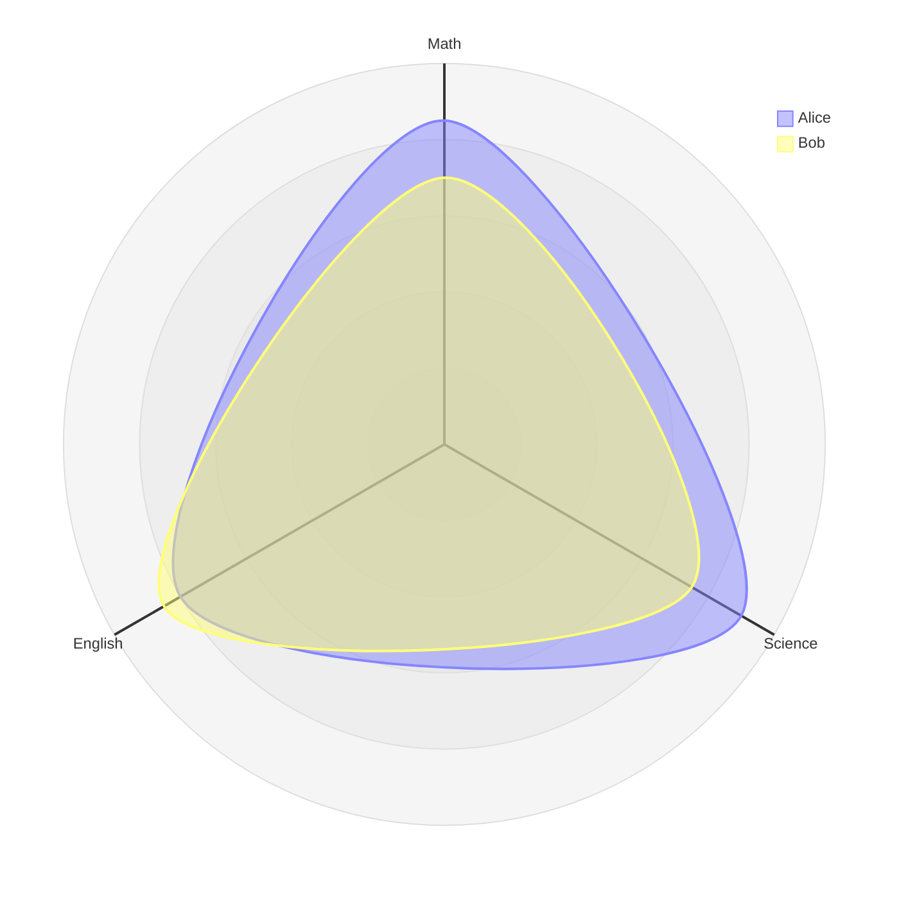
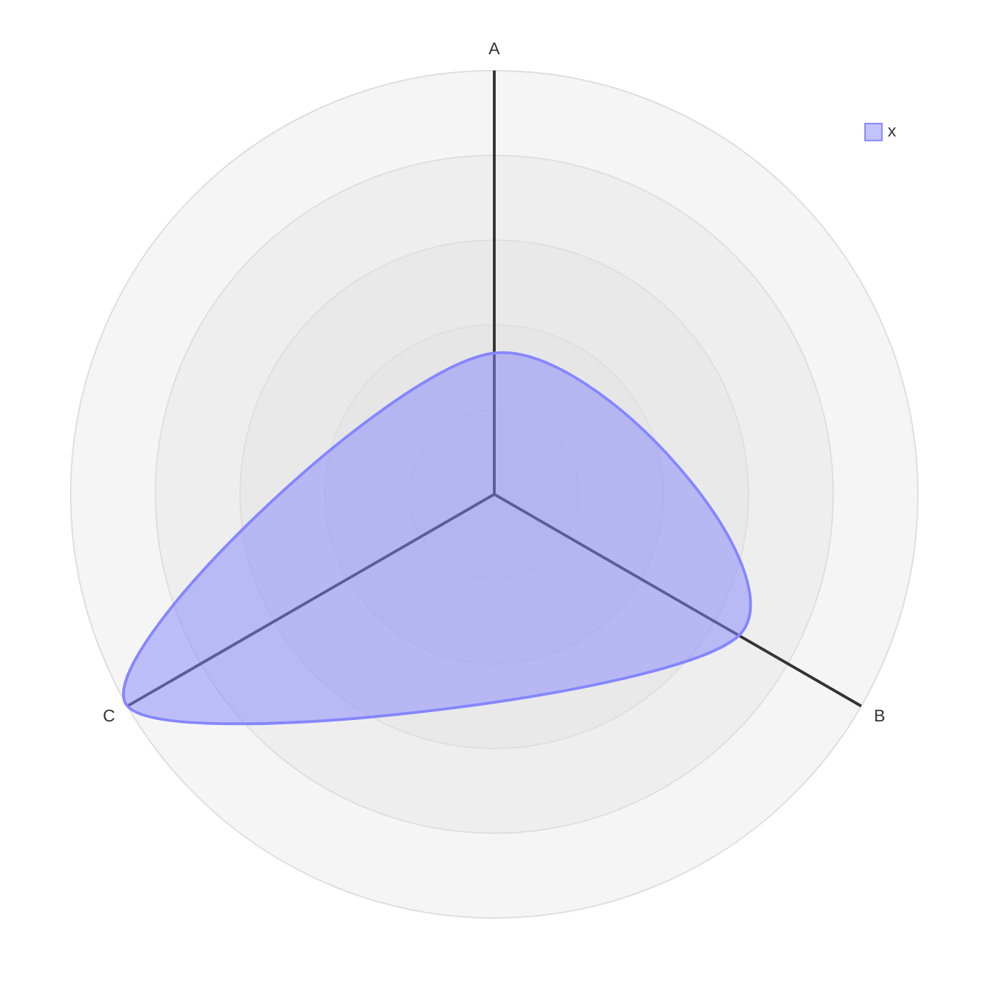
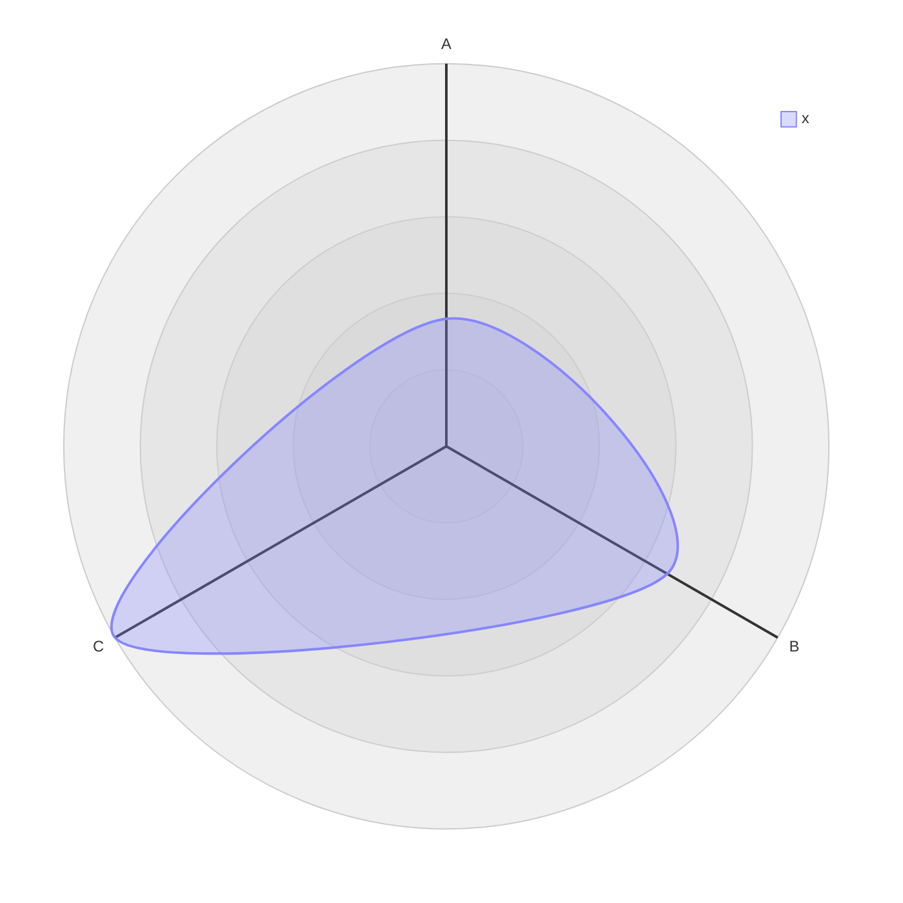

# Radar Diagram

## Contents
- Axes and Curves
- Options (max, min, graticule, ticks)
- Configuration
- Theme Variables

## Overview

Radar charts plot multi-dimensional data in circular format. Available since v11.6.0.



## Axes and Curves

### Axes

Define dimensions with `axis`:

```
axis id1["Label1"], id2["Label2"], id3["Label3"]
```

Multiple `axis` lines allowed.

### Curves

Define data series with `curve`:

```
curve id["Label"]{val1, val2, val3}
```

Values in axis order, or as key-value pairs:

```
curve c1{ axis2: 30, axis1: 20, axis3: 10 }
```

Multiple curves per line:

```
curve a["A"]{1,2,3}, b["B"]{4,5,6}
```

## Options

| Option | Description |
|---|---|
| `max N` | Maximum value (auto-calculated if omitted) |
| `min N` | Minimum value (default 0) |
| `graticule circle\|polygon` | Background grid shape (default: circle) |
| `ticks N` | Number of concentric rings (default: 5) |
| `showLegend true\|false` | Show/hide legend (default: true) |

```mermaid
radar-beta
    axis A, B, C
    curve x{3, 4, 2}
    graticule polygon
    ticks 4
    max 5
```



## Configuration



## Theme Variables


