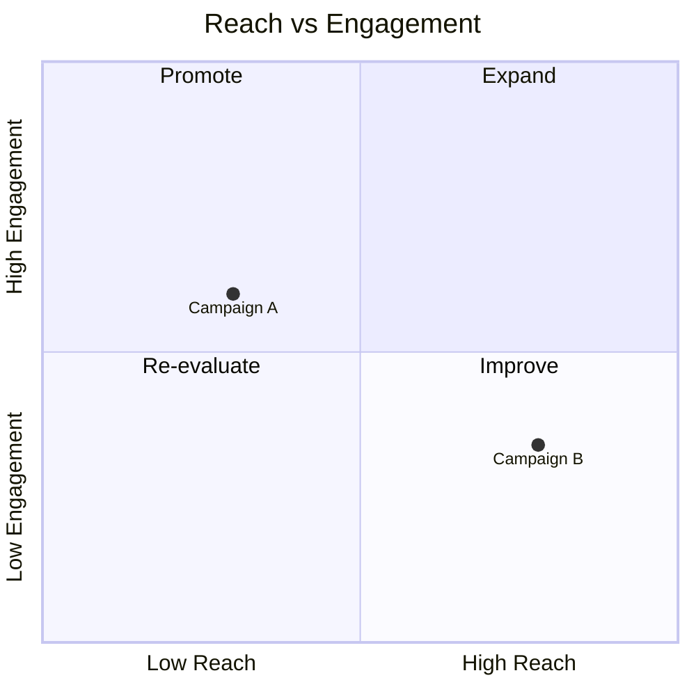
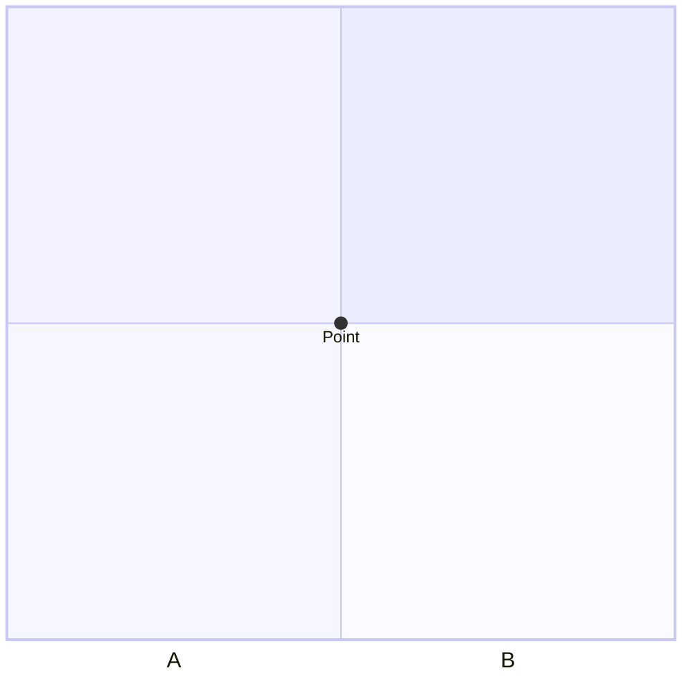
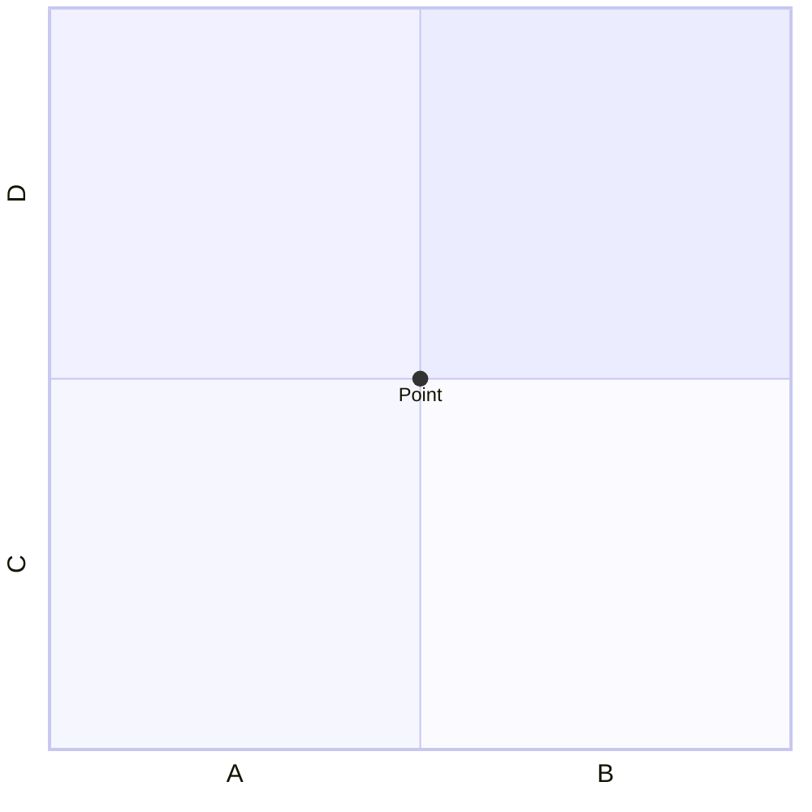

# Quadrant Chart

## Contents
- Axes and Quadrants
- Points
- Configuration
- Theme Variables

## Overview

Quadrant charts plot data points on a 2D grid divided into four quadrants.



## Axes and Quadrants

### X-Axis

```
x-axis Left Label --> Right Label
x-axis Single Label         ' left only
```

### Y-Axis

```
y-axis Bottom Label --> Top Label
y-axis Single Label         ' bottom only
```

### Quadrant Labels

| Keyword | Position |
|---|---|
| `quadrant-1` | Top right |
| `quadrant-2` | Top left |
| `quadrant-3` | Bottom left |
| `quadrant-4` | Bottom right |

## Points

Plot points with `<label>: [x, y]`. X and Y values range from 0 to 1.

```
Point A: [0.75, 0.80]    ' top right quadrant
Point B: [0.25, 0.15]    ' bottom left quadrant
```

## Configuration



## Theme Variables


