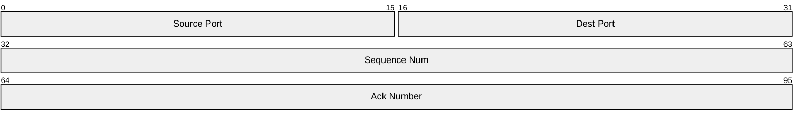
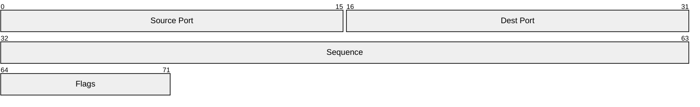

# Packet Diagram

## Contents
- Bit Range Syntax
- Bit Count Syntax (v11.7.0+)
- Configuration
- Theme Variables

## Overview

Packet diagrams visualize network packet structures as bit-level field layouts. Available since v11.0.0.



## Bit Range Syntax

`start-end: "Block name"` for multi-bit blocks, `bit: "name"` for single bits.

```mermaid
packet
    0-15: "Source Port"
    16-31: "Dest Port"
    32-63: "Sequence"
    106: "URG flag"
```

## Bit Count Syntax (v11.7.0+)

Use `+N` for bit count from end of previous field:



Mix and match both syntaxes in the same diagram.

## Configuration


## Theme Variables


