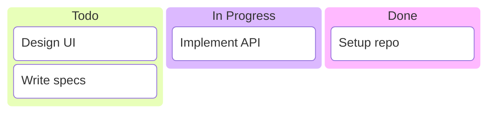
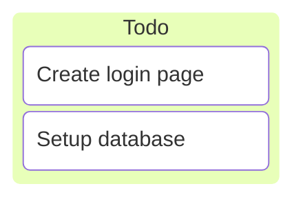
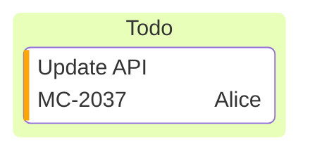
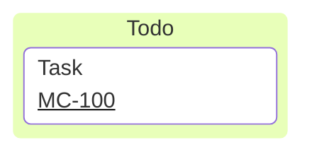

# Kanban Diagram

## Contents
- Columns
- Tasks
- Metadata
- Configuration

## Overview

Kanban diagrams visualize tasks across workflow stages.



## Columns

Define workflow stages:

```
columnId[Column Title]
```


## Tasks

Indent tasks under their column:

```
taskId[Task Description]
```



## Metadata

Add metadata with `@{ ... }`:

| Key | Values |
|---|---|
| `assigned` | Person name |
| `ticket` | Ticket/issue number |
| `priority` | 'Very High', 'High', 'Low', 'Very Low' |



## Configuration



`ticketBaseUrl` replaces `#TICKET#` with the actual ticket value to create a clickable link.
