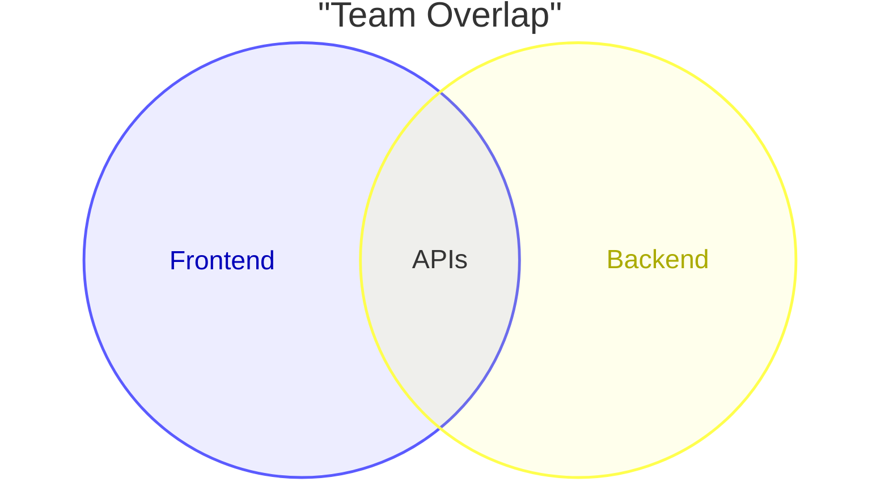
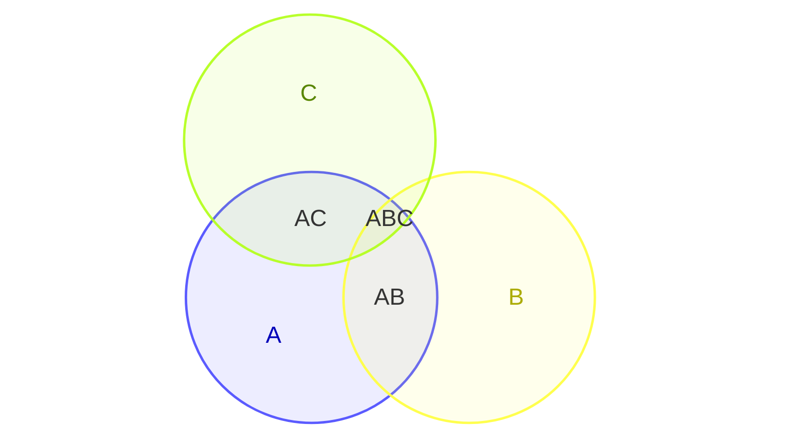
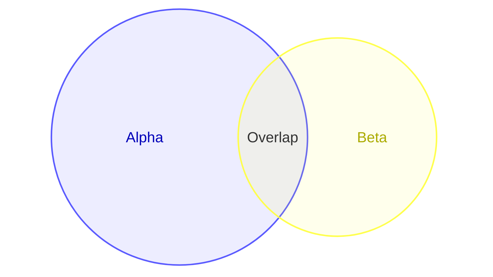
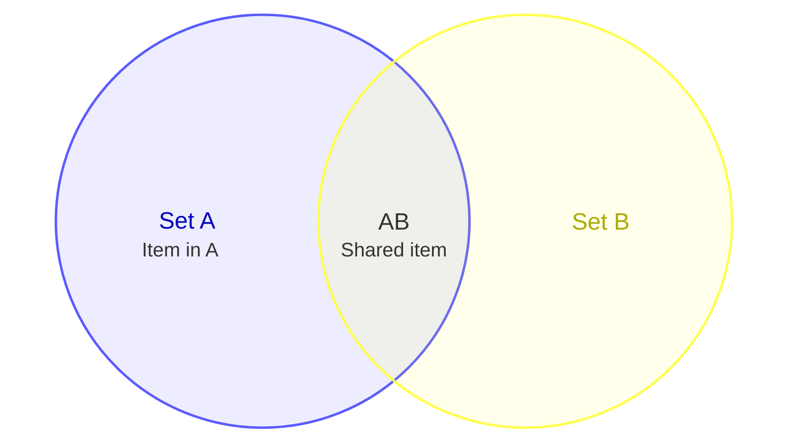

# Venn Diagram

## Contents
- Sets and Unions
- Labels and Sizes
- Text Nodes

## Overview

Venn diagrams show set relationships using overlapping circles. Available since v11.12.3. Experimental.

## Sets and Unions

- `set` defines a single set
- `union` defines overlap of two or more sets (must be defined first)

## Labels and Sizes

Use `["label"]` for display labels, `:N` for sizes:

## Text Nodes

Place text inside sets or unions with indented `text`:

