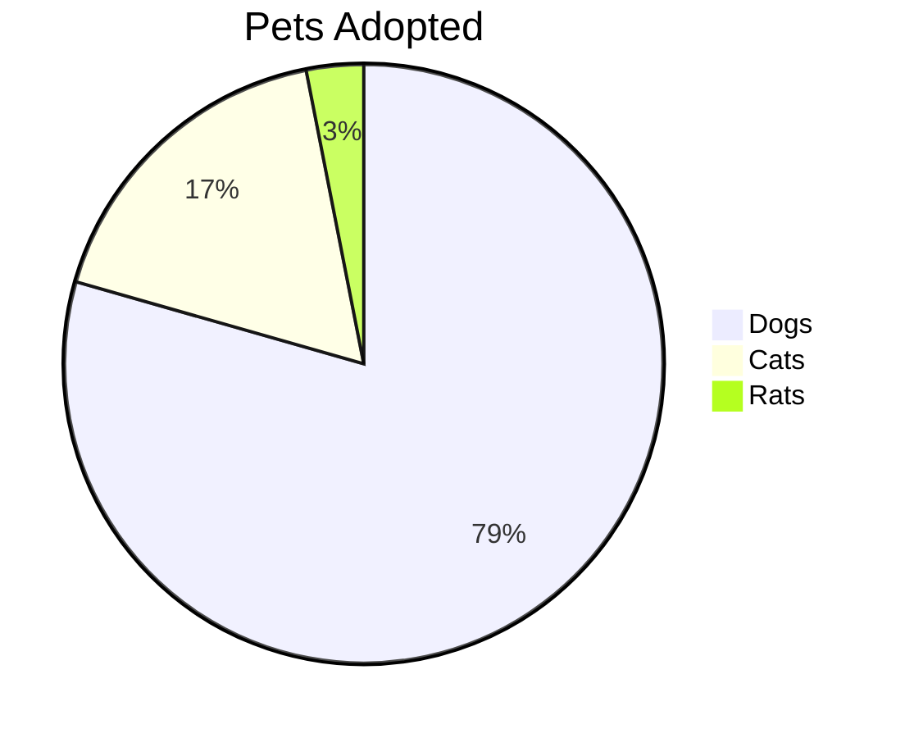
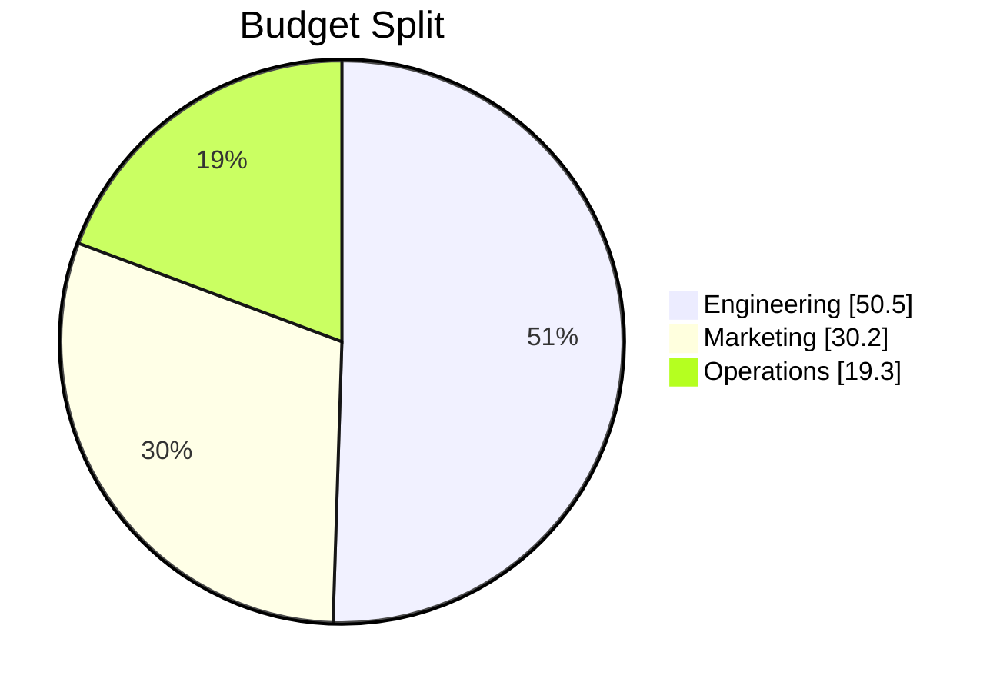
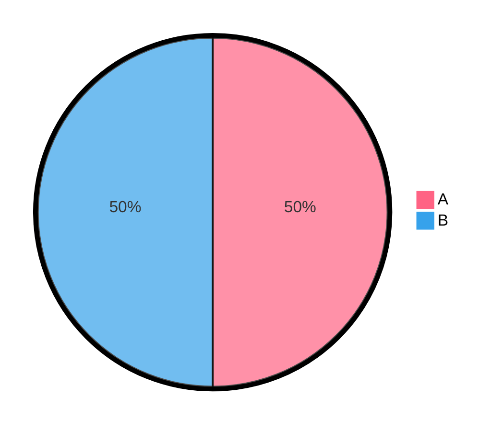

# Pie Chart

## Contents
- Syntax
- showData
- Configuration

## Overview

Pie charts display proportional data as circular slices.

## Syntax

- Start with `pie` keyword
- Optional `showData` to display values after legend
- Optional `title "text"`
- Slices: `"label" : value` (positive numbers only, up to 2 decimal places)

Negative values are not allowed.

## Configuration

`textPosition` controls radial position of labels (0.0 = center, 1.0 = edge).
