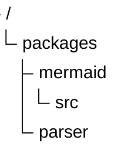
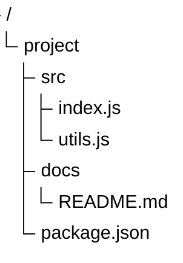
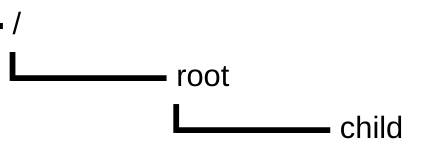
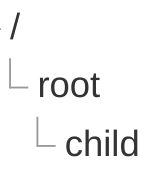

# Tree View Diagram

## Contents
- Syntax (Indentation)
- Configuration
- Theme Variables

## Overview

Tree view diagrams represent hierarchical data as directory-like structures. Available since v11.14.0.

## Syntax

Hierarchy is defined entirely by indentation. Quoted strings represent folder/file names.

## Configuration

| Option | Default | Description |
|---|---|---|
| `rowIndent` | auto | Horizontal spacing between levels |
| `lineThickness` | auto | Thickness of connector lines |

## Theme Variables

