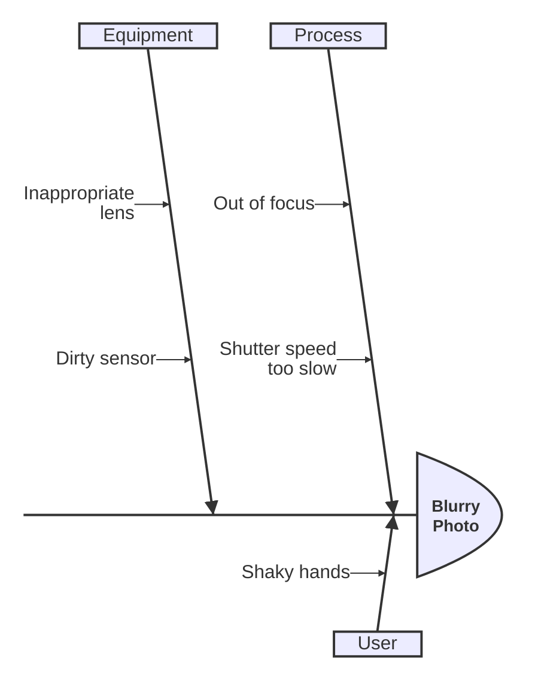
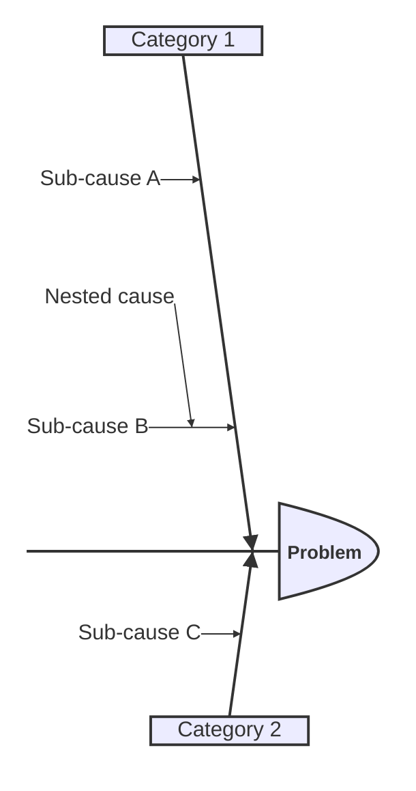

# Ishikawa (Fishbone) Diagram

## Contents
- Syntax
- Nested Causes

## Overview

Ishikawa diagrams visualize causes of a problem as a fishbone structure. Available since v11.12.3. Experimental.

## Syntax

- First line: the problem (diagram title)
- Top-level indented items: cause categories (bones)
- Further indented items: sub-causes

Any nesting depth is supported. Categories and causes are plain text (no quoting required for simple names).
