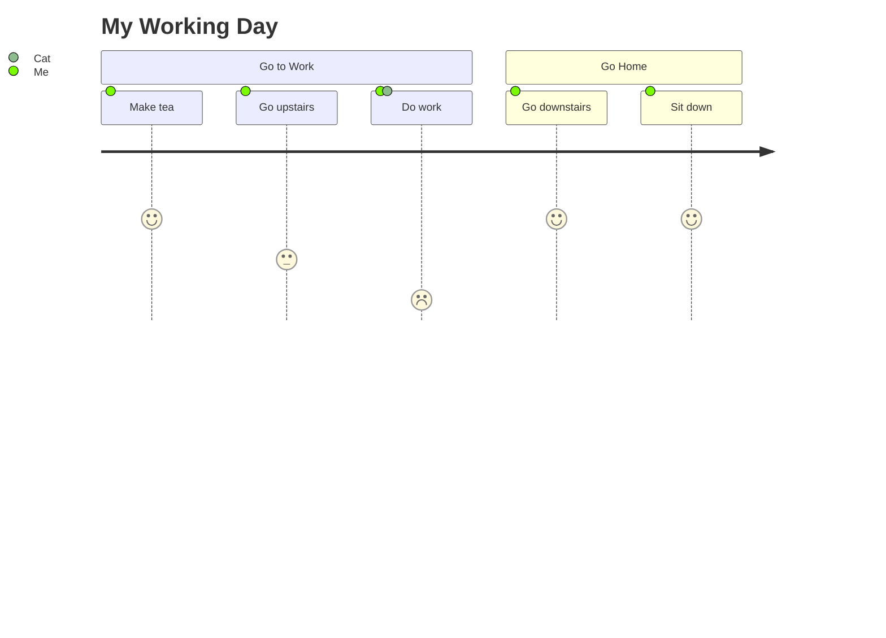
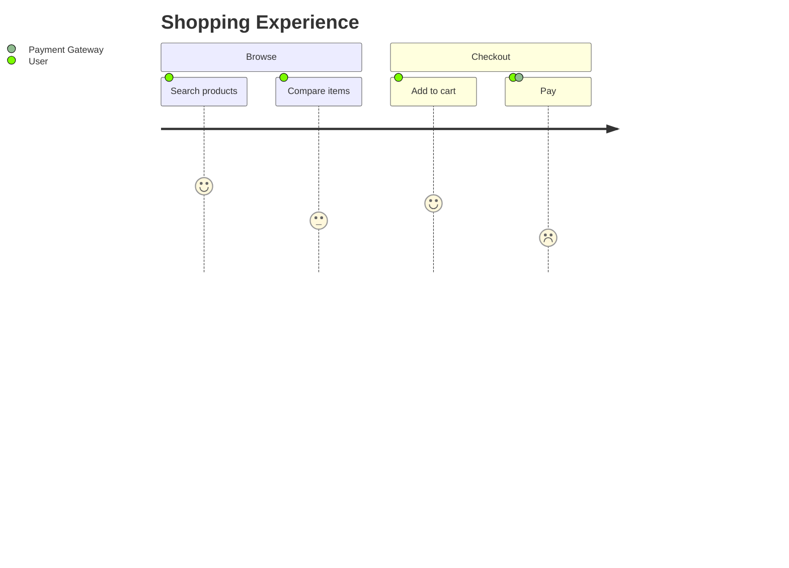

# User Journey Diagram

## Contents
- Sections
- Tasks and Scores
- Actors

## Overview

User journey diagrams describe steps users take to complete a task, revealing workflow areas for improvement.



## Sections

Group tasks with `section <name>`:



## Tasks and Scores

Syntax: `Task name: <score>: <actors>`

- **Score**: integer 1–5 (1 = worst experience, 5 = best)
- **Actors**: comma-separated list of involved actors

```
Login: 4: User, Admin
Process payment: 2: User
```

The score determines the visual height/thickness of the task bar for each actor.
