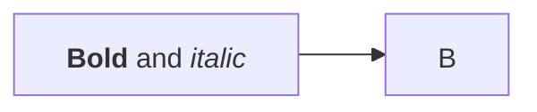

# Flowcharts

Flowcharts are composed of **nodes** (shapes) and **edges** (arrows/lines). Supports multi-directional arrows, subgraphs with independent direction, rich styling, animations, icons, and images.

> Use `flowchart` or `graph` interchangeably.

## Direction

```
flowchart TD   %% Top-down (TB is alias)
flowchart LR   %% Left-right
flowchart BT   %% Bottom-top
flowchart RL   %% Right-left
```

## Node shapes (classic syntax)

| Syntax | Shape |
| --- | --- |
| `id` or `id["text"]` | Default (rectangle) |
| `id(text)` | Rounded edges |
| `id([text])` | Stadium / pill |
| `id[[text]]` | Subroutine |
| `id[(text)]` | Cylinder (database) |
| `id((text))` | Circle |
| `id>text]` | Asymmetric |
| `id{text}` | Rhombus (decision) |
| `id{{text}}` | Hexagon |
| `id[/text/]` | Parallelogram |
| `id[\text\]` | Parallelogram alt |
| `id[/text\]` | Trapezoid |
| `id[\text/]` | Trapezoid alt |
| `id(((text)))` | Double circle |

## Expanded node shapes (v11.3.0+)

Use `@{ shape: <name>, label: "text" }` syntax for 50+ additional shapes:

```
A@{ shape: rect, label: "Process" }
B@{ shape: diamond, label: "Decision" }
C@{ shape: cloud, label: "Cloud service" }
D@{ shape: docs, label: "Multiple documents" }
```

### Shape catalog

| Shape name | Short name | Description |
| --- | --- | --- |
| Process | `rect`, `process` | Standard rectangle |
| Event | `rounded` | Rounded rectangle |
| Terminal Point | `stadium`, `pill` | Stadium shape |
| Subprocess | `subproc`, `framed-rectangle` | Framed rectangle |
| Database | `cyl`, `cylinder`, `db` | Cylinder |
| Start | `circle`, `circ` | Circle |
| Start (small) | `sm-circ`, `small-circle` | Small circle |
| Stop | `dbl-circ`, `double-circle` | Double circle |
| Stop | `framed-circle`, `stop` | Framed circle |
| Decision | `diamond`, `decision`, `question` | Diamond |
| Prepare | `hex`, `hexagon` | Hexagon |
| Input/Output | `lean-r`, `lean-right` | Lean right parallelogram |
| Output/Input | `lean-l`, `lean-left` | Lean left parallelogram |
| Datastore | `datastore` | Data flow diagram store |
| Priority Action | `trap-b`, `trapezoid` | Trapezoid base bottom |
| Manual Operation | `trap-t`, `manual` | Trapezoid base top |
| Text Block | `text` | Plain text block |
| Card | `notch-rect`, `card` | Notched rectangle |
| Lined Process | `lin-rect`, `lined-process` | Lined rectangle |
| Fork/Join | `fork`, `join` | Filled rectangle |
| Collate | `hourglass`, `collate` | Hourglass |
| Comment | `comment`, `brace-l` | Curly brace left |
| Comment Right | `brace-r` | Curly brace right |
| Comment (both) | `braces` | Double curly braces |
| Com Link | `bolt`, `lightning-bolt` | Lightning bolt |
| Document | `doc`, `document` | Document shape |
| Delay | `delay` | Half-rounded rectangle |
| Direct Access Storage | `das`, `horizontal-cylinder` | Horizontal cylinder |
| Disk Storage | `disk`, `lined-cylinder` | Lined cylinder |
| Display | `curv-trap`, `curved-trapezoid` | Curved trapezoid |
| Divided Process | `div-rect`, `divided-process` | Divided rectangle |
| Extract | `tri`, `triangle` | Triangle |
| Internal Storage | `win-pane`, `window-pane` | Window pane |
| Junction | `f-circ`, `filled-circle` | Filled circle |
| Lined Document | `lin-doc` | Lined document |
| Loop Limit | `notch-pent`, `loop-limit` | Notched pentagon |
| Manual File | `flip-tri`, `flipped-triangle` | Flipped triangle |
| Manual Input | `sl-rect`, `manual-input` | Sloped rectangle |
| Multi-Document | `docs`, `stacked-document` | Stacked documents |
| Multi-Process | `processes`, `procs` | Stacked rectangles |
| Paper Tape | `flag`, `paper-tape` | Flag shape |
| Stored Data | `bow-rect` | Bow tie rectangle |
| Summary | `cross-circ`, `summary` | Crossed circle |
| Tagged Document | `tag-doc` | Tagged document |
| Tagged Process | `tag-rect`, `tagged-process` | Tagged rectangle |
| Cloud | `cloud` | Cloud shape |
| Bang | `bang` | Bang/exclamation shape |
| Odd | `odd` | Odd shape |

## Special shapes

### Icon shape

```
A@{ icon: "fa:user", form: "square", label: "User", pos: "t", h: 60 }
```

Parameters:
- `icon`: Icon name from registered pack (`fa:`, `fas:`, `fab:`, etc.)
- `form`: Background shape — `square`, `circle`, `rounded` (optional)
- `label`: Text label (optional)
- `pos`: Label position — `t` (top), `b` (bottom); default bottom
- `h`: Height; default 48 (minimum)

### Image shape

```
A@{ img: "https://example.com/logo.png", label: "Logo", pos: "t", w: 60, h: 60, constraint: "on" }
```

Parameters:
- `img`: Image URL
- `label`: Text label (optional)
- `pos`: Label position — `t` or `b`; default bottom
- `w`, `h`: Width and height (optional, defaults to natural size)
- `constraint`: `on` maintains aspect ratio when resizing; `off` (default)

## Edges

### Arrow types

| Syntax | Description |
| --- | --- |
| `A --> B` | Solid arrow |
| `A --- B` | Open (no arrowhead) |
| `A ==> B` | Thick arrow |
| `A -.-> B` | Dotted arrow |
| `A ~~~ B` | Invisible link (positioning only) |

### Arrowhead variants

| Syntax | Description |
| --- | --- |
| `A --o B` | Circle at end |
| `A --x B` | Cross at end |
| `A o--o B` | Bidirectional circle |
| `A <--> B` | Bidirectional arrow |
| `A x--x B` | Bidirectional cross |

### Edge labels

```
A -->|label| B
A -- label --> B
```

### Multi-directional links & chaining

```
A -- text --> B -- text2 --> C
a --> b & c --> d
A & B --> C & D
```

### Minimum link length

Add extra dashes to force longer links (spans more ranks):

| Base | Length 1 | Length 2 | Length 3 |
| --- | --- | --- | --- |
| Normal | `---` | `----` | `-----` |
| Arrow | `-->` | `--->` | `---->` |
| Thick | `===` | `====` | `=====` |
| Thick arrow | `==>` | `===>` | `====>` |
| Dotted | `-.-` | `-..-` | `-...-` |
| Dotted arrow | `-.->` | `-..->` | `-...->` |

### Edge IDs (v11.10.0+)

```
A e1@--> B
e1@{ curve: linear }
e1@{ animate: true }
e1@{ animation: fast }
```

## Subgraphs

```
subgraph title
    direction LR   %% Optional: override direction
    A --> B
end

subgraph explicit_id [Display Title]
    C --> D
end
```

Subgraphs can have edges to/from other subgraphs. Nested subgraphs are supported.

> **Gotcha**: If any node inside a subgraph is linked to an outside node, the subgraph's `direction` is ignored and it inherits the parent graph's direction. Link to the subgraph itself (not its nodes) to preserve direction.

## Markdown strings (v11+)

Wrap text in backticks for markdown formatting (bold, italics, auto-wrap):



Disable auto-wrap with `markdownAutoWrap: false`.

## Styling

### Direct style on nodes

```
style nodeId fill:#f9f,stroke:#333,stroke-width:4px
style nodeId2 fill:#bbf,color:#fff,stroke-dasharray: 5 5
```

### Class definitions

```
classDef className fill:#f9f,stroke:#333,stroke-width:4px;
class nodeId1,nodeId2 className;
```

### Inline class on node

```
A:::someclass --> B
classDef someclass fill:#f96
```

### Default class (applies to all nodes)

```
classDef default fill:#f9f,stroke:#333,stroke-width:4px;
```

### Link styling by index

```
linkStyle 3 stroke:#ff3,stroke-width:4px,color:red;
linkStyle 1,2,7 color:blue;
```

### Curve styles

Available: `basis`, `bumpX`, `bumpY`, `cardinal`, `catmullRom`, `linear`, `monotoneX`, `monotoneY`, `natural`, `step`, `stepAfter`, `stepBefore`.

Diagram-level:
```
---
config:
  flowchart:
    curve: stepBefore
---
```

Per-edge (v11.10.0+): `e1@{ curve: linear }`

## Interactions

```
click nodeId callback "Tooltip text"
click nodeId "https://url.com" "Tooltip" _blank
click nodeId call callback() "Tooltip"
click nodeId href "https://url.com" "Tooltip" _blank
```

Target options: `_self`, `_blank`, `_parent`, `_top`. Requires `securityLevel: 'loose'`.

## FontAwesome icons

```
A["fa:fa-twitter for peace"]
B[fa:fa-ban forbidden]
C(fa:fa-spinner)
```

Prefixes: `fa`, `fab`, `fas`, `far`, `fal`, `fad`. Custom icons use `fak` prefix. Requires Font Awesome CSS or registered icon pack.

## Configuration

```yaml
---
config:
  flowchart:
    defaultRenderer: "elk"   %% elk, dagre (default), cose-bilkent, tidy-tree
    curve: cardinal
  htmlLabels: true           %% false needed for markdown strings
  theme: forest
---
```

## Comments

```
%% This is a comment
flowchart LR
   A --> B
```

Comments must be on their own line, prefixed with `%%`.

## Special characters

Use quotes for troublesome characters: `id["text (with) parens"]`

Entity codes: `A["quote:#quot;"]`, `B["heart:#9829;"]`. Numbers are base 10. `#` is `#35;`.
