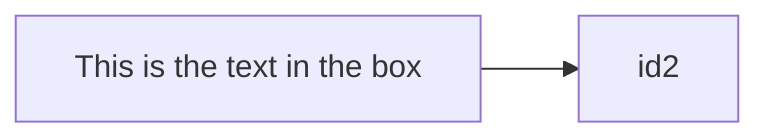
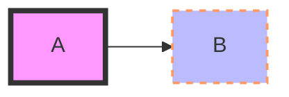
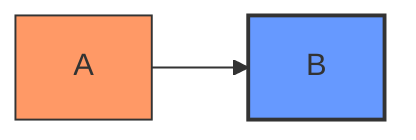
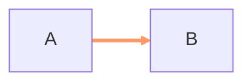
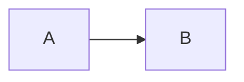
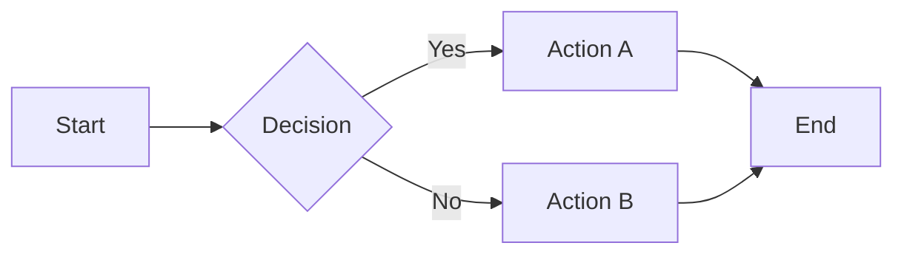
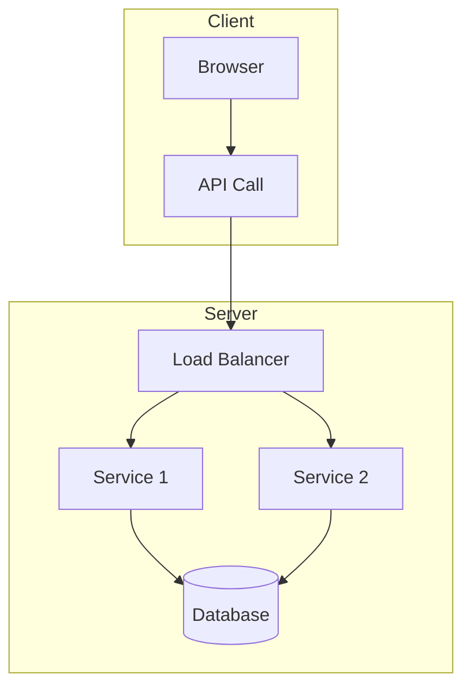
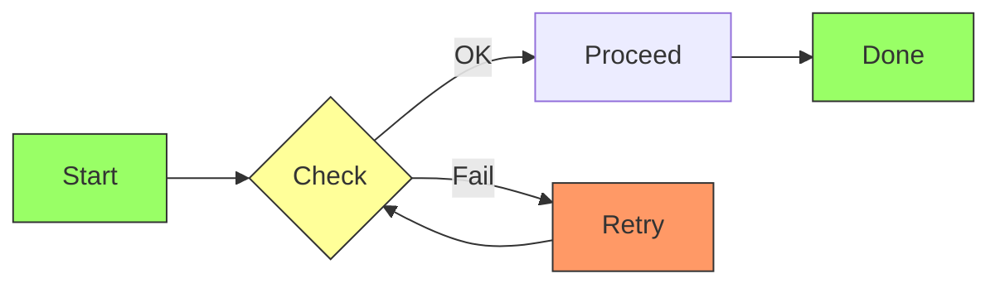

# Flowchart Reference

## Description

Flowcharts are composed of **nodes** (geometric shapes) and **edges** (arrows or lines). Use `flowchart` or `graph` keyword. Mermaid code defines how nodes and edges are made, supporting different arrow types, multi-directional arrows, subgraphs, and styling.

> **Warning:** The word `end` in lowercase breaks flowcharts. Capitalize (`End`, `END`) or wrap in quotes/brackets.
> **Warning:** Single-letter `o` or `x` as the first letter of a node after an edge creates circle/cross edge markers. Add a space or capitalize.

## Basic Syntax



- `flowchart` and `graph` are interchangeable
- Direction: `TD`/`TB` (top-down, default), `LR` (left-right), `RL`, `BT`

## Nodes

### Node Shapes

| Syntax | Shape | Example |
|--------|-------|---------|
| `id` | Default (rounded rect) | `A` |
| `id[Text]` | Rectangle | `A[Step 1]` |
| `id(Text)` | Rounded rectangle | `A(Start)` |
| `id((Text))` | Circle | `A((Go))` |
| `id[(Text)]` | Stadium | `A[(Server)]` |
| `id([Text])` | Subroutine | `A([Process])` |
| `id{Text}` | Rhombus (decision) | `A{Yes?}` |
| `id{{Text}}` | Hexagon | `A{{Hex}}` |
| `id[[Text]]` | Parallelogram | `A[[Data]]` |
| `id((Text))` | Circle | `A((O))` |
| `id(((Text)))` | Double circle | `A(((End)))` |
| `id[/Text/]` | AsciiMath (sloped right) | `A[/calc/]` |
| `id[\Text\]` | AsciiMath (sloped left) | `A[\calc\]` |
| `id>Text]` | Flag | `A>Alert]` |
| `id{Text}` | Diamond | `A{Decision}` |

### Node Text

- **Plain text:** `id[Label]`
- **Unicode:** `id["Text with ❤ emoji"]` — use double quotes
- **Markdown:** `id["`**bold** and _italic_`"]` — backticks inside double quotes, requires `htmlLabels: false`
- **Multi-line:** Use `<br/>` or actual newlines in quoted text
- **HTML:** Supported when `htmlLabels: true` (default)

### Node Styling



Style properties: `fill`, `stroke`, `stroke-width`, `stroke-dasharray`, `color`, `font-size`, `font-weight`, `text-align`.

### Class-Based Styling



## Edges

### Edge Types

| Syntax | Arrow Type | Example |
|--------|-----------|---------|
| `A --> B` | Solid arrow | Default |
| `A --- B` | Solid line (no arrow) | |
| `A -.-> B` | Dashed arrow | |
| `A -.- B` | Dotted arrow | |
| `A ==> B` | Thick arrow | |
| `A == B` | Thick line | |
| `A -.>. B` | Dashed thin arrow | |
| `A o-> B` | Open circle start | |
| `A x-> B` | Crossed circle start | |
| `A -->o B` | Open circle end | |
| `A -->x B` | Crossed circle end | |
| `A ==o> B` | Thick arrow, circle end | |
| `A ==>o B` | Thick arrow, open circle end | |

### Edge Labels

```mermaid
flowchart LR
    A -->|label| B
    A -- text --> B
    A ---|inline|--- B
```

- Arrow-first: `A -->|label| B`
- Text in middle: `A -- label --> B`
- Line with label: `A ---|label|--- B`

### Edge Styling



Or inline: `A -.[stroke:#f00,stroke-width:2px]-> B`

## Subgraphs

```mermaid
flowchart TD
    subgraph Init
        A[Setup] --> B[Configure]
    end
    subgroup "Processing" :proc
        C[Process 1] --> D[Process 2]
    end
    B --> C
    D --> E[Result]
```

- `subgraph id` or `subgraph id[label text]`
- `subgroup` for nested subgraphs with direction override
- Can have their own direction: `subgraph init[Init]:::class(TD)`

## Direction

```mermaid
flowchart TD
    A --> B

subgraph direction(LR)
    C --> D
end
```

- Top-level: `flowchart LR` / `flowchart TD`
- Per-subgraph: `subgraph name[Label](LR)`

## Click Links

```mermaid
flowchart LR
    click A "https://example.com" _blank
    click B "https://example.com/page" "Open page"
```

## Accessibility



- `accTitle:` — single-line accessible title
- `accDescr:` — single or multi-line description (multi-line uses `{...}`)

## Configuration

| Parameter | Description | Default |
|-----------|-------------|---------|
| `curve` | Edge curve style: `linear`, `basis` (default), `monotoneX` | `basis` |
| `diagramPadding` | Padding around diagram | `8` |
| `htmlLabels` | Use HTML labels | `true` |
| `useMaxWidth` | Use max width for container | `true` |
| `defaultRenderer` | Layout engine: `dagre`, `elk` | `dagre` |

## Examples

### Basic Flowchart



### Complex with Subgraphs



### With Styling and Classes


