# Sequence Diagram Reference

## Description

Sequence diagrams show how processes operate with one another and in what order. Participants appear as vertical lifelines; messages are horizontal arrows between them.

> **Warning:** The word `end` can break sequence diagrams. Wrap in quotes, parentheses, or brackets.

## Basic Syntax

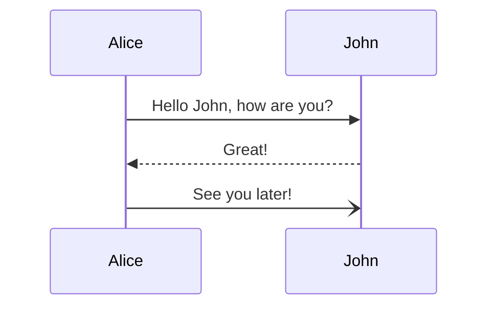

## Participants

### Implicit Declaration

Participants are declared by first appearance in messages.

### Explicit Declaration

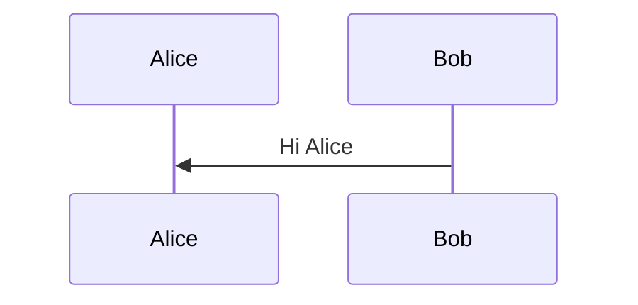

### Actor Symbol

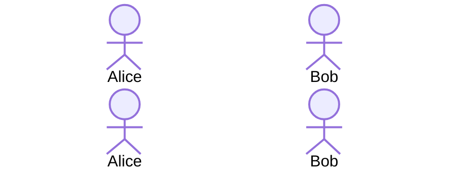

### Boundary / Control / Entity Symbols

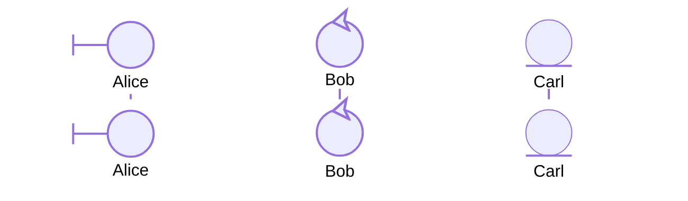

### Aliases

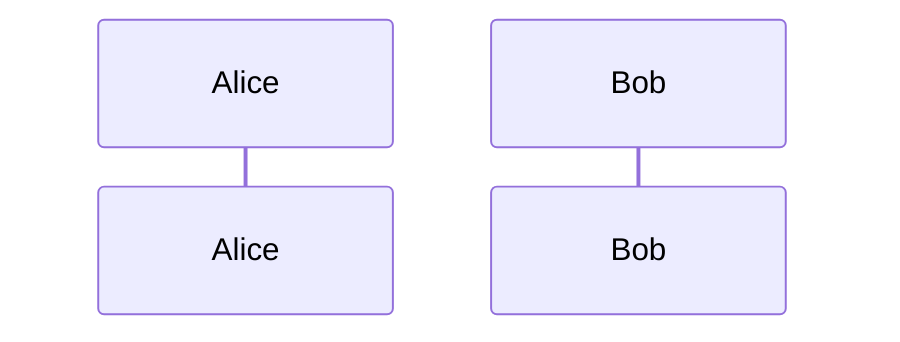

## Message Types

| Syntax | Arrow Style | Description |
|--------|-------------|-------------|
| `A->>B: msg` | Solid arrow | Synchronous call |
| `A-->B: msg` | Dashed arrow | Asynchronous reply |
| `A->B: msg` | Solid line, no arrowhead | |
| `A-x B: msg` | Solid line with cross | Deleted message |
| `A--)B: msg` | Dashed arrow | Async message |
| `A-)B: msg` | Thin dashed arrow | |
| `A==B: msg` | Note/sync return | |

## Notes

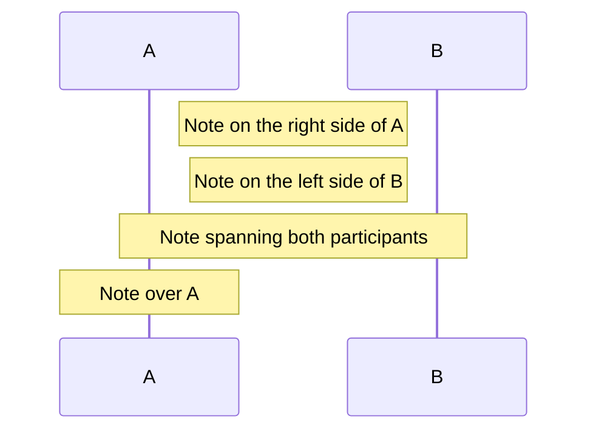

## Activations

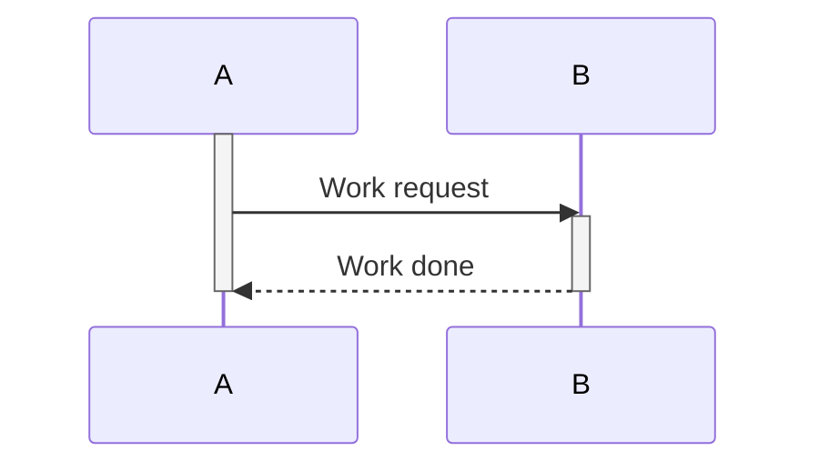

Or implicit (auto-activation):

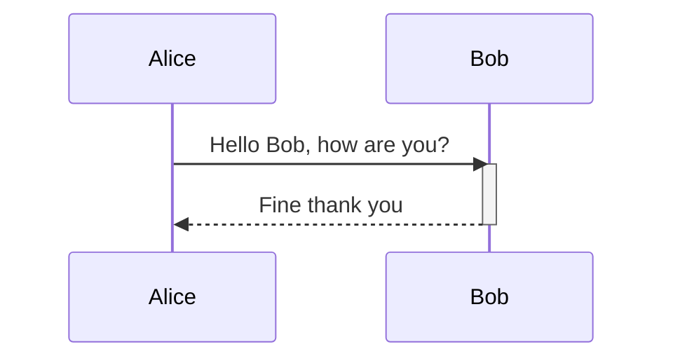

## Loops and Conditions

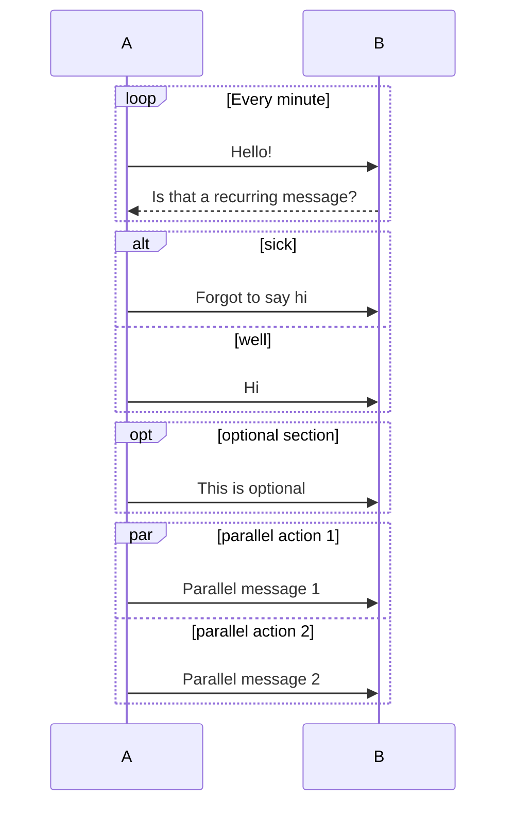

### Supported Blocks

| Keyword | Purpose |
|---------|---------|
| `loop ... end` | Repeating section |
| `alt ... else ... end` | Conditional branches |
| `opt ... end` | Optional section |
| `par ... and ... end` | Parallel sections |
| `break ... end` | Break the sequence |
| `critical ... option ... end` | Critical section with fallback options |

## autonumber

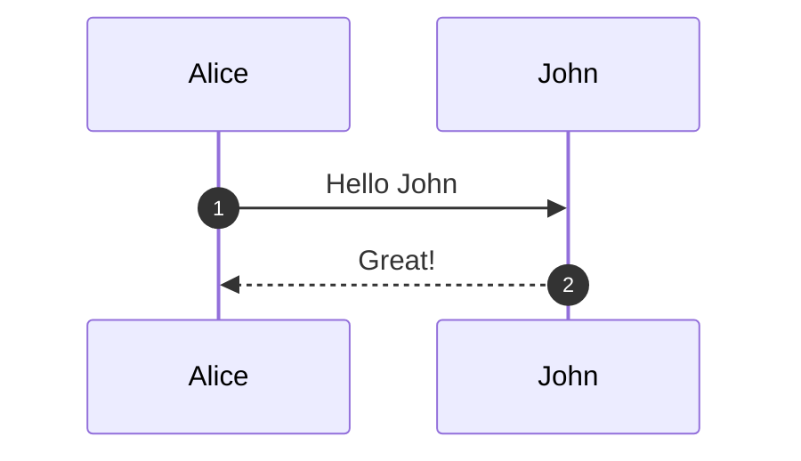

Auto-number messages starting from 1. Use `autonumber [offset]` to start from a different number.

## Box (Grouping Participants)

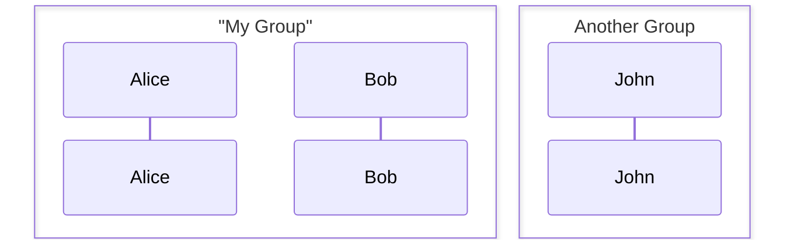

## Configuration

| Parameter | Description | Default |
|-----------|-------------|---------|
| `width` | Participant actor width | `150` |
| `height` | Participant actor height | `65` |
| `messageAlign` | `left`, `center`, `right` | `center` |
| `mirrorActors` | Mirror actors below diagram | `false` |
| `showSequenceNumbers` | Show message numbers | `false` |
| `wrap` | Wrap long messages | `false` |
| `wrapWidth` | Characters before wrapping | `200` |
| `rightAngles` | Use right angles for arrows | `false` |

## Accessibility

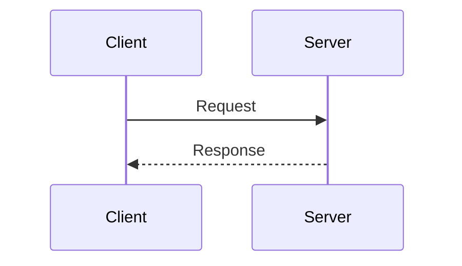

## Examples

### Full Example

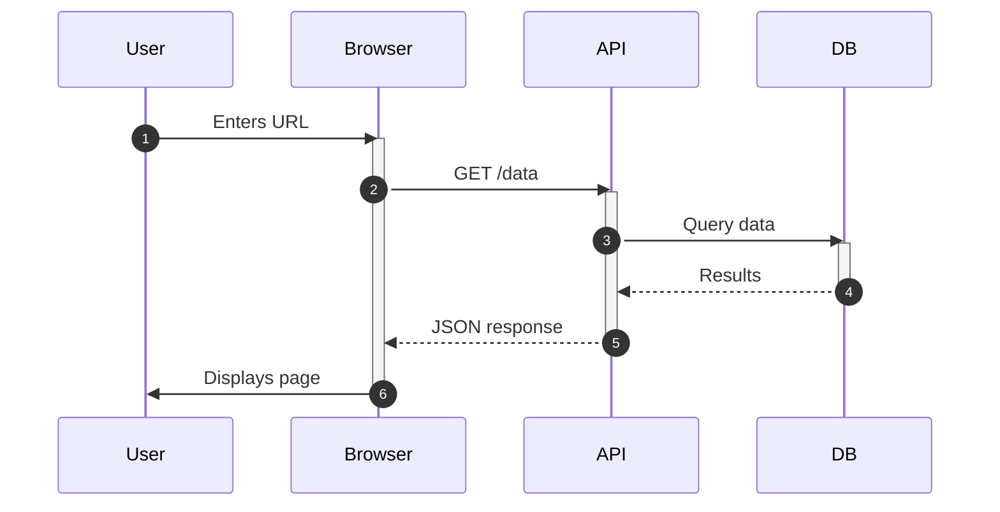

### With Conditions

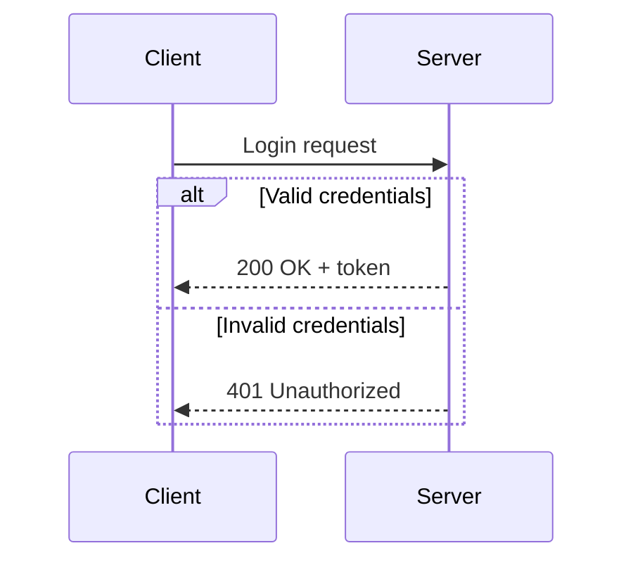
