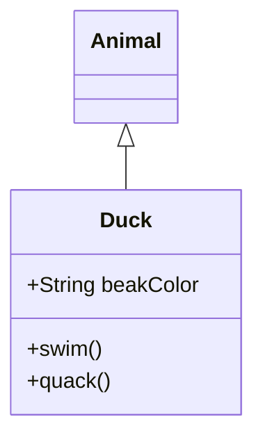
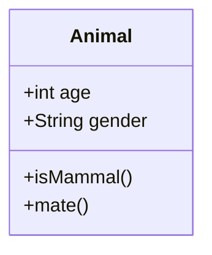
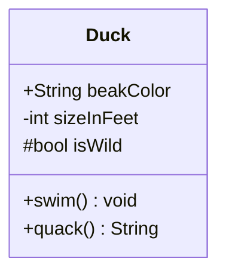
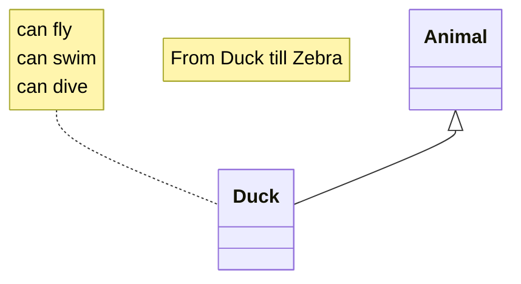
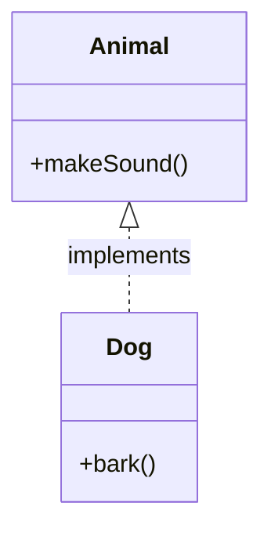
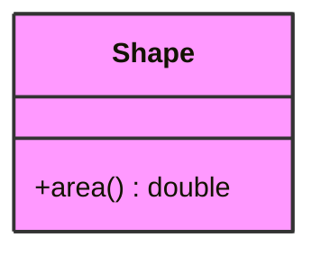
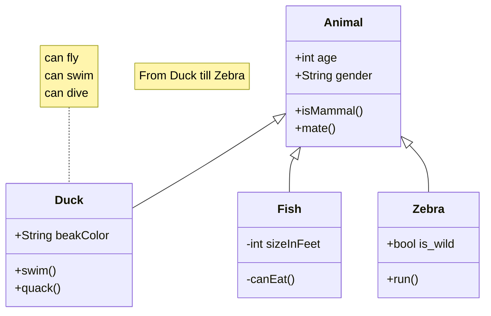
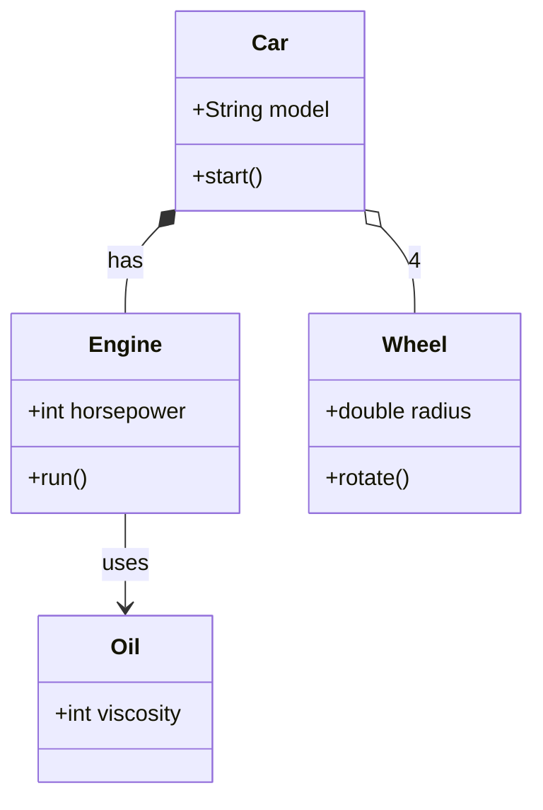

# Class Diagram Reference

## Description

UML class diagrams describe system structure by showing classes, their attributes, operations (methods), and relationships. Used for conceptual modeling and detailed design-to-code translation.

## Basic Syntax



## Class Definition

### Compact Notation



### Full Block Notation



### Visibility Modifiers

| Symbol | Meaning |
|--------|---------|
| `+` | Public |
| `-` | Private |
| `#` | Protected |
| `~` | Package/internal |

## Relationships

| Syntax | Relationship | Description |
|--------|-------------|-------------|
| `A -- B` | Association | Simple link |
| `A --> B` | Directed association | A depends on B |
| `A o-- B` | Aggregation | Whole-part (weak) |
| `A *-- B` | Composition | Whole-part (strong) |
| `A <|-- B` | Inheritance | B extends A |
| `A <|.. B` | Dependency/Implementation | B uses/implements A |
| `A -- B : label` | Labeled association | |
| `A o-- B : 1` | Aggregation with multiplicity | |
| `A *-- B : *` | Composition with multiplicity | |

### Multiplicity

| Symbol | Meaning |
|--------|---------|
| `0..1` | Zero or one |
| `0..*` / `*` | Zero or more |
| `1..1` / `` | Exactly one |
| `1..*` | One or more |
| `n..m` | Between n and m |

## Notes



## Enumerations

```mermaid
classDiagram
    enum Color {
        RED
        GREEN
        BLUE
    }
```

## Interfaces



## Class Styling



## Configuration

| Parameter | Description | Default |
|-----------|-------------|---------|
| `diagramPadding` | Padding around diagram | `8` |
| `htmlLabels` | Use HTML labels | `true` |
| `wrap` | Wrap text in class members | `false` |

## Examples

### Inheritance Hierarchy



### Composition and Aggregation


