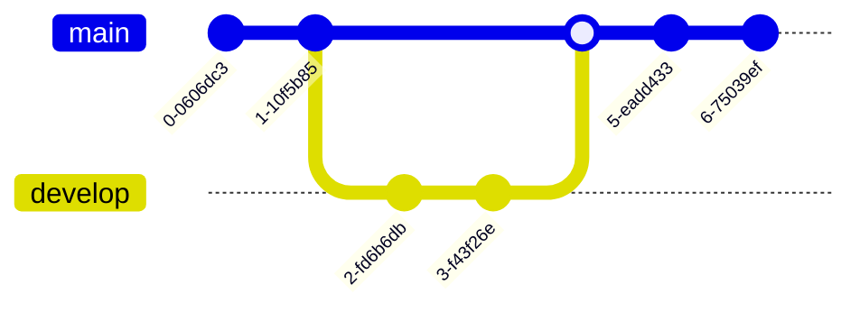
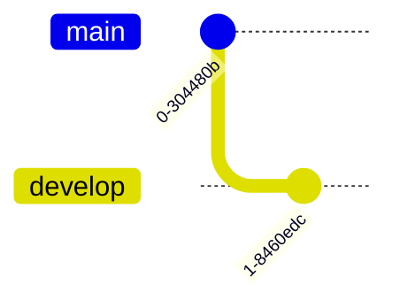
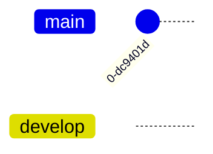
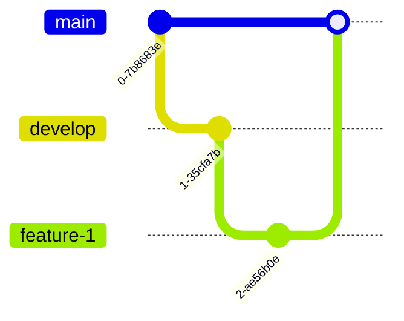
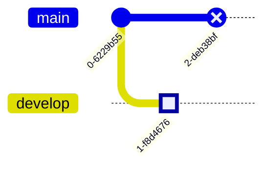
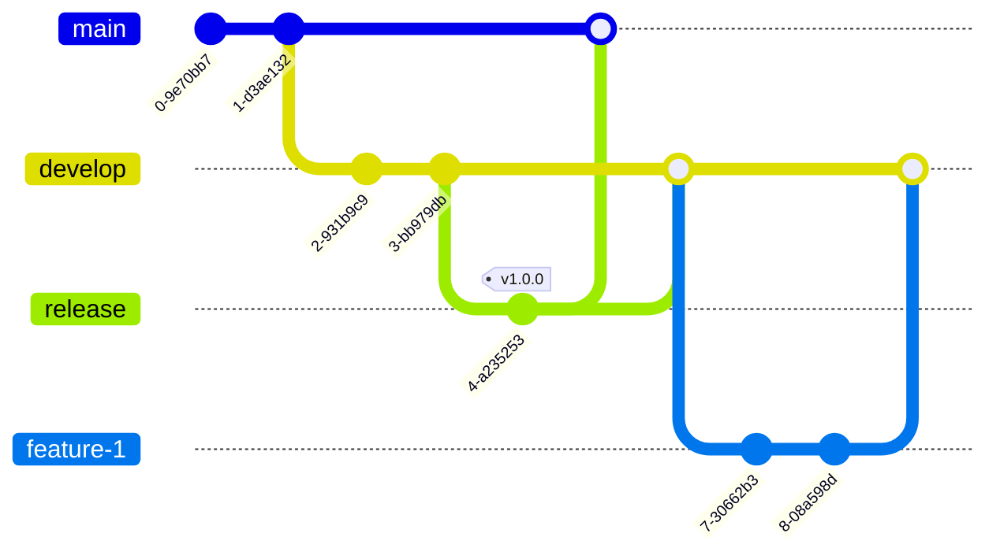
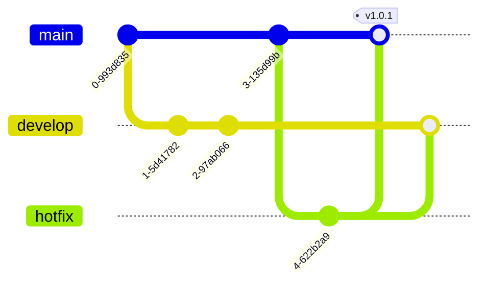

# GitGraph Reference

## Description

GitGraph diagrams visualize git commits and branch operations. Helpful for documenting branching strategies (git flow, trunk-based, etc.) and explaining commit history.

> **Note:** `checkout` and `switch` are interchangeable keywords.

## Basic Syntax



## Commands

### commit

Create a new commit on the current branch.


#### Commit Options

| Option | Description | Example |
|--------|-------------|---------|
| `msg` | Commit message | `commit msg: "Fix bug"` |
| `tag` | Tag on commit | `commit tag: "v1.0.0"` |
| `type` | Commit style | `HIGHLIGHT`, `REVERSE`, `NORMAL` |
| `strokefmt` | Custom stroke color | `strokefmt: "#ff0000"` |

### branch

Create and switch to a new branch.



### checkout / switch

Switch to an existing branch.



### merge

Merge a branch into the current branch.

```mermaid
gitGraph
    branch feature
    checkout feature
    commit
    checkout main
    merge feature
```

#### Merge Options

| Option | Description | Example |
|--------|-------------|---------|
| `msg` | Merge message | `merge feature msg: "Merge PR #42"` |
| `type` | Merge style | `NORMAL`, `REVERSE`, `HIGHLIGHT` |

### cherry-pick

Cherry-pick commits from another branch.


### reset

Reset the current branch.


#### Reset Types

| Type | Description |
|------|-------------|
| `soft` | Keep changes staged |
| `mixed` | Keep changes unstaged (default) |
| `hard` | Discard all changes |

## Branch Styling



### Custom Colors



## Configuration

| Parameter | Description | Default |
|-----------|-------------|---------|
| `showBranches` | Show branch labels | `true` |
| `mainBranchName` | Name of default branch | `"main"` |
| `direction` | Layout direction: `LR`, `TB` | `LR` |
| `nodeLargest` | Node size | `30` |
| `commitSpacing` | Space between commits | `250` |
| `diagramPadding` | Padding around diagram | `10` |
| `parallelCommitGap` | Gap for parallel commits | `50` |
| `showCommitLabel` | Show commit messages | `true` |

## Examples

### Git Flow Strategy



### Hotfix Workflow



### Cherry-Pick Example


