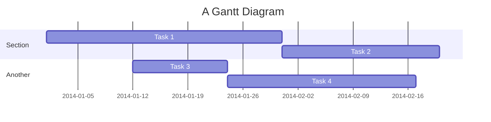
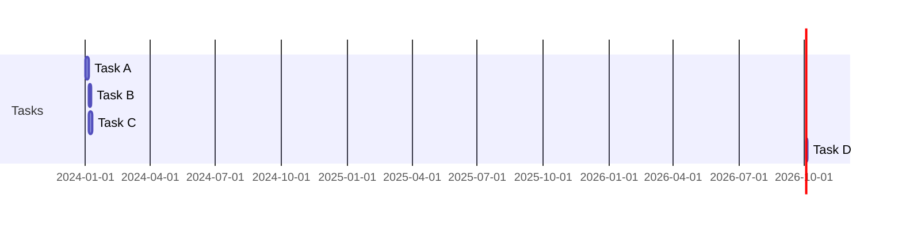
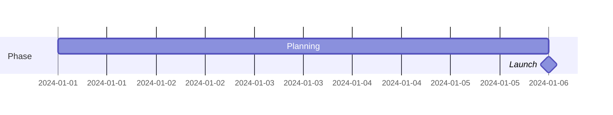
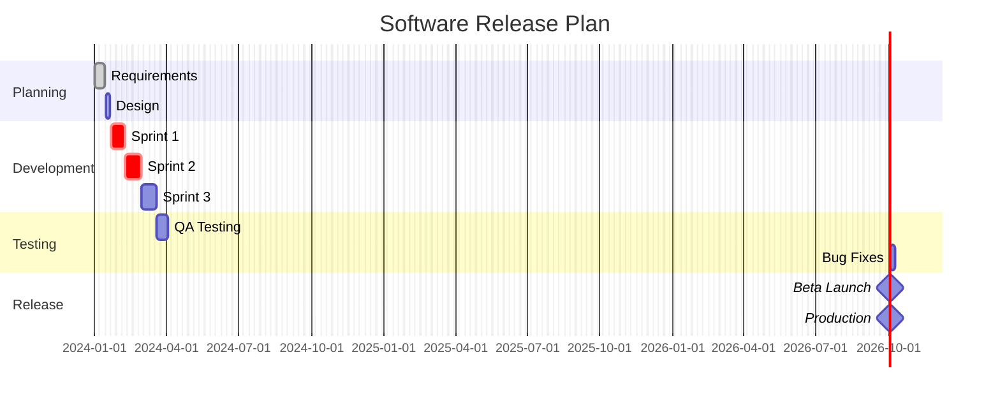
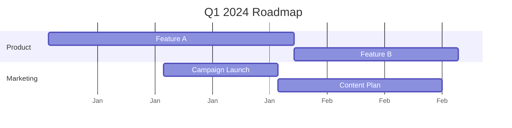

# Gantt Chart Reference

## Description

Gantt charts illustrate project schedules with tasks as horizontal bars along a time axis. Tasks extend left-to-right showing start and end dates, durations, and dependencies.

> **Note:** Excluded dates extend task duration to the right (no gaps within a bar). If excluded dates fall between two consecutive tasks, the gap is shown blank.

## Basic Syntax



## Directives

| Directive | Description | Example |
|-----------|-------------|---------|
| `title` | Chart title | `title My Project` |
| `dateFormat` | Date format string | `dateFormat YYYY-MM-DD` |
| `axisFormat` | X-axis display format | `axisFormat %Y-%m-%d` |
| ` excludes` | Excluded dates | `excludes weekends` |
| `section` | Task group | `section Phase 1` |

## Date Formats

Supported formats: `YYYY-MM-DD`, `DD-MM-YYYY`, `MM-DD-YYYY`, `ISO-8601`.

```mermaid
gantt
    dateFormat  YYYY-MM-DD
    title       Project Schedule
    excludes    weekends
```

## Task Syntax

```
Task Name : [status] id, start, duration
```

### Statuses

| Status | Description |
|--------|-------------|
| `done` | Completed task (gray) |
| `active` | In-progress task (blue) |
| `crit` | Critical path task (red) |
| *(none)* | Future/pending task |

Can combine: `crit, done`, `crit, active`.

### Duration Formats

| Format | Example | Meaning |
|--------|---------|---------|
| `Xd` | `30d` | X days |
| `Xh` | `24h` | X hours |
| `Xw` | `2w` | X weeks |
| `Xm` | `3m` | X months |
| `Xy` | `1y` | X years |

### Dependencies



### Milestones



## Exclusions

```mermaid
gantt
    excludes weekends
    excludes 2024-12-25
    excludes monday, friday
```

- `weekends` — Saturday and Sunday
- Day names: `monday`, `tuesday`, etc.
- Specific dates: `2024-12-25`

## Configuration

| Parameter | Description | Default |
|-----------|-------------|---------|
| `useWidth` | Maximum width in pixels | `100%` |
| `topPadding` | Top padding | `50` |
| `barHeight` | Height of task bars | `20` |
| `barGap` | Gap between bars | `4` |
| `topAxis` | Show top axis | `false` |
| `sectionFontSize` | Section font size | `16` |
| `numberSectionStyles` | Number of section styles | `4` |
| `displayMode` | `compact` or `default` | `default` |

## Examples

### Project Schedule



### Simple Timeline


