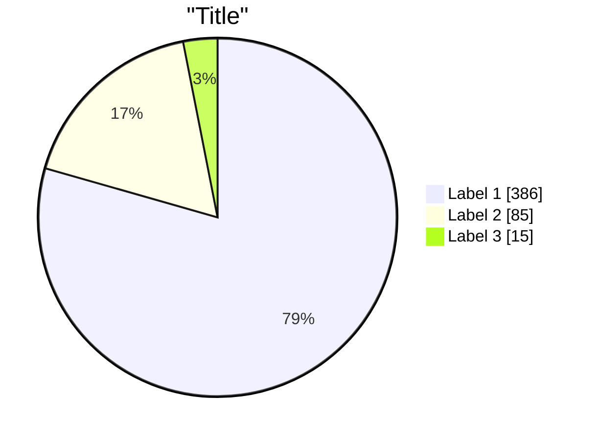

# Pie Charts

Circular statistical graphics divided into slices to illustrate numerical proportions.

## Syntax



- Values must be **positive numbers > 0** (zero and negative cause errors)
- Slices ordered clockwise in declaration order
- `showData` renders actual values after legend text

## Configuration

```yaml
---
config:
  pie:
    textPosition: 0.5          %% Label position (0.0 to 1.0, default ~0.75)
    donutHole: 0.4              %% Donut hole ratio (0 = no hole, 0.4 = donut)
    legendPosition: "right"     %% "right" (default), "left", "bottom"
    highlightSlice: [0, 2]      %% Array of slice indices to highlight
  themeVariables:
    pieOuterStrokeWidth: "5px"
    pieOuterStrokeColor: "#333"
    pieOpacity: 0.8
---
```

| Option             | Type     | Default  | Description                        |
|--------------------|----------|----------|------------------------------------|
| `textPosition`     | number   | ~0.75    | Label radial position              |
| `donutHole`        | number   | `0`      | Donut hole ratio (0–1)             |
| `legendPosition`   | string   | `right`  | Legend placement                   |
| `highlightSlice`   | array    | —        | Slice indices to highlight         |

## Theme variables

| Variable | Description |
| --- | --- |
| `pie1`–`pie12` | Fill colors for slices (cycle after 12) |
| `pieTitleTextSize` | Title text size (default: 25px) |
| `pieTitleTextColor` | Title color |
| `pieSectionTextSize` | Section label size (default: 17px) |
| `pieSectionTextColor` | Section label color |
| `pieLegendTextSize` | Legend text size (default: 17px) |
| `pieLegendTextColor` | Legend text color |
| `pieStrokeColor` | Slice border color (default: black) |
| `pieStrokeWidth` | Slice border width (default: 2px) |
| `pieOuterStrokeWidth` | Outer circle border width (default: 2px) |
| `pieOuterStrokeColor` | Outer circle border color (default: black) |
| `pieOpacity` | Slice opacity (default: 0.7) |
