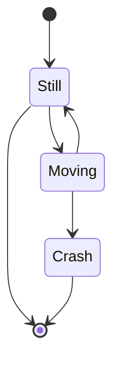
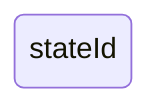
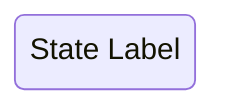
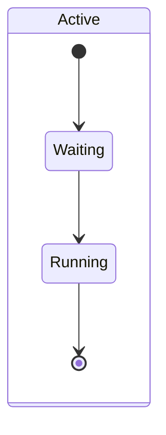
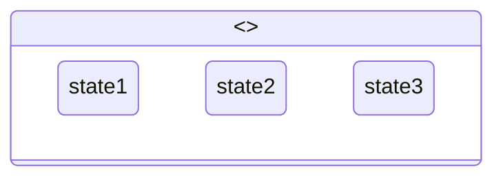
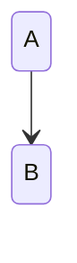
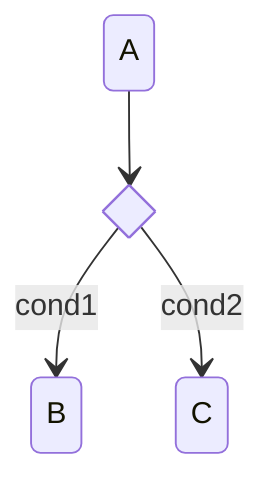
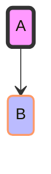
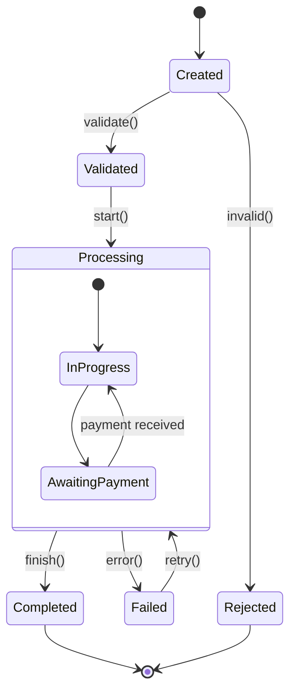
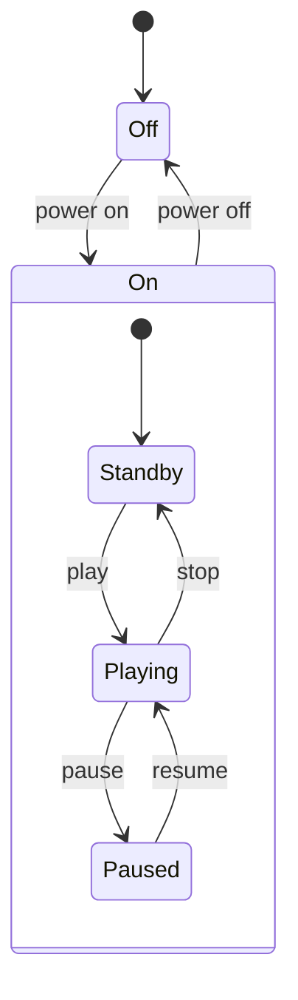

# State Diagram Reference

## Description

State diagrams describe system behavior through states and transitions. Systems are modeled as a finite set of states with transitions between them triggered by events.

> **Note:** Use `stateDiagram-v2` for the modern renderer with full features. Plain `stateDiagram` uses the older renderer.

## Basic Syntax



- `[*]` — Start and end pseudo-states
- `-->` — Transition arrow

## States

### Simple State



### State with Label



### Composite (Nested) States



### Parallel States



### Choice (Decision) States


## Transitions

### Basic Transition



### Labeled Transition

```mermaid
stateDiagram-v2
    Still -- is moving --> Moving
```

### Multiple Labels

```mermaid
stateDiagram-v2
    A -- click --> B
    A -- double click --> C
```

## Entry / Exit / Internal

```mermaid
stateDiagram-v2
    state StateName {
        [*] --> entry_state
        entry_state --> exit_state
        exit_state --> [*]
    }
    StateName : entry DoSomething()
    StateName : exit CleanUp()
```

## Choose (Conditional Transitions)



## Styling



## Configuration

| Parameter | Description | Default |
|-----------|-------------|---------|
| `defaultRenderer` | Layout: `dagre`, `elk` | `dagre` |
| `diagramPadding` | Padding around diagram | `8` |
| `htmlLabels` | Use HTML labels | `true` |

## Examples

### Traffic Light

```mermaid
stateDiagram-v2
    [*] --> Green
    Green -- timer --> Yellow
    Yellow -- timer --> Red
    Red -- sensor --> Green
    Red -- timer --> Yellow
    Yellow --> Red
```

### Order Processing



### With Composite States


