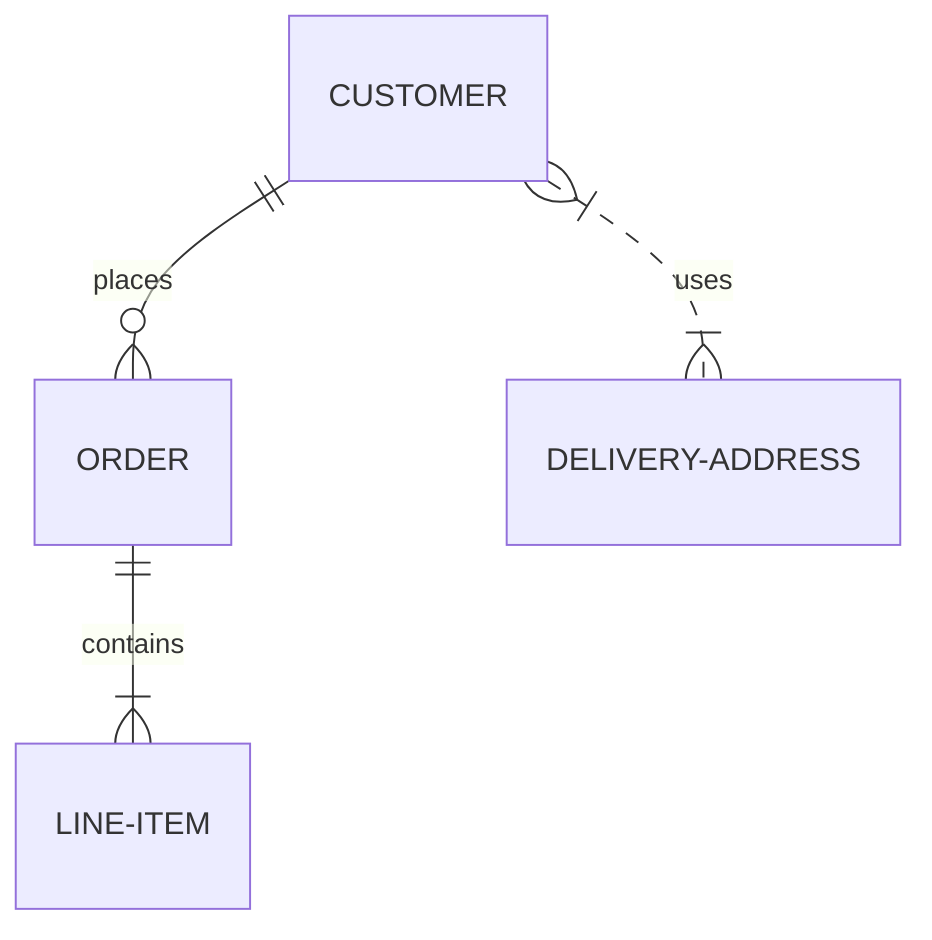
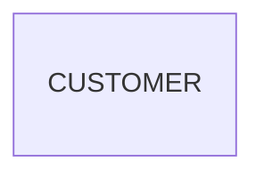
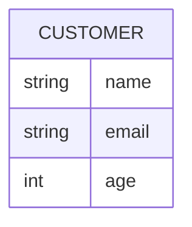
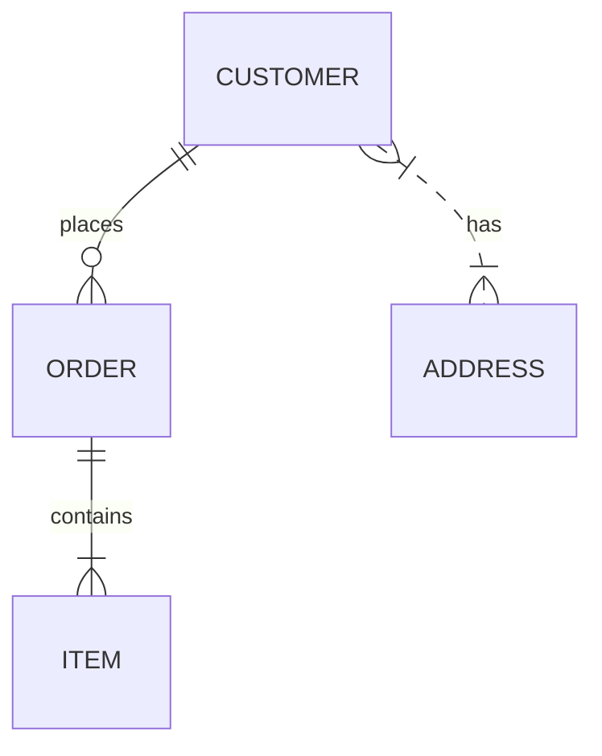
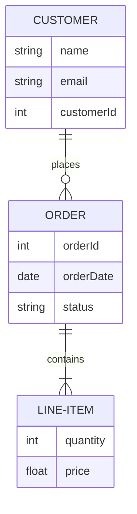
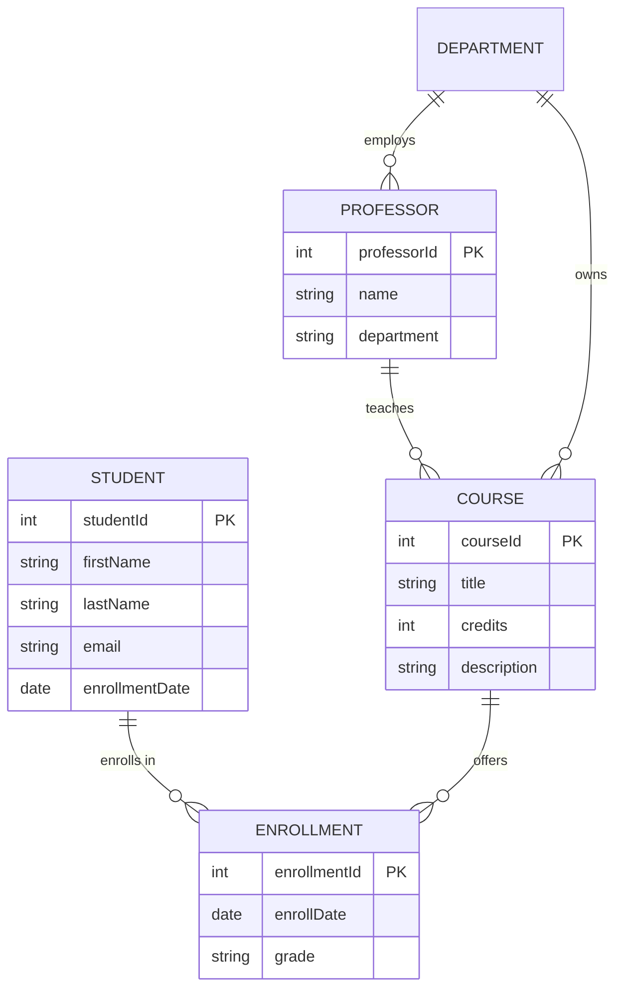

# ER Diagram Reference

## Description

Entity-Relationship (ER) diagrams model data structures using entities, attributes, and relationships. Uses crow's foot notation for cardinality. Useful for database design and domain modeling.

## Basic Syntax



## Entities

### Simple Entity



### Entity with Attributes



## Relationships (Crow's Foot Notation)

| Left Side | Right Side | Meaning |
|-----------|------------|---------|
| `||` | `o{` | One to zero or many |
| `||` | `\|{` | One to many (at least one) |
| `}|` | `o{` | Zero or one to zero or many |
| `}|` | `\|{` | Zero or one to many |
| `||` | `o\|` | One to zero or one |
| `||` | `||` | One to one |
| `}|` | `o\|` | Zero or one to zero or one |
| `}|` | `||` | Zero or one to one |

### Line Styles

| Symbol | Meaning |
|--------|---------|
| `--` | Solid line |
| `..` | Dashed line |

### Full Syntax

```
ENTITY1 <left_cardinality><line_style><right_cardinality> ENTITY2 : "relationship label"
```



## Examples

### Simple ER Diagram



### Complex Schema


