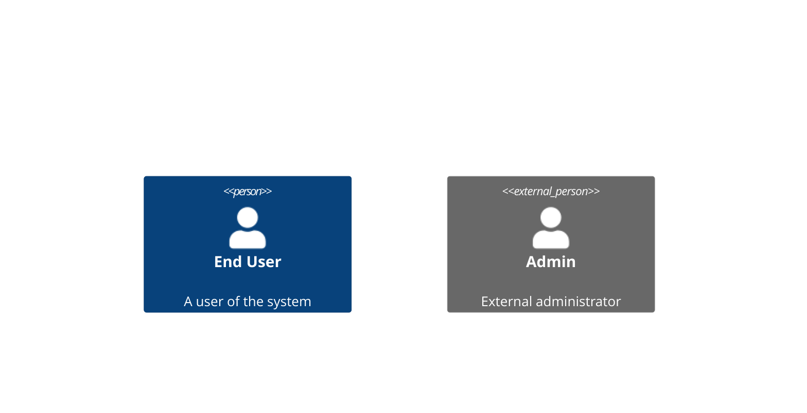
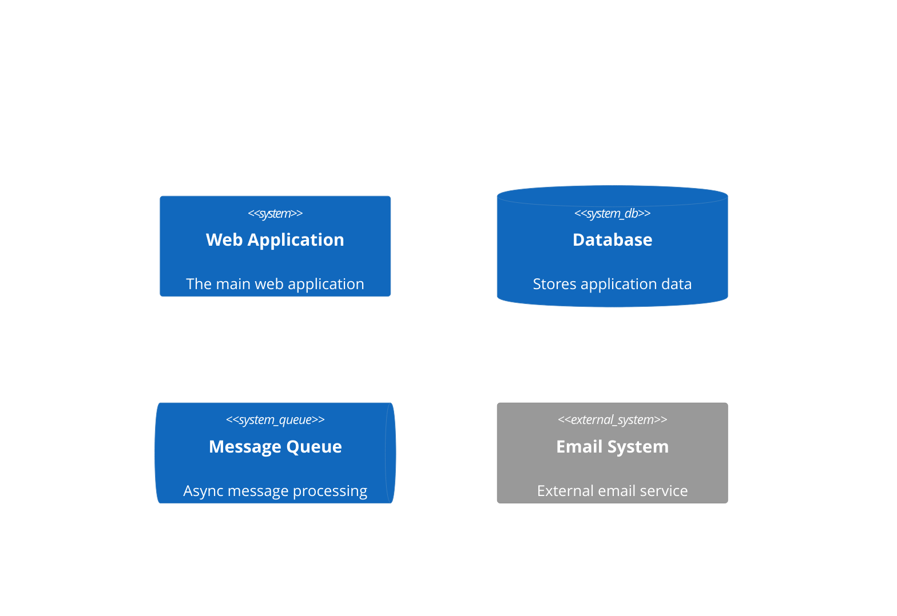
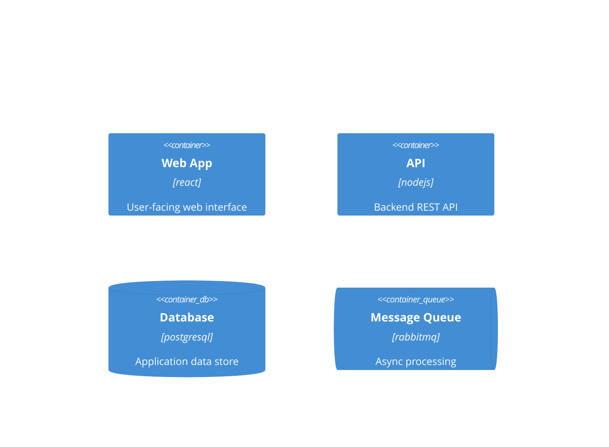
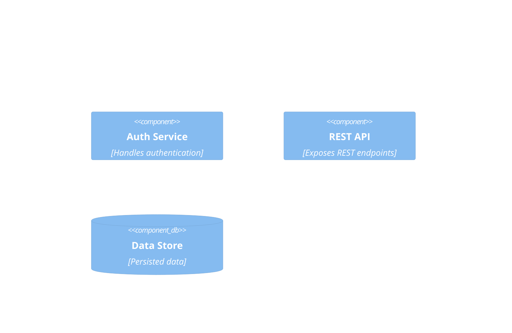
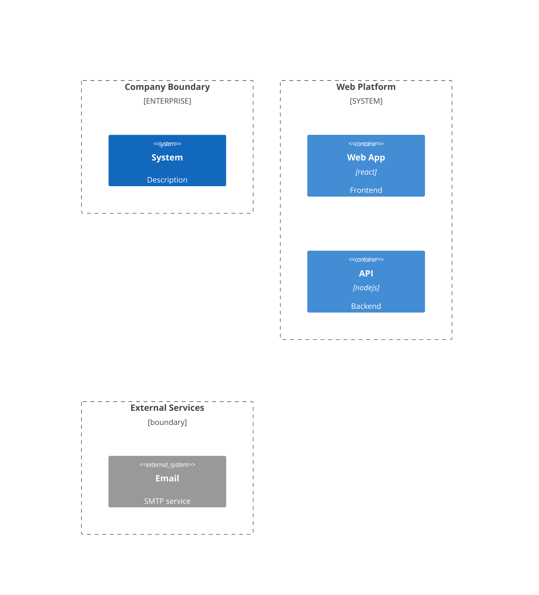
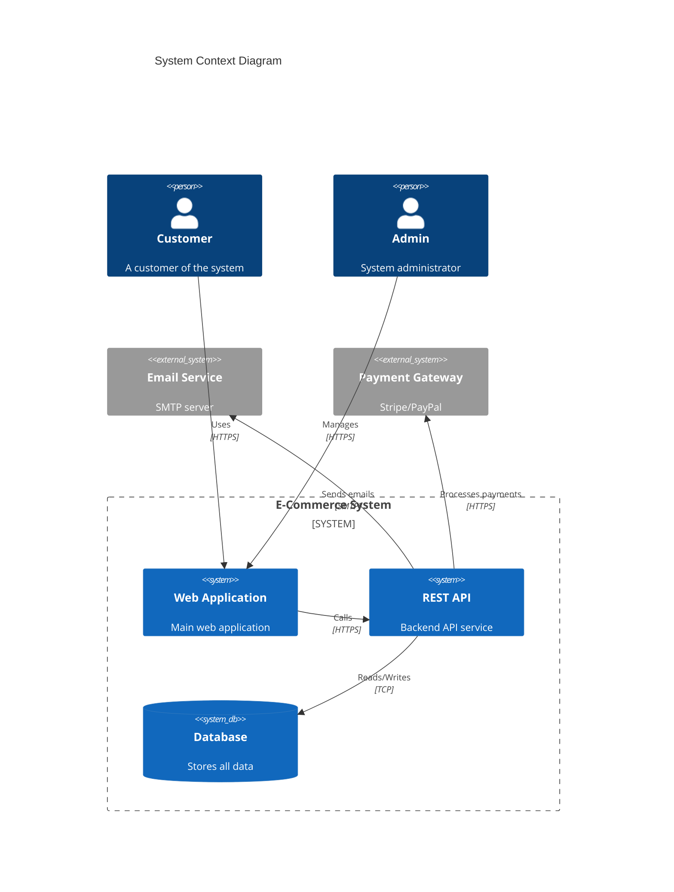

# C4 Diagram Reference

## Description

C4 model diagrams represent software architecture at different abstraction levels. Compatible with plantUML C4 syntax. Four diagram types: Context, Container, Component, Dynamic, and Deployment.

> **Note:** Experimental diagram — syntax may change in future releases.

## Diagram Types

| Keyword | Level | Purpose |
|---------|-------|---------|
| `C4Context` | System Context | System and its users/external systems |
| `C4Container` | Container | Containers (apps, databases, file systems) within a system |
| `C4Component` | Component | Components within a container |
| `C4Dynamic` | Dynamic | Runtime interactions between containers/components |
| `C4Deployment` | Deployment | Deployment topology |

## Elements

### People



### Systems



### Containers



### Components



### Boundaries



## Relationships

```mermaid
C4Context
    Rel(user, webApp, "Uses")
    Rel(webApp, api, "Calls", "HTTPS")
    BiRel(user, webApp, "Interacts with")
    Rel_U(user, webApp, "Uses", "HTTPS")
    Rel_D(webApp, db, "Reads/Writes", "TCP")
    Rel_R(api, queue, "Publishes to")
    Rel_L(queue, worker, "Consumes from")
```

### Relationship Directions

| Keyword | Direction |
|---------|-----------|
| `Rel` | Auto (default) |
| `Rel_U` | Up |
| `Rel_D` | Down |
| `Rel_L` | Left |
| `Rel_R` | Right |
| `BiRel` | Bidirectional |

## Styling

```mermaid
C4Context
    UpdateElementStyle(user, $fontColor="red", $bgColor="grey", $borderColor="red")
    UpdateRelStyle(user, webApp, $textColor="blue", $lineColor="blue", $offsetY="-10")
```

### Style Properties

| Property | Description |
|----------|-------------|
| `$fontColor` | Text color |
| `$bgColor` | Background color |
| `$borderColor` | Border color |
| `$textColor` | Relationship text color |
| `$lineColor` | Relationship line color |
| `$offsetX` | Horizontal offset |
| `$offsetY` | Vertical offset |

## Layout

```mermaid
C4Context
    UpdateLayoutConfig($c4ShapeInRow="3", $c4BoundaryInRow="1")
```

## Examples

### System Context Diagram



### Container Diagram

```mermaid
C4Container
    title Container Diagram

    Person(user, "User", "App user")

    Container_Spa(spa, "Single Page App", "react", "User-facing interface")
    Container(mobile, "Mobile App", "flutter", "Mobile application")
    Container(api, "API Service", "nodejs", "Backend API")
    ContainerDb(db, "Database", "postgresql", "Data store")
    Container(queue, "Message Queue", "rabbitmq", "Async jobs")

    Rel(user, spa, "Uses")
    Rel(user, mobile, "Uses")
    Rel(spa, api, "Calls", "HTTPS/JSON")
    Rel(mobile, api, "Calls", "HTTPS/JSON")
    Rel(api, db, "Reads/Writes", "TCP")
    Rel(api, queue, "Publishes to", "AMQP")
```
