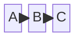
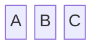
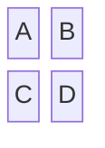
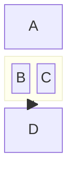
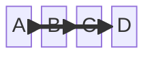
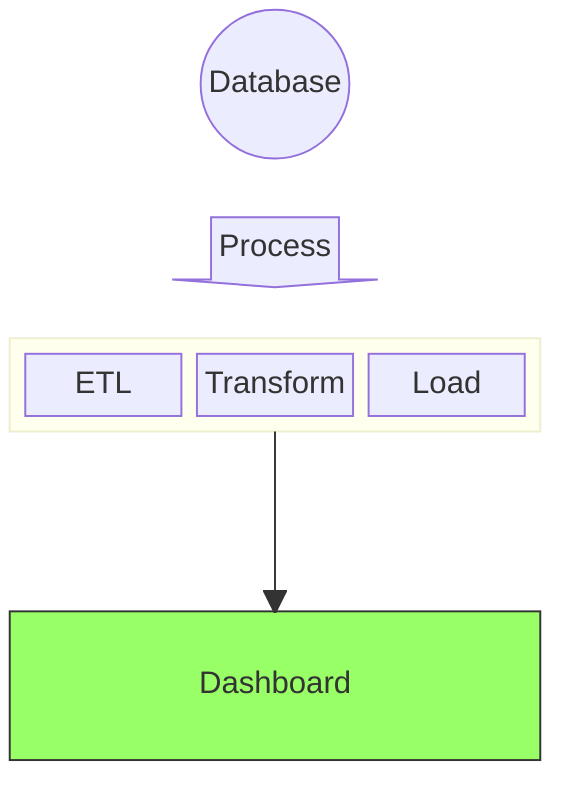

# Block Diagram Reference

## Description

Block diagrams give the author full control over shape positioning using a grid layout. Unlike flowcharts where auto-layout may move shapes, block diagrams let you explicitly place each block. Useful for system architectures, network diagrams, and process flows.

## Basic Syntax



## Block Shapes

| Syntax | Shape | Example |
|--------|-------|---------|
| `A` | Default (rounded rect) | `A` |
| `A["Label"]` | Rectangle with label | `A["Server"]` |
| `A(("Label"))` | Circle/ellipse | `A(("DB"))` |
| `A<["Label"]>` | Left arrow | `A<["Input"]>` |
| `A>["Label"]>` | Right arrow | `A>["Output"]>` |
| `A^["Label"]>` | Up arrow | `A^["Up"]>` |
| `A_v["Label"]` | Down arrow | `A_v["Down"]>` |
| `Aspace` | Empty space | `space` |

## Grid Layout

### Columns



Blocks are placed left-to-right, wrapping to the next row when the column count is reached.

### Rows and Columns Together



This creates a 2-column grid:
```
A | B
C | D
```

## Nested Blocks (Groups)



- `block:id` — Named group
- `block:id["Label"]` — Named group with label
- Reference the group by its `id` for connections

## Connectors



Same connector syntax as flowcharts: `-->`, `---`, `-.->`, `==>`.

## Styling

```mermaid
block
    A
    style A fill:#f9f,stroke:#333,stroke-width:4px
```



## Examples

### Simple Pipeline



### System Architecture

```mermaid
block
    columns 3
    Client["Web Client"]
    space
    space
    LB["Load Balancer"]
    API1["API Server 1"]
    API2["API Server 1"]
    DB1[(DB 1)]
    DB2[(DB 2)]

    Client --> LB
    LB --> API1
    LB --> API2
    API1 --> DB1
    API2 --> DB2
```

### With Nested Blocks

```mermaid
block
    columns 1
    User["User"]
    block:Frontend
        Web["Web App"]
        Mobile["Mobile App"]
    end
    block:Backend
        API["API Gateway"]
        Auth["Auth Service"]
        Data["Data Service"]
    end
    DB[(Database)]

    User --> Frontend
    Frontend --> Backend
    Backend --> DB
```
