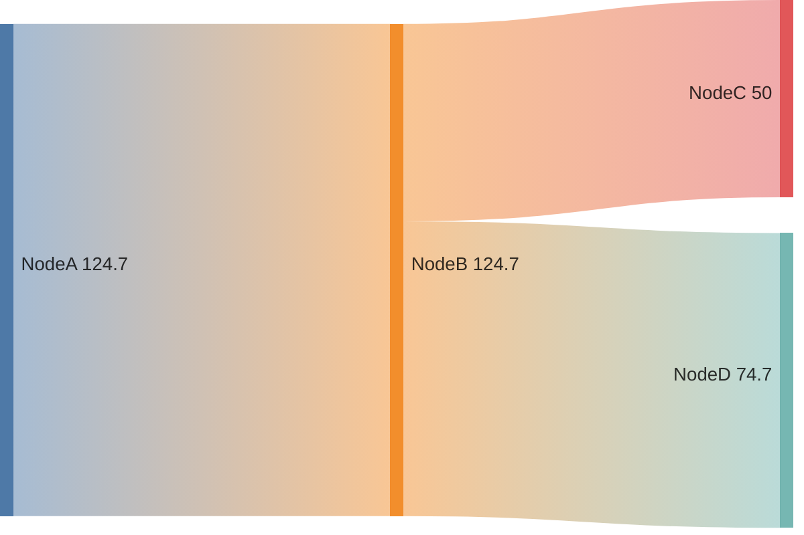

# Sankey Diagrams (v10.3.0+)

Visualize flows from one set of values to another. Nodes are entities, links show flow volume.

## Syntax

CSV-like format: `source,target,value`



- Nodes with spaces use single quotes: `'Agricultural waste',Bio-conversion,124.7`
- Values are numeric (integers or decimals)
- Links define both nodes and their connection values
- Empty lines between rows are allowed for readability

### Commas in node names

Wrap names containing commas in double quotes:

```
Pumped heat,"Heating and cooling, homes",193.026
Pumped heat,"Heating and cooling, commercial",70.672
```

### Double quotes in node names

Escape with doubled quotes inside quoted strings:

```
Pumped heat,"Heating, ""homes""",193.026
```

## Configuration

```yaml
---
config:
  sankey:
    showValues: true     %% Show numeric values on links
---
```

| Option          | Type   | Default  | Description                          |
|-----------------|--------|----------|--------------------------------------|
| `showValues`    | bool   | `true`   | Show values on links                 |
| `linkColor`     | string | `source` | Link coloring mode                   |
| `nodeAlignment` | string | `left`   | Node alignment                       |
| `labelStyle`    | string | `legacy` | Label rendering (v11.15.0+)          |
| `nodeWidth`     | number | `10`     | Node rectangle width in px (v11.15.0+) |
| `nodePadding`   | number | `12`     | Vertical padding between nodes (v11.15.0+) |
| `nodeColors`    | object | —        | Custom per-node colors (v11.15.0+)   |

### Link coloring

- `source` — link takes source node color
- `target` — link takes target node color
- `gradient` — smooth gradient between source and target
- hex code — e.g., `#a1a1a1` for uniform color

### Node alignment

- `justify`, `center`, `left`, `right`

### Label style (v11.15.0+)

- `legacy` (default) — plain text labels
- `outlined` — labels with background stroke for readability

### Custom node colors (v11.15.0+)

```yaml
---
config:
  sankey:
    nodeColors:
      Electricity grid: "#4e79a7"
      Industry: "#e15759"
      Losses: "#bab0ab"
---
```

Unlisted nodes use the default color scheme.
