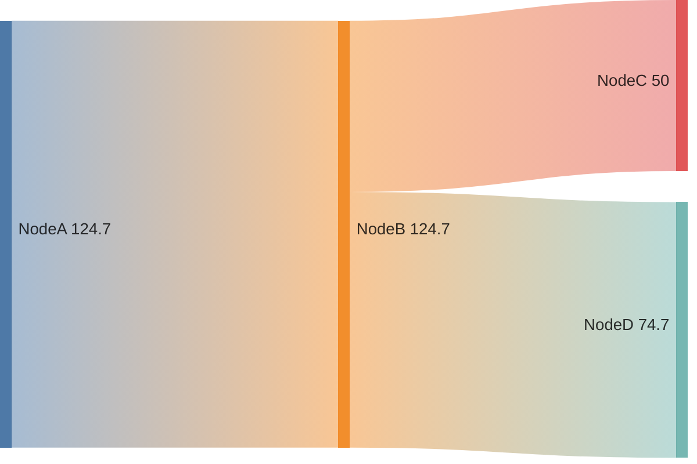

# Sankey Diagrams (v10.3.0+)

Visualize flows from one set of values to another. Nodes are entities, links show flow volume.

## Syntax

CSV-like format: `source,target,value`



- Nodes with spaces use single quotes: `'Agricultural waste',Bio-conversion,124.7`
- Values are numeric (integers or decimals)
- Links define both nodes and their connection values

## Configuration

```yaml
---
config:
  sankey:
    showValues: true     %% Show numeric values on links
---
```
