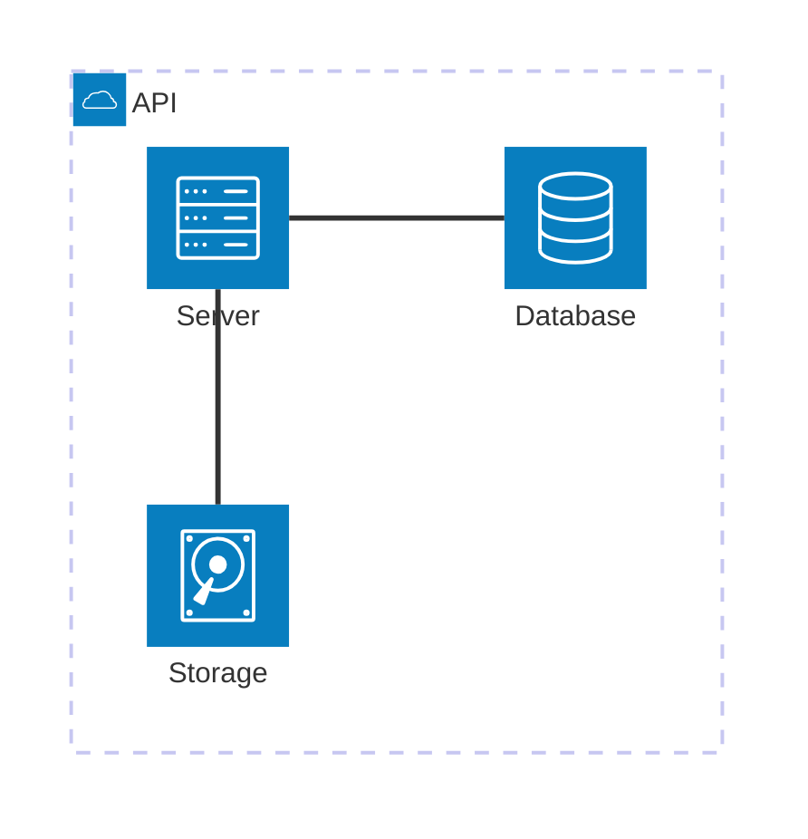

# Architecture Diagram Reference

## Description

Architecture diagrams show relationships between cloud services and CI/CD resources. Services (nodes) are connected by edges. Related services can be grouped to illustrate organization.

> **Note:** Uses `architecture-beta` keyword — experimental, syntax may evolve.

## Basic Syntax



## Elements

### Groups

```mermaid
architecture-beta
    group id(icon)[Label]
    group id(icon)[Label] in parentGroup
```

- `id` — Unique identifier
- `(icon)` — Icon name (optional)
- `[Label]` — Display label
- `in parentGroup` — Nested in another group

### Services


### Edges


#### Edge Directions

| Direction | Meaning |
|-----------|---------|
| `T` | Top |
| `B` | Bottom |
| `L` | Left |
| `R` | Right |

### Junctions


## Icons

Common icon names: `cloud`, `database`, `disk`, `server`, `monitor`, `network`, `storage`, `security`, `code`, `people`, `gear`, `flag`, `heart`, `star`.

## Examples

### Cloud Architecture


### CI/CD Pipeline


