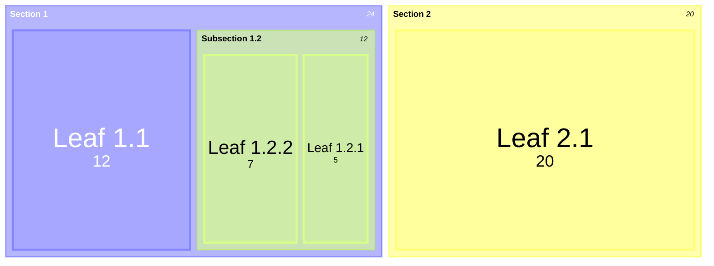

# Treemaps

Hierarchical data displayed as nested rectangles. Rectangle size is proportional to value.

## Syntax



## Node types

| Type | Syntax | Description |
| --- | --- | --- |
| Section (parent) | `"Name"` | Container node, no value |
| Leaf (value) | `"Name": value` | Terminal node with numeric value |

Hierarchy is defined by indentation (spaces or tabs).

## Styling

```
"Section 1.2":::highlight
    "Leaf": 12:::highlight
classDef highlight fill:red,color:blue,stroke:#FFD600;
```

Apply `:::className` to sections and leaves. Use `classDef` to define styles.

## Configuration

Under the `treemap` config key:

| Option          | Type    | Default | Description                      |
|-----------------|---------|---------|----------------------------------|
| `padding`       | number  | `0`     | Padding between rectangles       |
| `rounding`      | boolean | `false` | Rounded corners                  |
| `clickable`     | boolean | `true`  | Enable click events              |

```yaml
---
config:
  treemap:
    padding: 5
    rounding: true
---
```

## Advanced features

### Root label

Set a title for the treemap root:

```
treemap-beta
    root("Project Structure")
        "src": 100
            "components": 40
            "utils": 20
```

### Nested sections

Deep nesting is supported — each level of indentation creates a new hierarchy layer.
