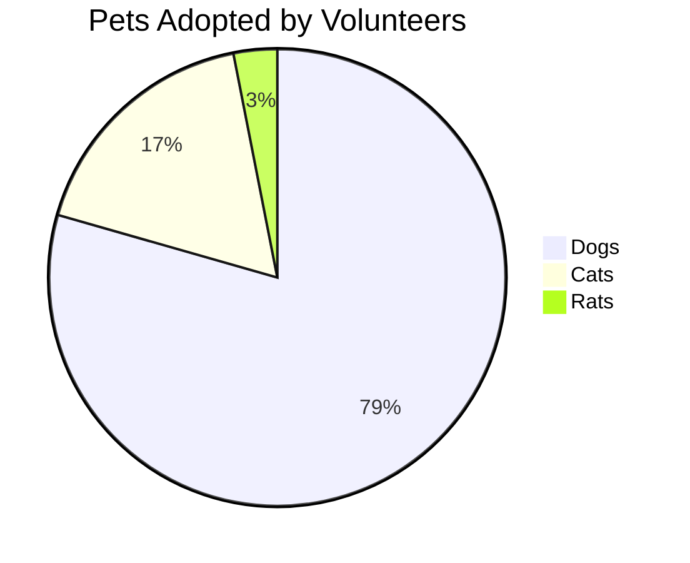
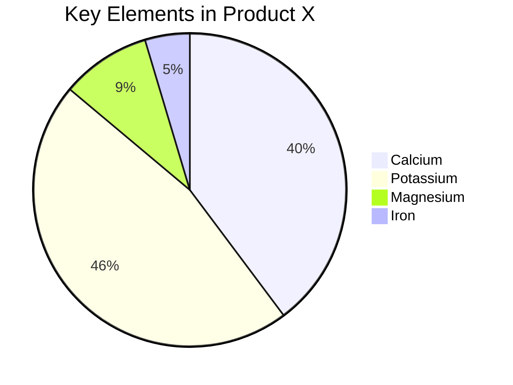
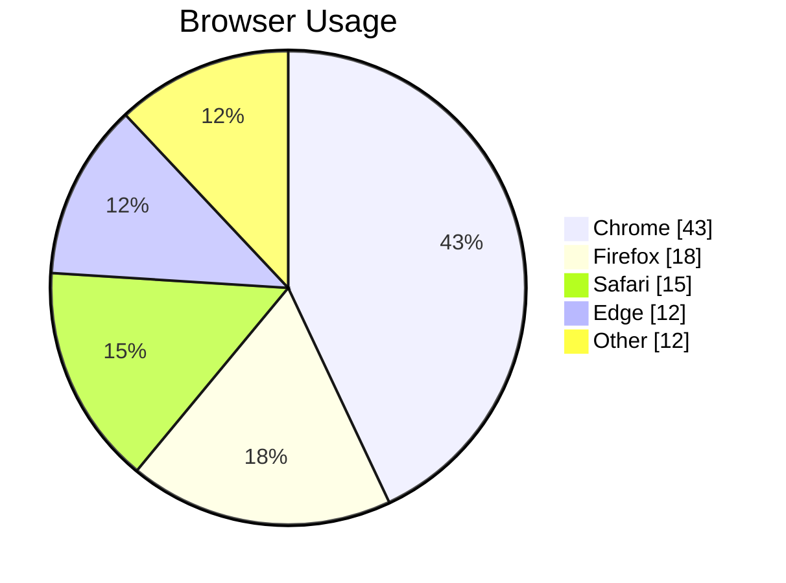
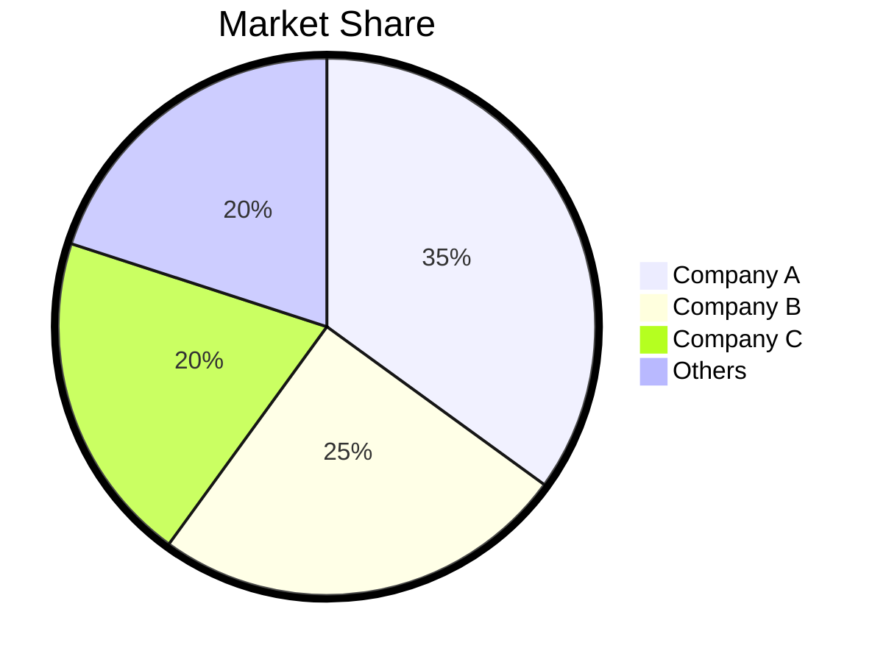

# Pie Chart Reference

## Description

Pie charts illustrate numerical proportions as circular slices. Arc length, central angle, and area of each slice are proportional to the quantity it represents.

> **Warning:** Values must be positive numbers greater than zero. Negative values and zero cause errors.

## Basic Syntax

## Options

| Option | Description |
|--------|-------------|
| `title` | Chart title (optional) | `title My Pie Chart` |
| `showData` | Show data values after legend text (optional) | |

## Configuration

| Parameter | Description | Default |
|-----------|-------------|---------|
| `textPosition` | Axial position of labels (0.0=center, 1.0=edge) | `0.75` |
| `pieOuterStrokeWidth` | Outer stroke width | `"2px"` |

## Examples

### Basic Pie Chart

### With showData

### With Custom Styling

