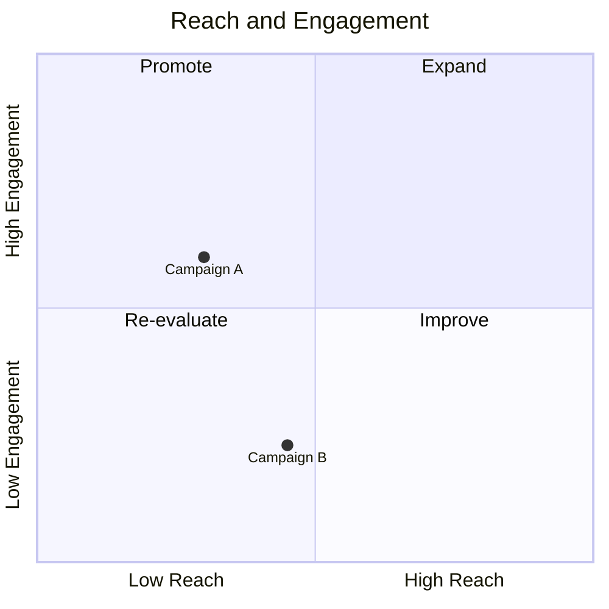
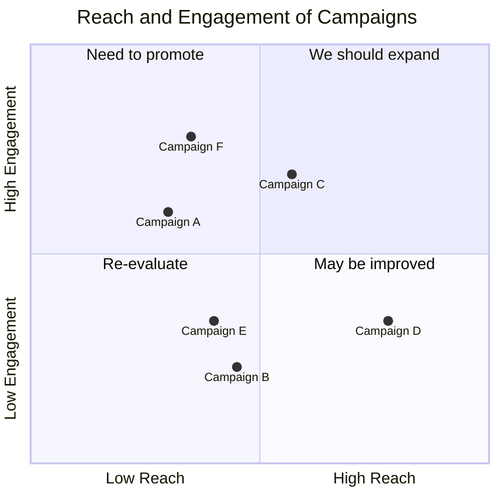
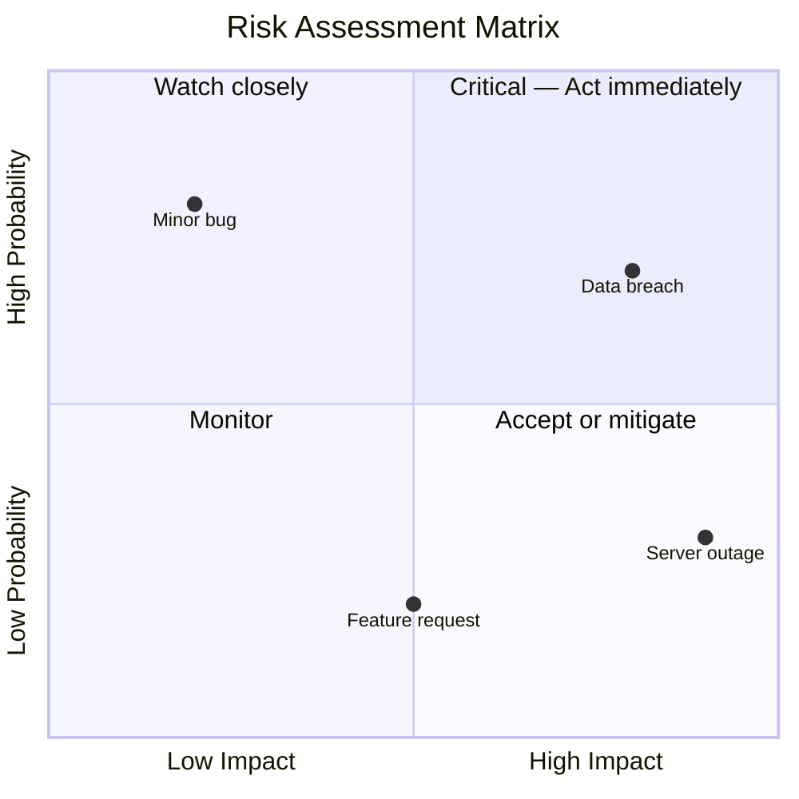

# Quadrant Chart Reference

## Description

Quadrant charts plot data points on a two-dimensional grid divided into four quadrants. Used to identify patterns, prioritize actions, and compare items across two variables. Common in business analysis, marketing, and risk management.

> **Note:** Point coordinates must be between 0 and 1. Values outside this range are clamped silently.

## Basic Syntax



## Axes

### X-Axis

```
x-axis <left_label> --> <right_label>
x-axis <left_label>          %% Only left label
```

### Y-Axis

```
y-axis <bottom_label> --> <top_label>
y-axis <bottom_label>            %% Only bottom label
```

## Quadrants

Quadrants are numbered counter-clockwise from top-right:

| Quadrant | Position |
|----------|----------|
| `quadrant-1` | Top-right |
| `quadrant-2` | Top-left |
| `quadrant-3` | Bottom-left |
| `quadrant-4` | Bottom-right |

```
quadrant-1 "Label"
quadrant-2 "Label"
quadrant-3 "Label"
quadrant-4 "Label"
```

## Data Points

```
Point Label: [x, y]
```

- `x` and `y` are values between 0 and 1
- Point labels can contain spaces (no quotes needed)

## Examples

### Campaign Analysis



### Risk Assessment


