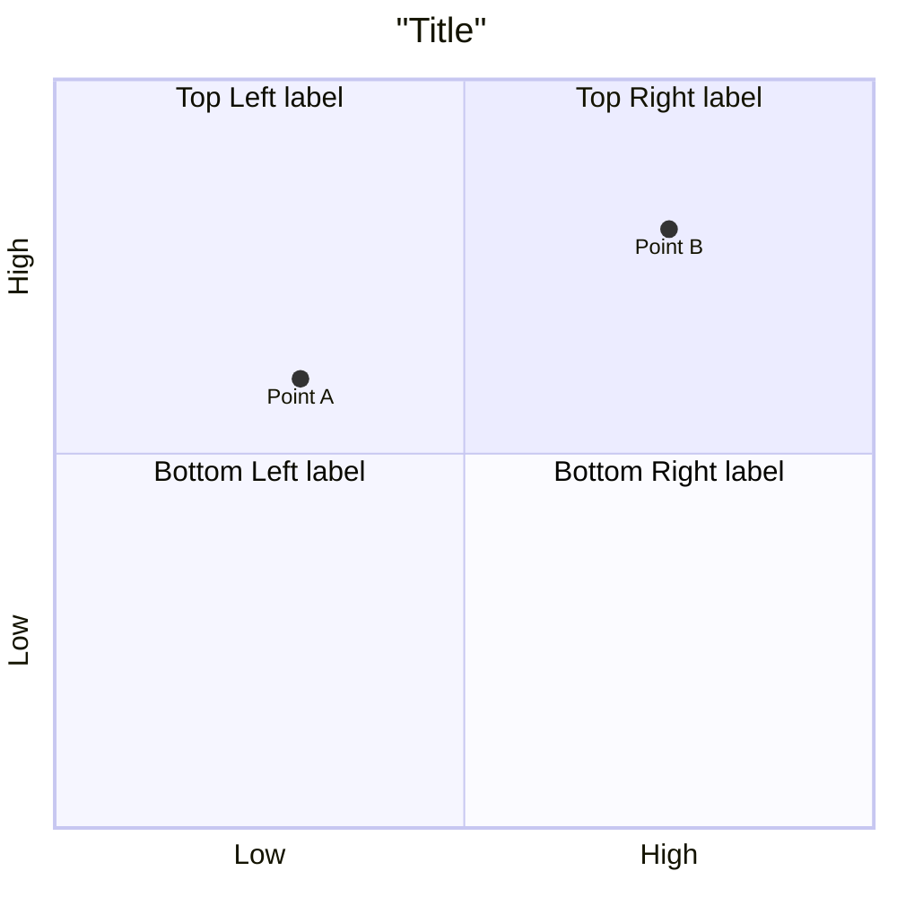

# Quadrant Charts

2x2 matrix with scatter points. Used for prioritization and pattern analysis.

## Syntax



## Details

### Axes

```
x-axis Left text --> Right text
y-axis Bottom text --> Top text
```

Either both labels or just the left/bottom label.

### Quadrant labels

| Keyword | Position |
| --- | --- |
| `quadrant-1` | Top-right |
| `quadrant-2` | Top-left |
| `quadrant-3` | Bottom-left |
| `quadrant-4` | Bottom-right |

### Points

```
Point Name: [x, y]
```

- x and y values range from 0 to 1
- `[0, 0]` = bottom-left corner
- `[1, 1]` = top-right corner

## Configuration

| Parameter | Default | Description |
| --- | --- | --- |
| `chartWidth` | 500 | Chart width |
| `chartHeight` | 500 | Chart height |
| `titleFontSize` | 20 | Title font size |
| `quadrantLabelFontSize` | 16 | Quadrant text font size |
| `xAxisLabelFontSize` | 16 | X-axis label font size |

## Theme variables

Override via `themeVariables`:

| Variable                              | Description                  |
|---------------------------------------|------------------------------|
| `quadrant1Fill`–`quadrant4Fill`       | Fill color per quadrant      |
| `quadrant1TextFill`–`quadrant4TextFill` | Text color per quadrant    |
| `quadrantPointFill`                   | Points fill color            |
| `quadrantPointTextFill`               | Points text color            |
| `quadrantXAxisTextFill`               | X-axis text color            |
| `quadrantYAxisTextFill`               | Y-axis text color            |
| `quadrantInternalBorderStrokeFill`    | Inner border color           |
| `quadrantExternalBorderStrokeFill`    | Outer border color           |
| `quadrantTitleFill`                   | Title color                  |

```yaml
---
config:
  themeVariables:
    quadrant1Fill: "#ffcccc"
    quadrant2Fill: "#ccffcc"
    quadrantPointFill: "#333333"
---
```
