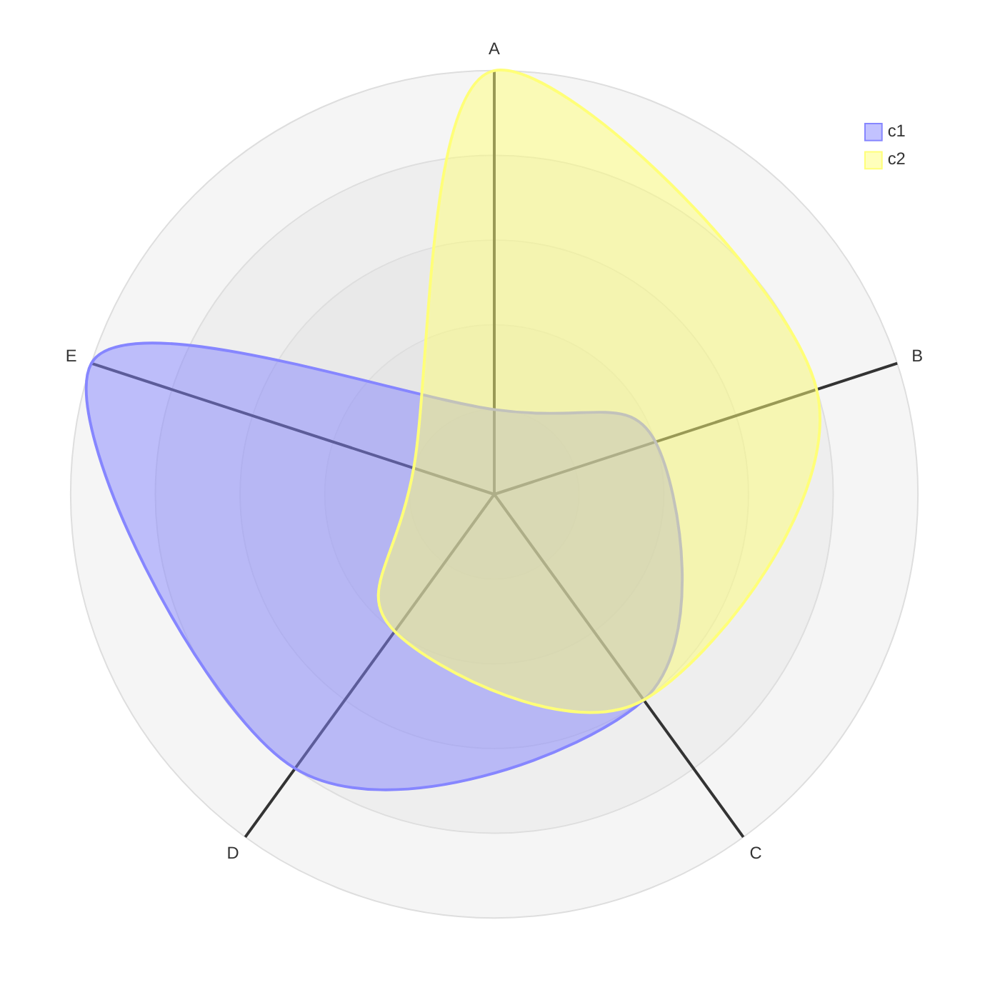
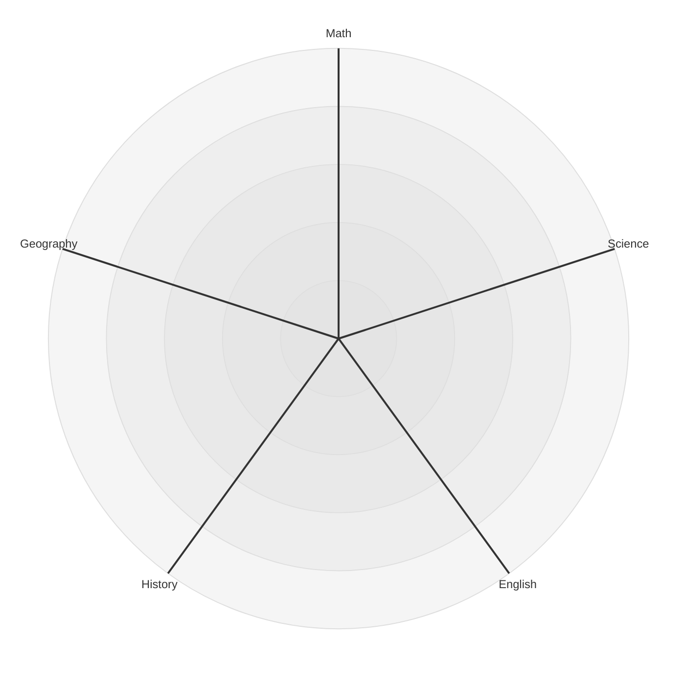
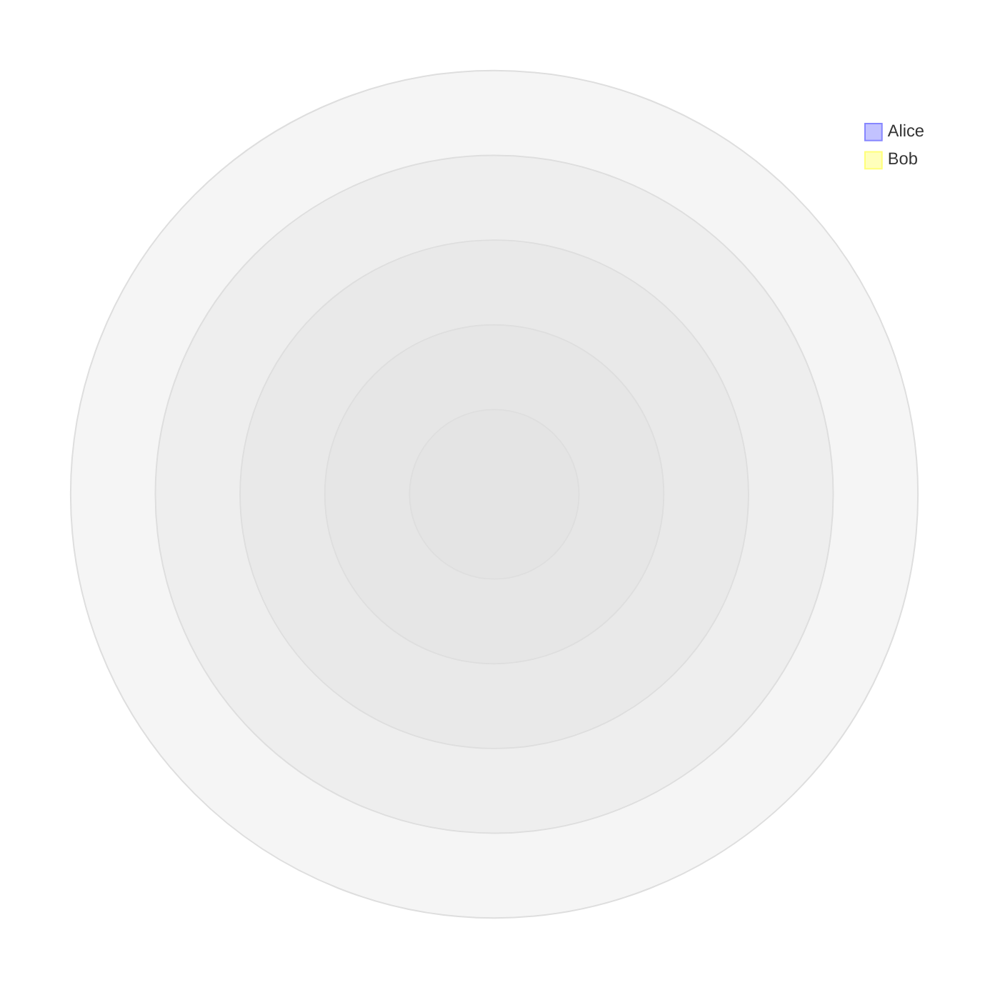
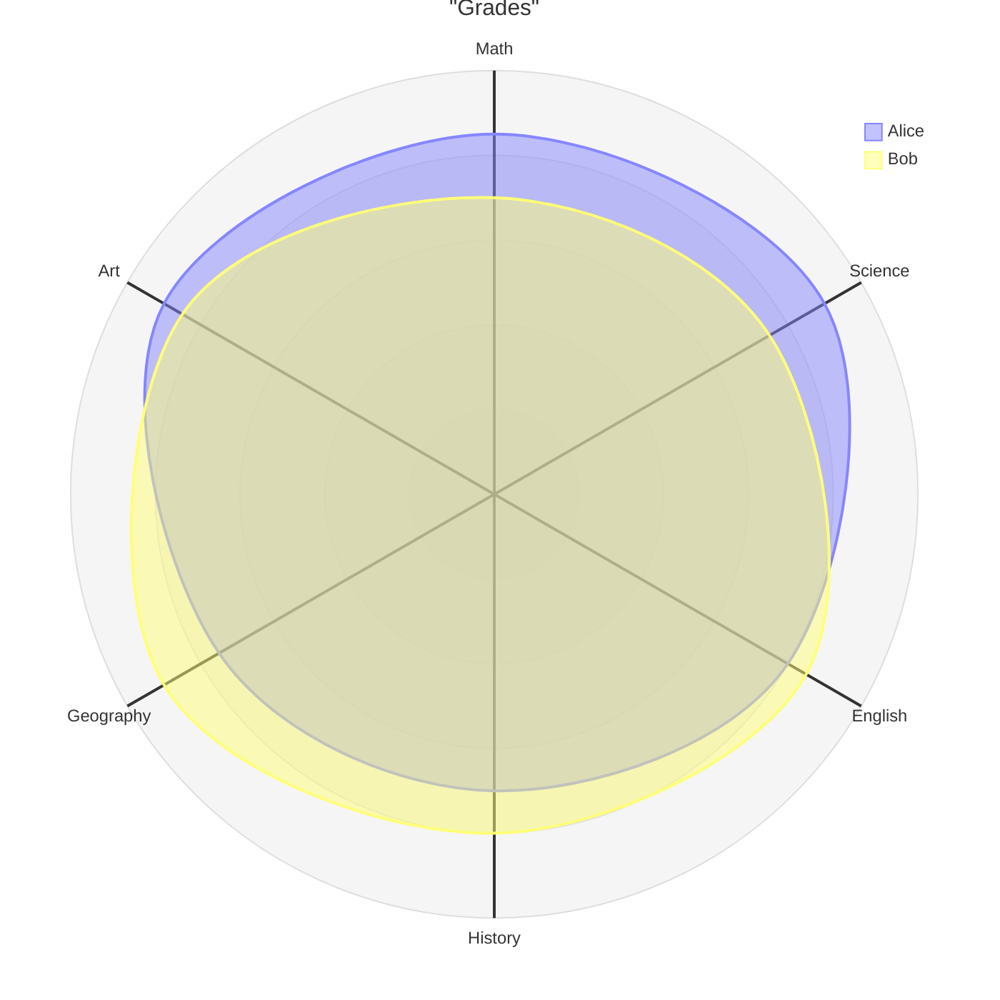
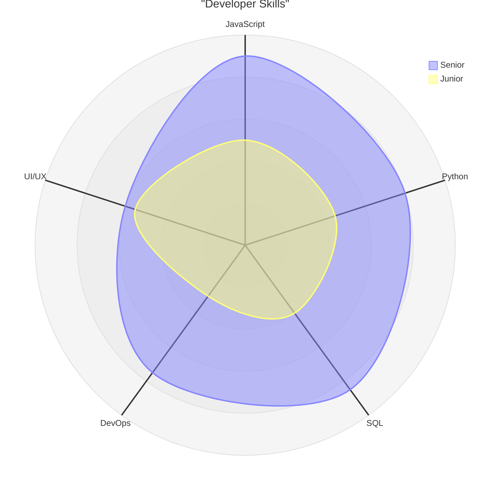
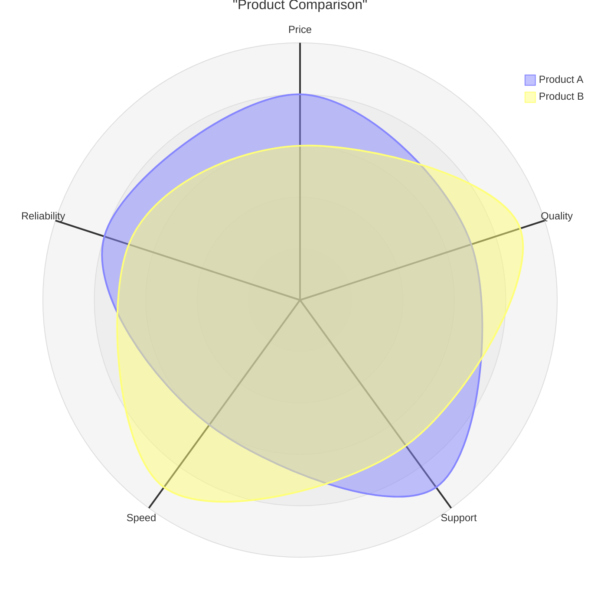

# Radar Chart Reference

## Description

Radar charts (also called spider, star, or Kiviat diagrams) plot low-dimensional data in circular format. Useful for comparing entities across multiple dimensions — performance metrics, skill profiles, product comparisons.

> **Note:** Uses `radar-beta` keyword — experimental, syntax may evolve.

## Basic Syntax

## Axes

Define one or more axis lines:

- Bare identifiers: `axis A, B, C`
- Labeled: `axis a["Label 1"], b["Label 2"]`

## Curves

Define data curves with values matching the axis order:

### Labeled Curves

## Min / Max

Set the scale range:

## Examples

### Student Grades

### Skill Comparison

### Product Features

