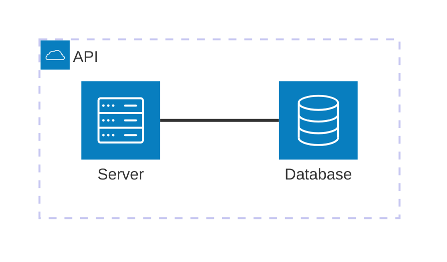

# Architecture Diagrams (v11.1.0+)

Cloud-style diagrams showing relationships between services and resources in deployments.

## Syntax



## Components

### Groups

```
group {id}({icon})[{label}] (in {parent_id})?
```

- `id`: Unique identifier
- `icon()`: Icon name (see icon list below)
- `[label]`: Display text
- `in {parent}`: Optional nesting

### Services

```
service {id}({icon})[{label}] (in {group_id})?
```

Same syntax as groups. Services are leaf nodes.

### Edges

```
{id}:{T|B|L|R} -- {T|B|L|R}:{id}
{id}:R --> L:{id2}      %% Arrow into right side
{id}:T <--> B:{id2}     %% Bidirectional
```

Direction: `T` (top), `B` (bottom), `L` (left), `R` (right). Arrows (`<`, `>`) attach to either side.

#### Edges from groups

Use `{group}` modifier on a service to route the edge from its parent group boundary:

```
server{group}:B --> T:subnet{group}
```

Edges go out of `groupOne` adjacent to `server` and into `groupTwo` adjacent to `subnet`. Group ids cannot be used directly — only services within groups with the `{group}` modifier.

### Aligning siblings

Prevent overlapping when multiple services share the same edge target:

```
align row {idA} {idB} {idC}     %% Same y-axis (horizontal row)
align column {idA} {idB}        %% Same x-axis (vertical stack)
```

Use `column` when members connect via same horizontal ports (`R --> L:target`). Use `row` when connecting via same vertical ports (`B --> T:target`). Order in directive determines layout order.

### Junctions

```
junction j1
db:R -- L:j1
j1:R -- L:server
```

Junctions are connection points for multiple edges.

## Icons

Common icons: `cloud`, `database`, `disk`, `server`, `lock`, `user`, `gear`, `code`, `monitor`, `network`, `storage`, `firewall`, `loadbalancer`, `queue`, `lambda`, `container`, `kubernetes`, `docker`, `git`, `ci-cd`, `api`, `web`, `mobile`, `email`, `chat`, `search`, `analytics`, `ml`, `cache`, `cdn`, `dns`.

## Configuration (v11.14.0+)

| Option      | Type    | Default  | Description                                        |
|-------------|---------|----------|----------------------------------------------------|
| `randomize` | boolean | `false`  | Randomize initial node positions before layout     |
| `seed`      | number  | —        | Lock layout deterministically (overrides randomize) |

By default nodes start at deterministic seed positions (`randomize: false`). Setting `randomize: true` may produce better-spaced layouts on complex diagrams. Use `seed` to lock the layout fully for reproducible renders.

```yaml
---
config:
  architecture:
    randomize: true
    seed: 42
---
```

> `randomize: false` alone is not enough to guarantee identical renders — the underlying fcose layout still calls `Math.random()`. Use `seed` for full determinism.
