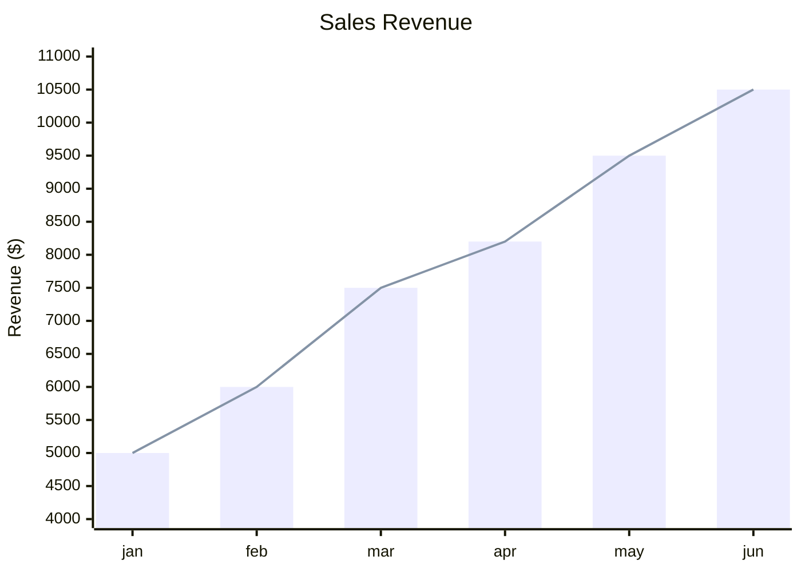
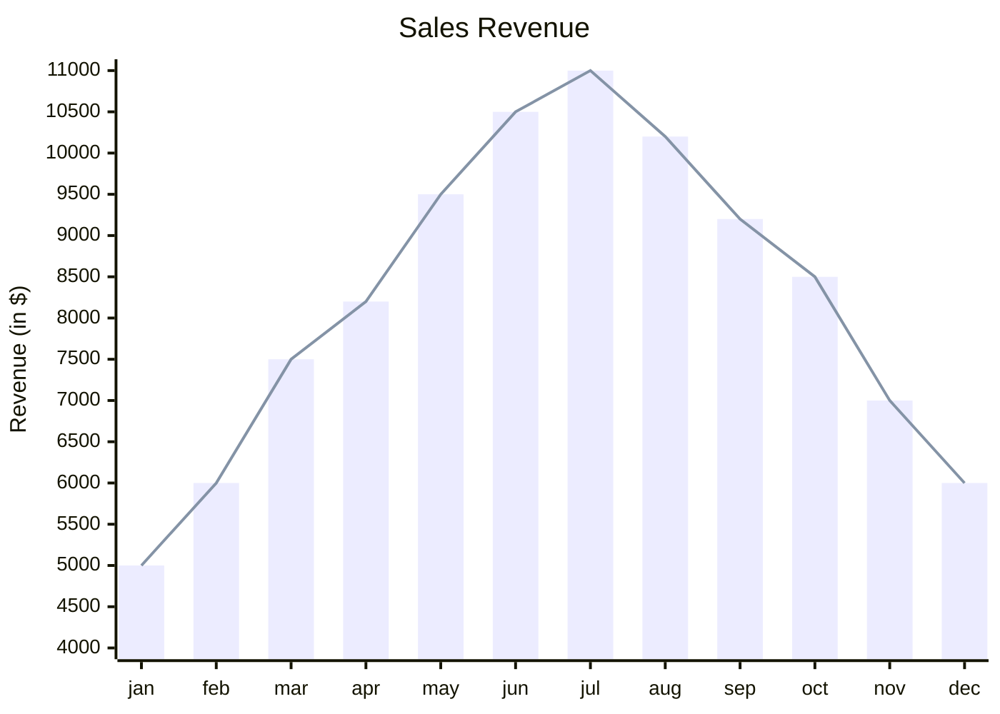
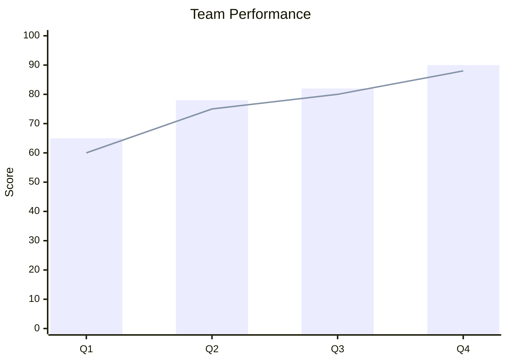

# XY Chart Reference

## Description

XY charts display data using x-axis and y-axis. Currently supports **bar charts** and **line charts**. Useful for time series, comparisons, and trend visualization.

## Basic Syntax



## Orientation

```mermaid
xychart              %% Vertical (default)
xychart horizontal   %% Horizontal
```

## Title

```
title "Chart Title"
```

Single-word titles don't need quotes. Multi-word titles require `"`.

## Axes

### X-Axis

```
x-axis [label1, label2, label3, ...]
```

- Labels are text values; single words can omit quotes, multi-word requires `"..."`

### Y-Axis

```
y-axis "Label" min --> max
y-axis "Label" min
```

- Optional range with `-->`
- Label in quotes if multi-word

## Data Series

| Type | Syntax | Description |
|------|--------|-------------|
| Bar | `bar [v1, v2, ...]` | Bar chart data |
| Line | `line [v1, v2, ...]` | Line chart data |

Multiple series of the same type are supported:

```mermaid
xychart
    title "Monthly Comparison"
    x-axis [jan, feb, mar, apr]
    y-axis 0 --> 100
    bar [20, 40, 60, 80]
    bar [10, 30, 50, 70]
```



## Configuration

| Parameter | Description | Default |
|-----------|-------------|---------|
| `chartOrientation` | `vertical` or `horizontal` | `vertical` |
| `plotBorderWidth` | Border width on plots | `1` |
| `axisLabelPadding` | Padding for axis labels | `10` |
| `titlePadding` | Padding for title | `20` |
| `width` | Chart width | `600` |
| `height` | Chart height | `400` |
| `yMax` | Maximum y value (auto if omitted) | auto |
| `yMin` | Minimum y value | `0` |
| `xMax` | Maximum x position | auto |

## Examples

### Revenue Trend



### Multiple Series



### Horizontal Chart

```mermaid
xychart horizontal
    title "Product Ratings"
    x-axis 1 --> 10
    y-axis [Product A, Product B, Product C, Product D]
    bar [7, 8.5, 6, 9]
```
