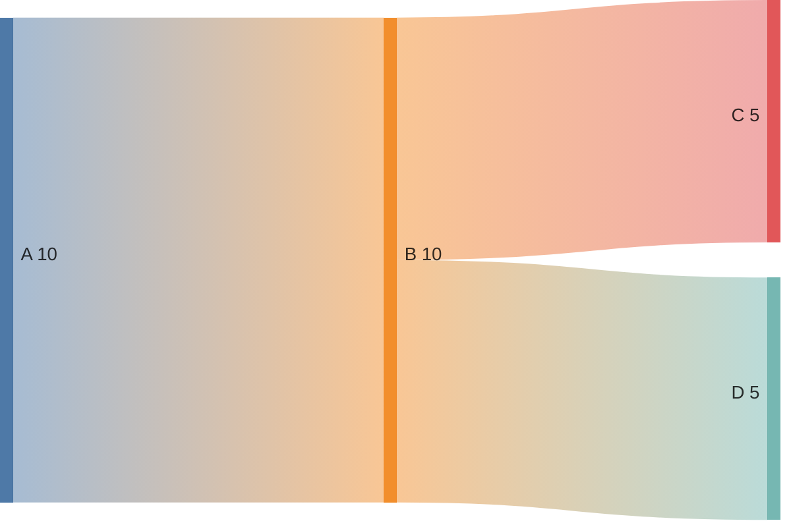
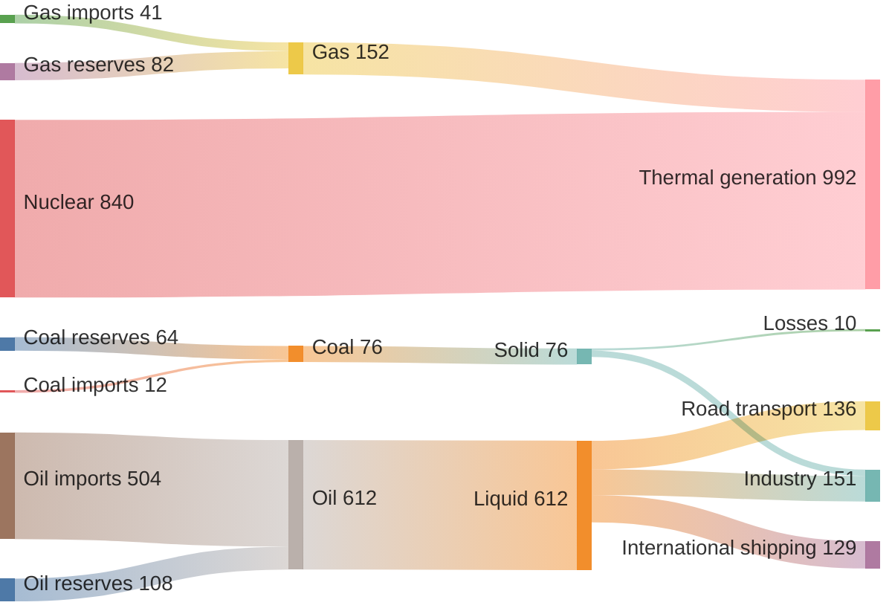
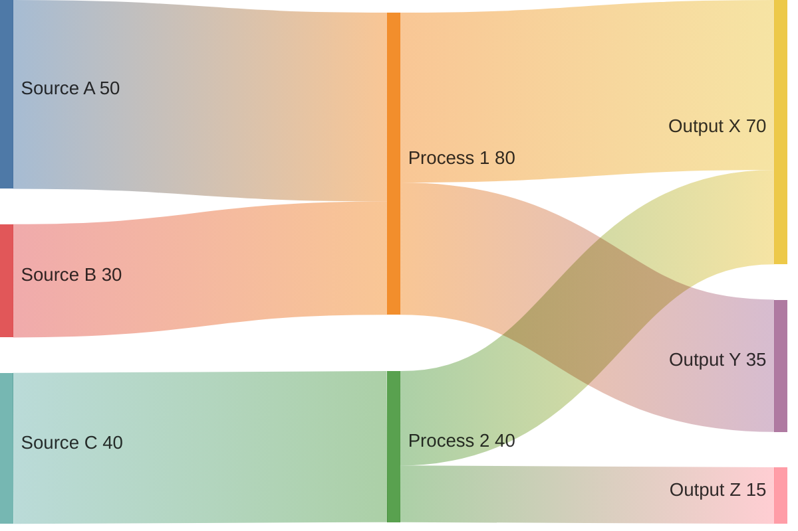

# Sankey Diagram Reference

## Description

Sankey diagrams visualize flows from one set of values to another. Nodes represent entities; links (with thickness proportional to value) show the flow between them. Syntax is close to CSV.

> **Note:** Experimental diagram — syntax may evolve in future releases.

## Basic Syntax



Each line: `source_node, target_node, value`

## Node Labels with Spaces

Use quotes for labels containing spaces:

```mermaid
sankey
    "Agricultural waste", Bio-conversion, 124.7
    Bio-conversion, Liquid, 0.6
    Bio-conversion, Losses, 26.9
```

## Styling Links

```mermaid
sankey
    A, B, 10
    A, C, 5
    style 0 stroke:#ff0000
    style 1 stroke:#00ff00
```

Link indices are zero-based in the order they appear.

## Configuration

| Parameter | Description | Default |
|-----------|-------------|---------|
| `nodeAlignment` | Alignment: `left`, `right`, `justify`, `center` | `justify` |
| `nodeWidth` | Width of nodes | `15` |
| `nodePadding` | Padding between nodes | `10` |
| `linkColor` | Color mode: `source`, `target`, `gradient`, `horizontal-gradient`, `constant` | `gradient` |
| `showValues` | Show flow values on links | `true` |

## Examples

### Energy Flow



### Simple Flow



### With Custom Config

```mermaid
---
config:
  sankey:
    showValues: false
    nodeAlignment: center
---
sankey
    "Raw Materials", Manufacturing, 100
    Manufacturing, "Quality Check", 85
    "Quality Check", Packaging, 75
    "Quality Check", Rework, 10
    Rework, "Quality Check", 8
    Packaging, Distribution, 73
    Distribution, Customers, 70
```
