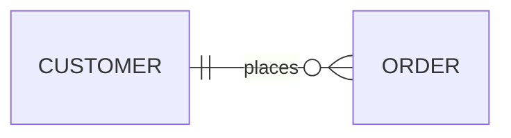

# Entity Relationship Diagrams

ER diagrams using crow's foot notation for database modeling.

## Relationships (crow's foot)

```
CUSTOMER ||--o{ ORDER : places
ORDER ||--|{ LINE-ITEM : contains
CUSTOMER }|..|{ DELIVERY-ADDRESS : uses
```

### Cardinality markers

| Marker | Meaning |
| --- | --- |
| `||` | Exactly one |
| `}|` | Zero or one |
| `}{` | Zero or many |
| `\|{` | One or many |
| `|O` | Zero or one (alt) |
| `o|` | Zero or one (alt) |
| `o{` | Zero or many (alt) |
| `{` | Many |

Line styles: `--` (solid), `..` (dashed).

## Entities with attributes

```
CUSTOMER {
    string name
    string custNumber
    int sector
}
ORDER {
    int orderNumber
    string deliveryAddress
}
```

Attributes are defined inside `{}` blocks. Type precedes name.

## Relationship aliases

Cardinality markers support text aliases:

| Alias | Maps to |
| --- | --- |
| `one or zero`, `zero or one` | Zero or one (`|o` / `o|`) |
| `only one`, `1` | Exactly one (`||`) |
| `one or more`, `one or many`, `many(1)`, `1+` | One or more (`}|` / `|{`) |
| `zero or more`, `zero or many`, `many(0)`, `0+` | Zero or more (`}o` / `o{`) |

Identification: `--` (solid/identifying), `..` (dashed/non-identifying). Aliases: `to` (identifying), `optionally to` (non-identifying).

```
CAR 1 to zero or more NAMED-DRIVER : allows
PERSON many(0) optionally to 0+ NAMED-DRIVER : is
```

## Optional attribute types

Append `?` to a type for nullable/optional attributes:

```
PERSON {
    string firstName
    string? middleName
    string lastName
}
```

## Entity name aliases

Use square brackets to show an alias label instead of the entity id:

```
p[Person] {
    string firstName
}
a["Customer Account"] {
    string email
}
p ||--o| a : has
```

## Attribute keys and comments

Append `PK`, `FK`, or `UK` to mark primary, foreign, or unique keys. Multiple keys separated by commas (`PK, FK`). Add quoted comments at the end.

```
PERSON {
    string driversLicense PK "The license #"
    string(99) firstName "Only 99 chars"
    string phone UK
}
NAMED-DRIVER {
    string carReg PK, FK
    string driverLicence PK, FK
}
```

## Direction



## Subgraphs

Group entities into logical sections. Supports nesting and per-subgraph direction.

```
erDiagram
    subgraph sales
        CUSTOMER ||--o{ ORDER : places
    end
    subgraph "Logistics"
        WAREHOUSE ||--|{ SHIPMENT : handles
    end
    sales ||--|| "Logistics" : triggers
```

Explicit id with title: `subgraph id1 [Title 1]`. Reference subgraphs by id in relationships.

## Styling

### Direct styling

```
style CUSTOMER fill:#f9f,stroke:#333,stroke-width:4px
style CUSTOMER,ORDER fill:#bbf,color:#fff
```

### Classes

```
classDef important fill:#f96,stroke:#333,stroke-width:4px
class CUSTOMER,ORDER important
```

Shorthand `:::` on entity declaration:

```
CAR:::important {
    string registrationNumber
}
classDef important fill:#f96
```

Default class applied to all entities without specific styling:

```
classDef default fill:#f9f,stroke:#333,stroke-width:4px
```

## Configuration

### Layout engine

```yaml
---
config:
  layout: elk    %% "dagre" (default) or "elk"
---
```

Use ELK for larger/more complex diagrams.
