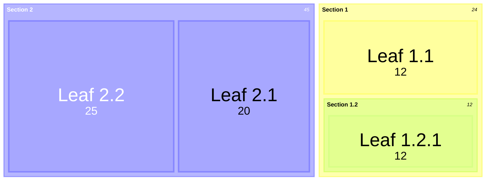
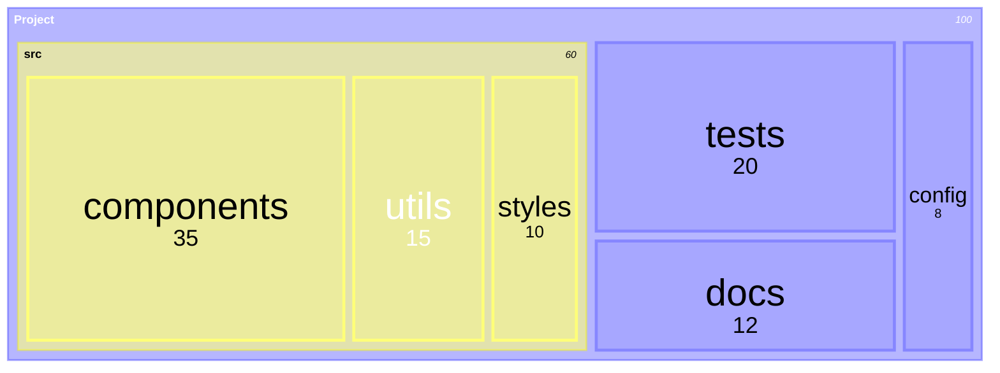
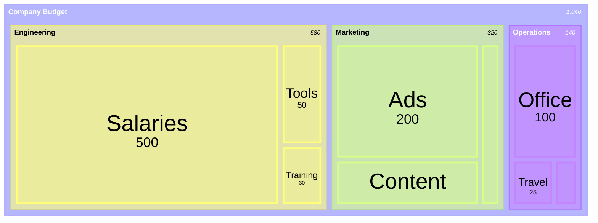

# Treemap Reference

## Description

Treemaps display hierarchical data as nested rectangles. Each branch is a rectangle tiled with smaller rectangles for sub-branches. Rectangle sizes are proportional to their values, making it easy to compare proportions within hierarchies.

> **Note:** Uses `treemap-beta` keyword — experimental, syntax may evolve.

## Basic Syntax

## Node Definition

| Type | Syntax | Description |
|------|--------|-------------|
| Section (parent) | `"Name"` | Container node, no value |
| Leaf (with value) | `"Name": value` | Terminal node with numeric value |
| Hierarchy | Indentation | Spaces or tabs define nesting level |

## Styling

Use `:::class` syntax for styling nodes:

## Configuration

| Parameter | Description | Default |
|-----------|-------------|---------|
| `padding` | Padding between rectangles | `2` |
| `reflectPadding` | Reflect padding on all sides | `false` |
| `clickValue` | Click behavior value | — |

## Examples

### File System

### Budget Breakdown

### With Styling

