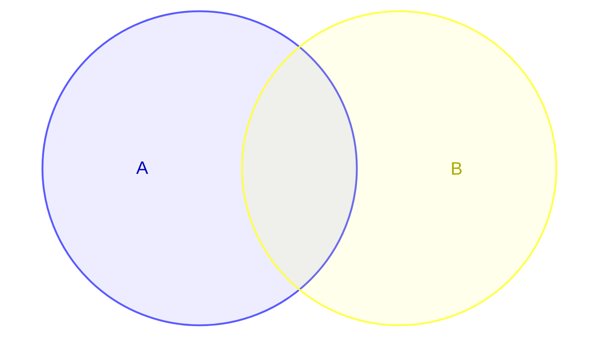
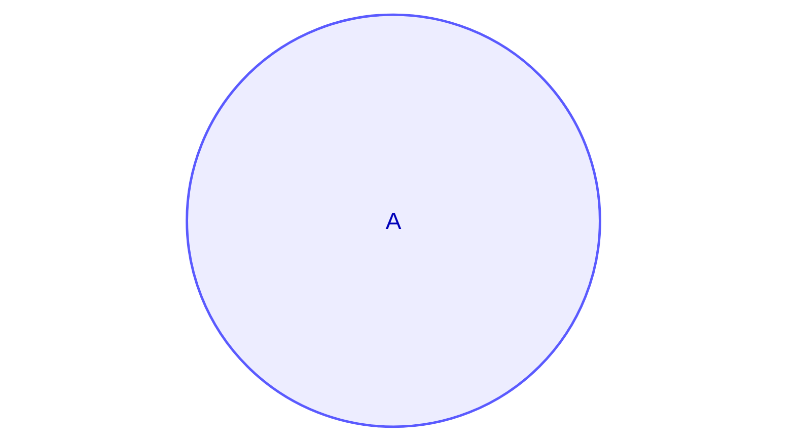
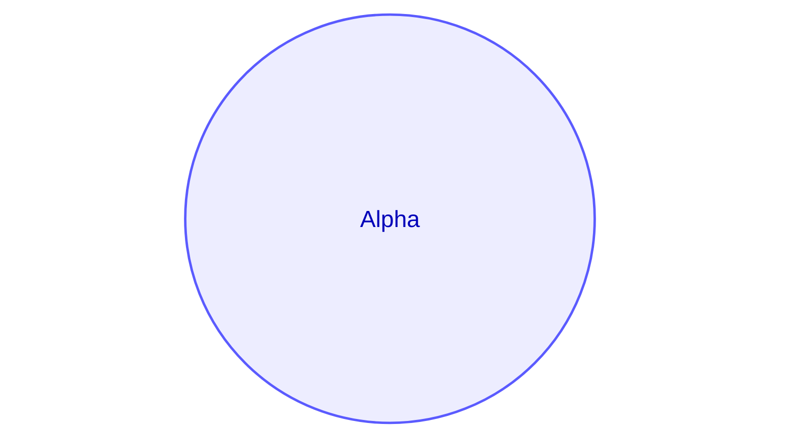
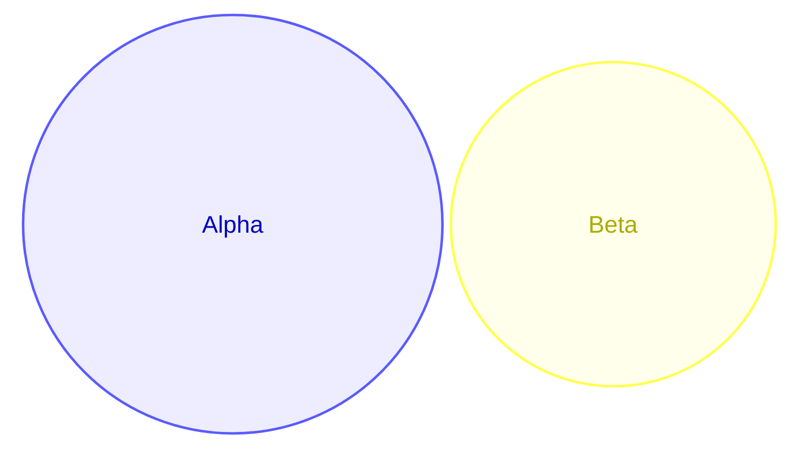
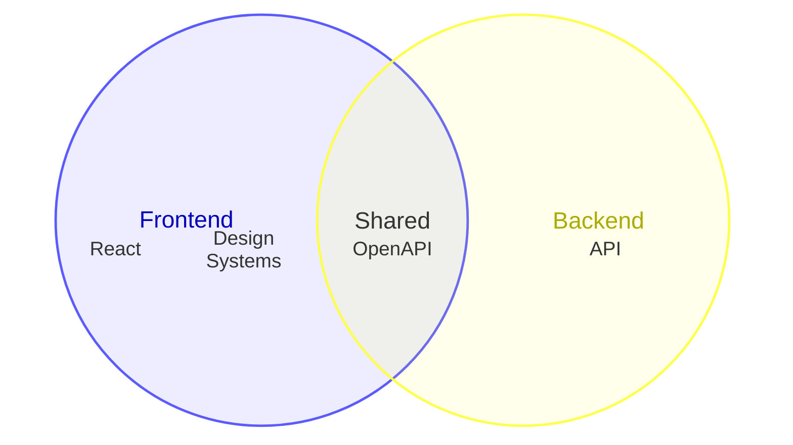
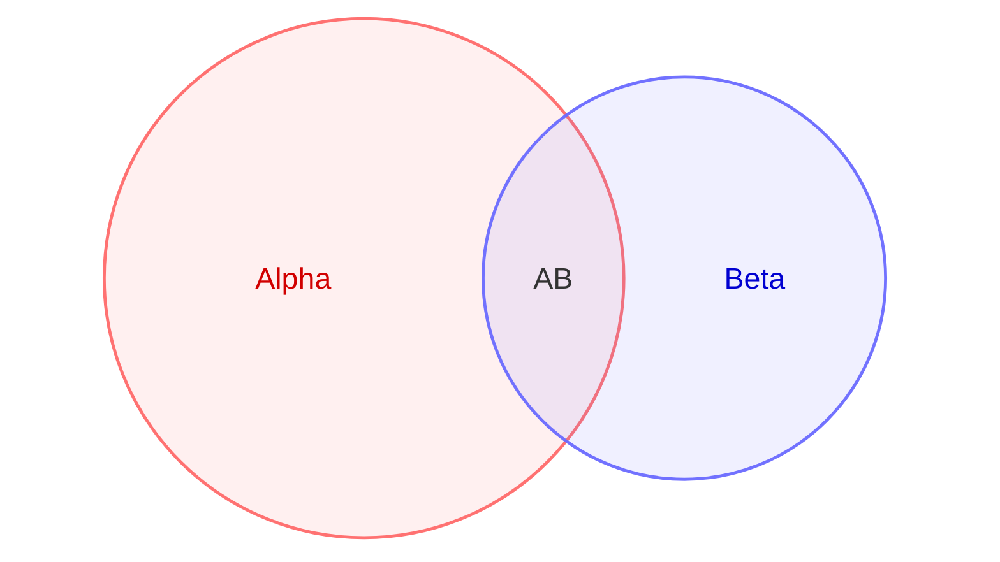
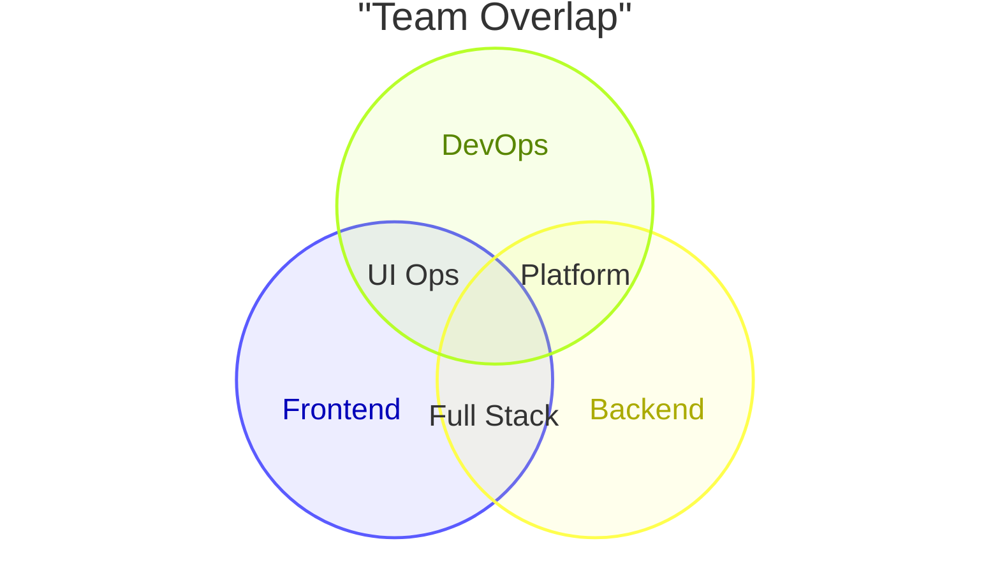
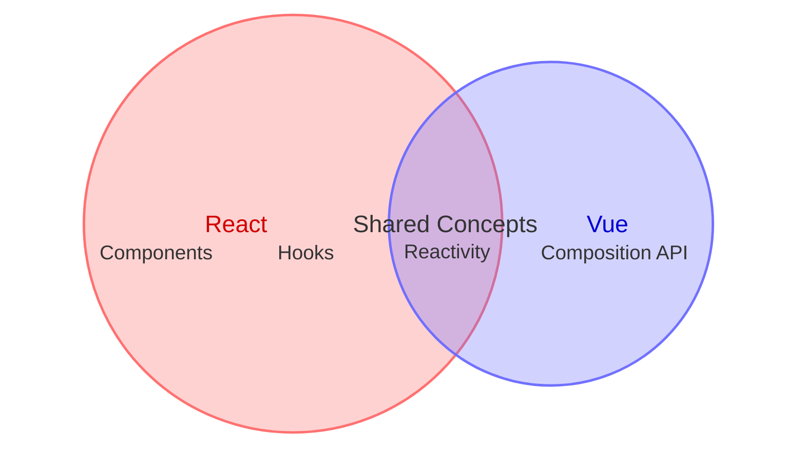
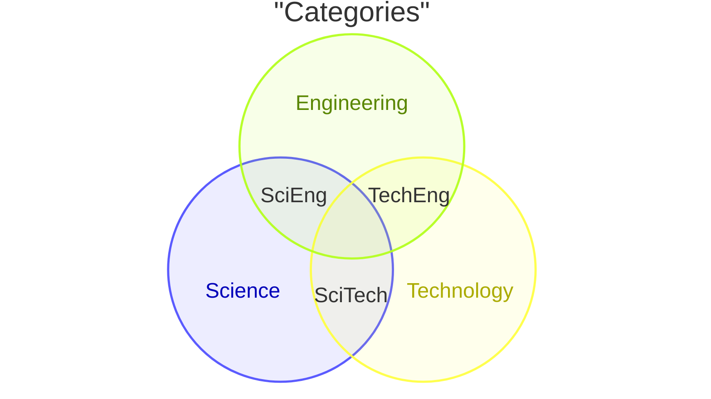

# Venn Diagram Reference

## Description

Venn diagrams show relationships between sets using overlapping circles. Sets, unions, and text nodes can be styled individually.

> **Note:** Uses `venn-beta` keyword — experimental, syntax may evolve. (v11.12.3+)

## Basic Syntax



## Sets

### Simple Set



### Set with Label



### Set with Size



## Unions

Define overlaps between sets:

```mermaid
venn-beta
    union A,B["Overlap"]
    union A,B:3          %% With size
```

- Identifiers in `union` must be defined by earlier `set` lines
- Multiple sets: `union A,B,C`

## Text Nodes

Place labels inside sets or unions using indented `text` lines:



## Styling



### Style Properties

| Property | Description |
|----------|-------------|
| `fill` | Fill color |
| `color` | Text color |
| `stroke` | Stroke color |
| `stroke-width` | Stroke width |
| `fill-opacity` | Fill opacity |

## Examples

### Team Skills



### With Sizes and Text



### Three-Set Diagram


