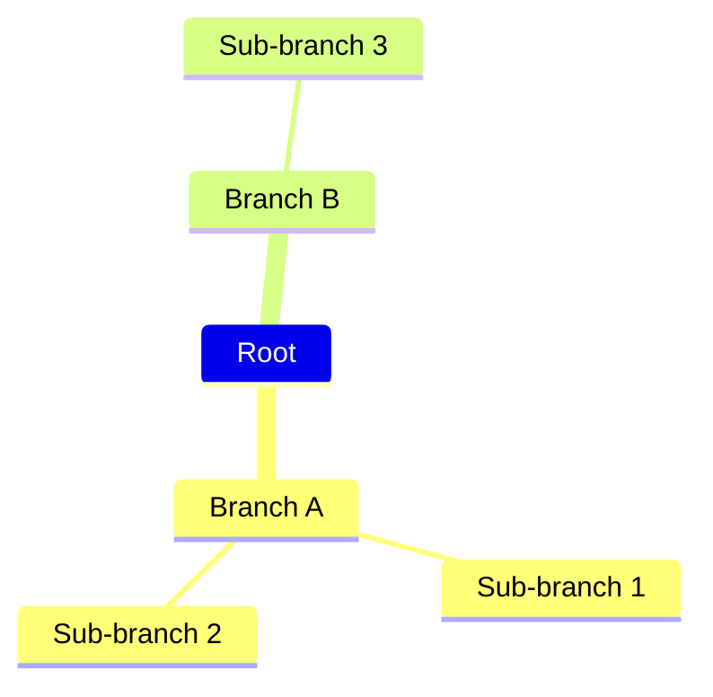
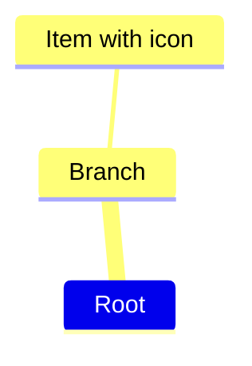
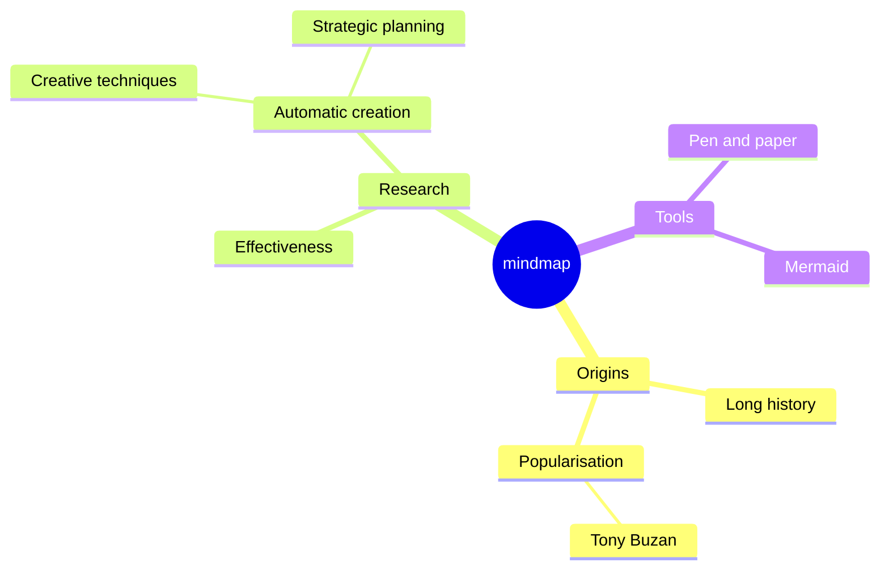
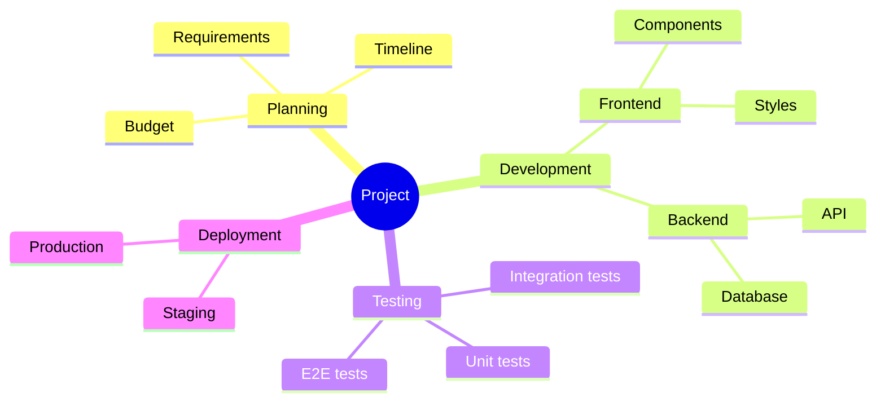
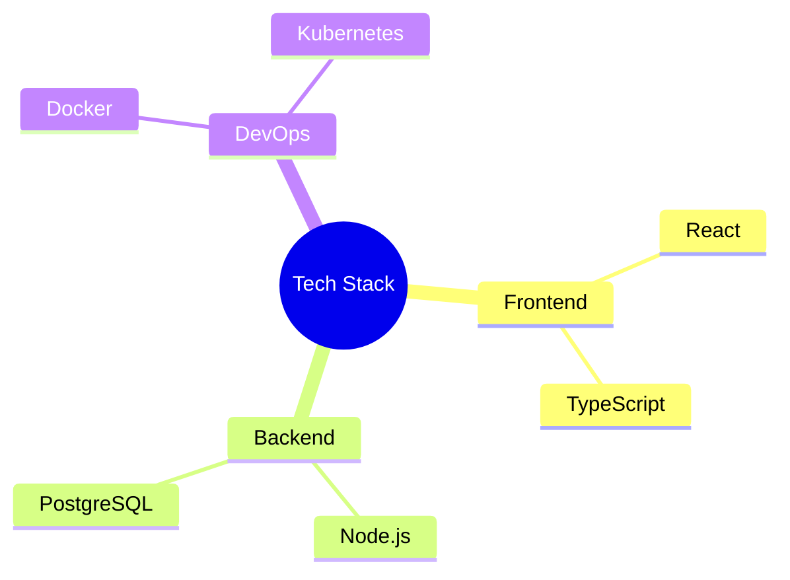

# Mindmap Reference

## Description

Mindmaps visually organize information into hierarchies. A central concept branches into major ideas, which further branch into sub-ideas. Hierarchy is defined by indentation.

> **Note:** Experimental — syntax may change in future releases. Icon integration is experimental.

## Basic Syntax



Hierarchy is determined by indentation level (spaces or tabs).

## Node Shapes

| Syntax | Shape |
|--------|-------|
| `Root` | Default |
| `Root["Text"]` | Rectangle |
| `Root("Text")` | Rounded rectangle |
| `Root(("Text"))` | Circle |
| `Root(["Text"])` | Flag/parallelogram |
| `Root{"Text"}` | Rhombus/diamond |
| `Root[[Text]]` | Parallelogram |

## Icons



Icon syntax: `::icon(icon_pack icon_name)` — uses iconify packs.

## Styling

```mermaid
mindmap
    root((Mindmap))
        Research
            On effectiveness
            On creation
    style Research fill:#f9f,stroke:#333
```

## Examples

### Basic Mindmap



### Project Planning



### With Icons


