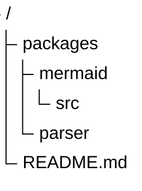

# TreeView Diagrams (v11.14.0+)

Directory-like hierarchical structure display.

## Syntax



Hierarchy is defined entirely by indentation. Quoted strings are node labels. No distinction between folders and files — structure comes from nesting.

## Configuration

```yaml
---
config:
  treeView:
    rowIndent: 80          %% Indentation per level (default: 10)
    paddingX: 5            %% Horizontal padding (default: 5)
    paddingY: 5            %% Vertical padding (default: 5)
    lineThickness: 3       %% Line thickness (default: 1)
  themeVariables:
    treeView:
      labelFontSize: '20px'
      labelColor: '#FF0000'
      lineColor: '#00FF00'
---
```

## Annotations

### Highlighting with `:::class`

Annotate nodes with `:::className` to apply a CSS class. Built-in `highlight` class is provided:

```
treeView-beta
    src/
        App.tsx :::highlight
        index.js
```

### Box-drawing input

Use Unicode box-drawing characters for explicit structure:

```
treeView-beta
    ├── packages
    │   ├── mermaid
    │   └── parser
    └── README.md
```

### Comments

Lines starting with `%%` are ignored:

```
treeView-beta
    %% Root directory
    src/
        App.tsx
```
