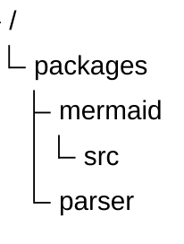
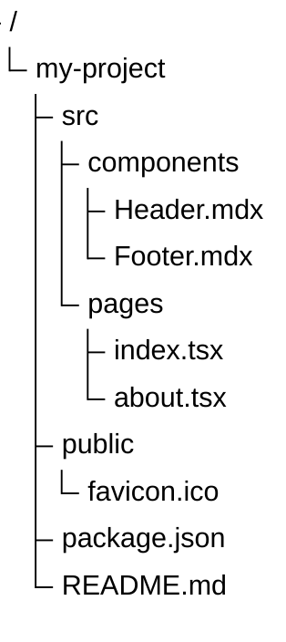
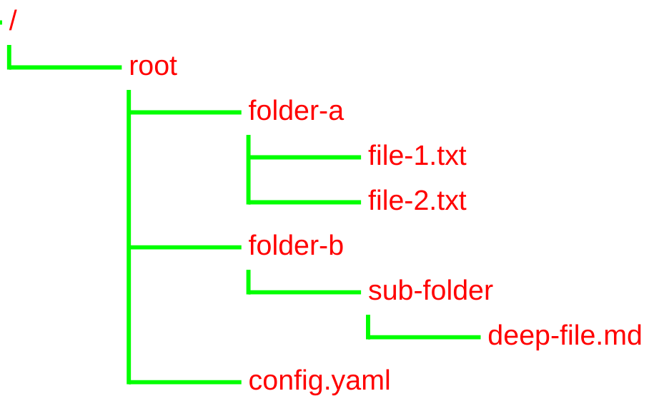

# Tree View Reference

## Description

Tree views represent hierarchical data in a directory-like structure. Structure depends only on indentation.

> **Note:** Uses `treeView-beta` keyword — experimental, syntax may evolve. (v11.14.0+)

## Basic Syntax

- Hierarchy defined by indentation (spaces or tabs)
- All items use quoted strings

## Configuration

| Parameter | Description | Default |
|-----------|-------------|---------|
| `rowIndent` | Horizontal indent per level | `40` |
| `lineThickness` | Thickness of connector lines | `1` |
| `labelFontSize` | Font size for labels | `"14px"` |
| `labelColor` | Color of labels | `#000` |
| `lineColor` | Color of connector lines | `#000` |

## Examples

### Project Structure

### With Custom Styling

