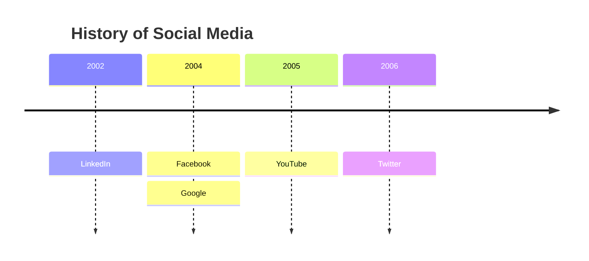
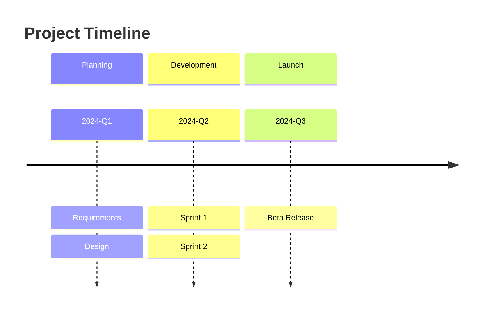
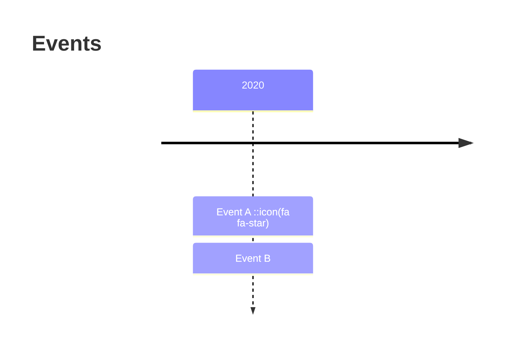
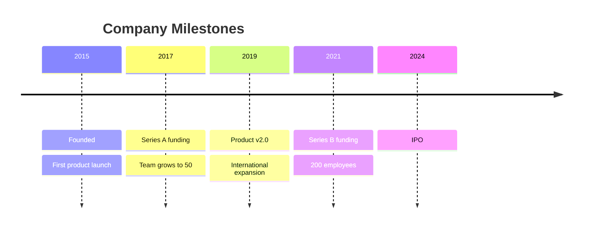
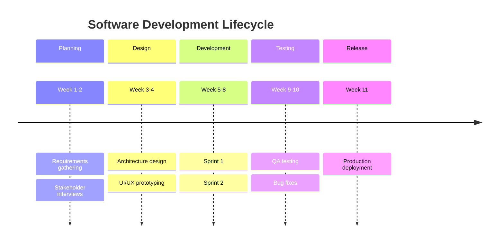

# Timeline Reference

## Description

Timelines illustrate chronologies of events, dates, or periods. Events are organized by time periods with optional sections and icons.

> **Note:** Experimental — icon integration is experimental. Syntax otherwise stable.

## Basic Syntax



## Structure

```
timeline
    title "Optional Title"
    {time_period} : {event}
                 : {another_event}    %% Same time period
    {time_period} : {event} : {event} %% Multiple events on one line
```

- Time periods and events are plain text (not limited to numbers)
- Multiple events per period: indent continuation lines or use `:` separators

## Sections



## Icons



Icon syntax: `::icon(icon_pack icon_name)` — uses iconify packs.

## Configuration

| Parameter | Description | Default |
|-----------|-------------|---------|
| `animating` | Enable animation | `false` |
| `height` | Diagram height | auto |
| `scale` | Time scale | `1` |
| `useWidth` | Use full width | `true` |

## Examples

### Company History



### With Sections


