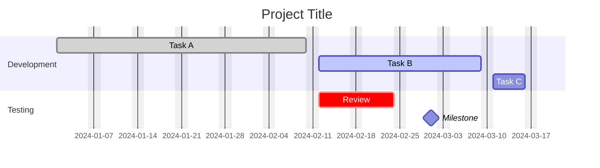

# Gantt Charts

Project schedule visualization with tasks, sections, milestones, and critical paths.

## Syntax



## Task metadata format

`Tag(s), ID, Start, Duration/End`

### Tags (optional, must come first)

| Tag | Meaning |
| --- | --- |
| `done` | Completed task |
| `active` | Currently in progress |
| `crit` | Critical path (red bar) |
| `milestone` | Single-point marker (diamond) |

### Start options

| Syntax | Meaning |
| --- | --- |
| `2024-01-01` | Explicit date (per `dateFormat`) |
| `after taskId` | After another task ends |
| `after t1 t2` | After multiple tasks end |

### Duration/End options

| Syntax | Meaning |
| --- | --- |
| `30d` | Duration (see units below) |
| `2024-02-01` | Explicit end date |
| `until taskId` | Until another task starts (v10.9.0+) |

### Duration units

| Unit | Suffix |
| --- | --- |
| Milliseconds | `ms` |
| Seconds | `s` |
| Minutes | `m` |
| Hours | `h` |
| Days | `d` |
| Weeks | `w` |
| Months | `M` |
| Years | `y` |

Decimals supported (e.g., `1.5d`).

## Excludes

```
excludes weekends
excludes 2024-07-04, 2024-12-25
excludes sunday
weekend friday        %% Fri-Sat weekend (v11.0.0+)
```

Excluded dates extend task duration to the right (no gaps within tasks).

## Vertical markers

```
vert label : vert, v1, 2024-01-15, 0d
```

Vertical lines across the chart at specific dates.

## Date formats

### Input (`dateFormat`)

Uses day.js format: `YYYY-MM-DD`, `DD/MM/YYYY`, `HH:mm`, etc.

### Output (`axisFormat`)

Uses d3-time-format: `%Y-%m-%d`, `%b %Y`, `%H:%M`, etc.

## Today marker

Style or hide the current-date marker:

```
todayMarker stroke-width:5px,stroke:#0f0,opacity:0.5
todayMarker off          %% Hide the marker
```

## Compact mode

Set `compact: true` in config to reduce spacing between rows.

## Interaction (click events)

```
gantt
    title Project with Click Events
    dateFormat  YYYY-MM-DD
    section Tasks
        Task One :done, task1, 2024-01-01, 5d
        Task Two :active, task2, after task1, 3d
    click task1 callback "Tooltip for task1"
    click task2 href "https://example.com" "Open in new tab" _blank
```

## Configuration

Under the `gantt` config key:

| Option      | Type    | Default | Description                    |
|-------------|---------|---------|--------------------------------|
| `compact`   | boolean | `false` | Compact row spacing            |
| `topAxis`   | boolean | `false` | Show axis labels on top        |
| `barHeight` | number  | `20`    | Task bar height                |
| `barGap`    | number  | `4`     | Gap between bars               |
| `fontSize`  | string  | `11px`  | Font size                      |

```yaml
---
config:
  gantt:
    compact: true
    topAxis: true
    barHeight: 25
---
```
