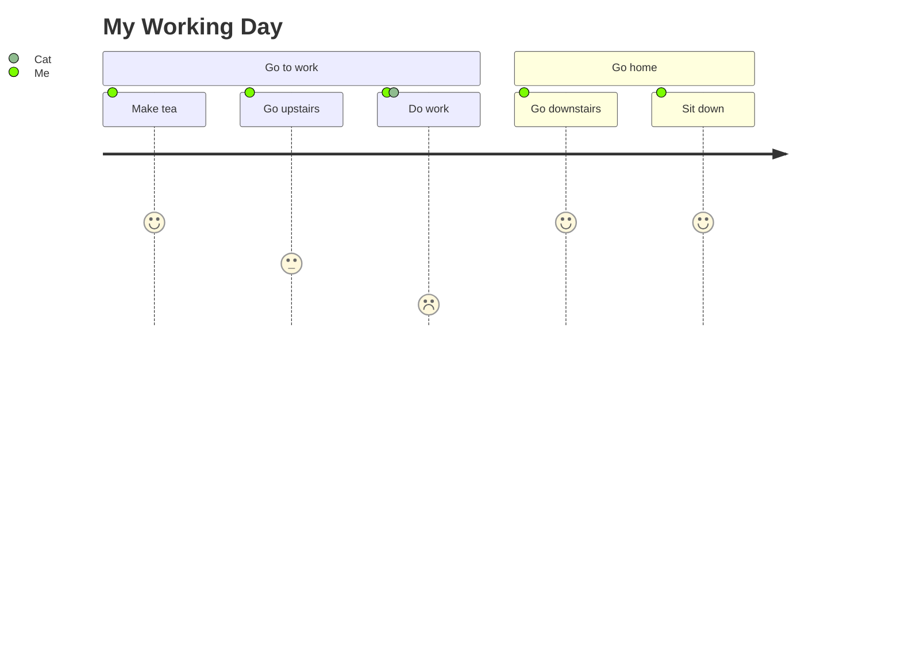
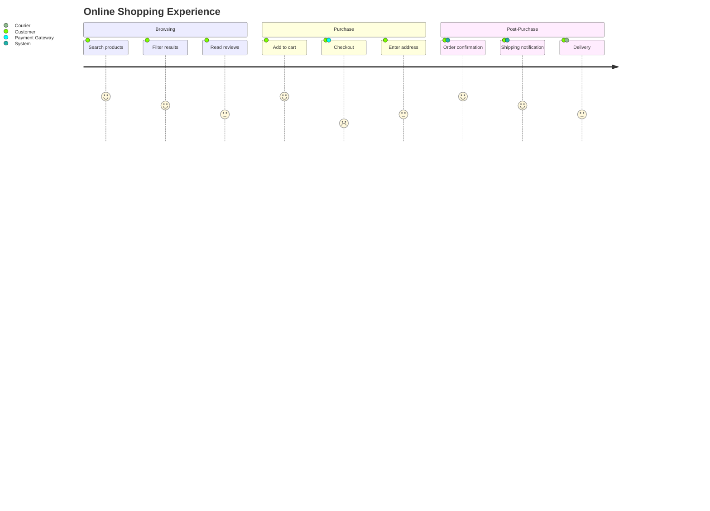
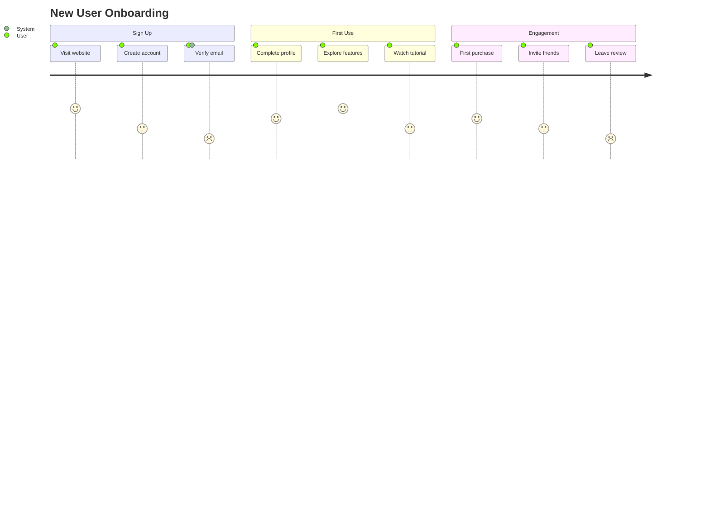

# User Journey Reference

## Description

User journey diagrams describe the steps different users take to complete a task within a system. They reveal the current workflow and areas for improvement.

## Basic Syntax



## Structure

```
journey
    title "Journey Title"
    section Section Name
        Task Name: <score>: <actor1>, <actor2>
```

### Task Syntax

```
Task name: <score>: <comma-separated actors>
```

- **Score:** Number between 1 and 5 (inclusive) — represents satisfaction/experience level
- **Actors:** Comma-separated list of participants in the task

## Examples

### Shopping Experience



### Onboarding Flow


