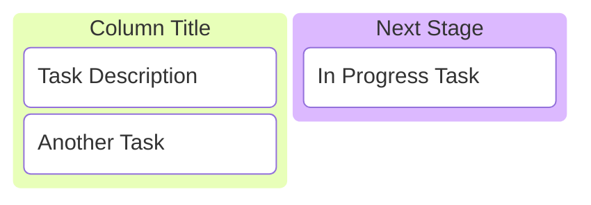
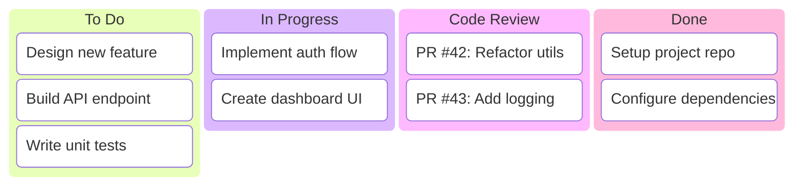

# Kanban Reference

## Description

Kanban diagrams visualize tasks moving through workflow stages. Columns represent stages (Todo, In Progress, Done); tasks are listed within columns.

## Basic Syntax



## Columns

```
columnId[Column Title]
```

- `columnId` — Unique identifier
- `[Column Title]` — Display label in brackets

## Tasks

Tasks are indented under their column:

```
taskId[Task Description]
```

### Task Metadata

Add metadata to tasks using `@{}` syntax:

```mermaid
kanban
    todo[Todo]
        task1[Write documentation] @{ priority: High }
        task2[Fix bug #42] @{ ticket: "PROJ-123", assigned: Alice }
    doing[In Progress]
        task3[Review PR] @{ priority: Medium }
    done[Done]
        task4[Setup CI/CD] @{ priority: Low }
```

## Examples

### Sprint Board



### With Metadata

```mermaid
kanban
    backlog[Backlog]
        task1[User authentication] @{ priority: High, ticket: "AUTH-001" }
        task2[Email notifications] @{ priority: Medium }
        task3[Analytics dashboard] @{ priority: Low }
    active[Active]
        task4[API rate limiting] @{ priority: High, assigned: Bob }
        task5[Database migration] @{ ticket: "DB-005" }
    complete[Complete]
        task6[Project setup] @{ priority: High }
```
