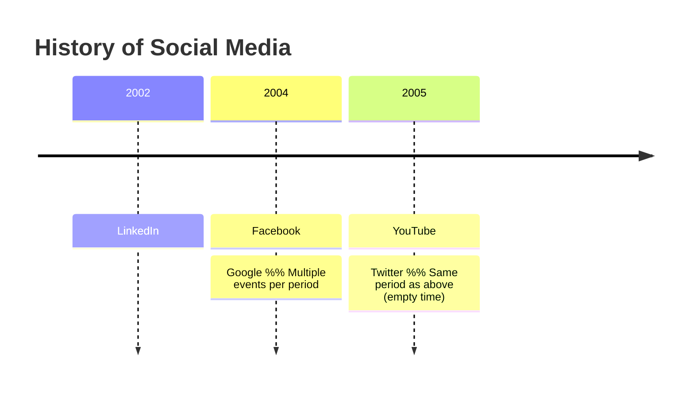
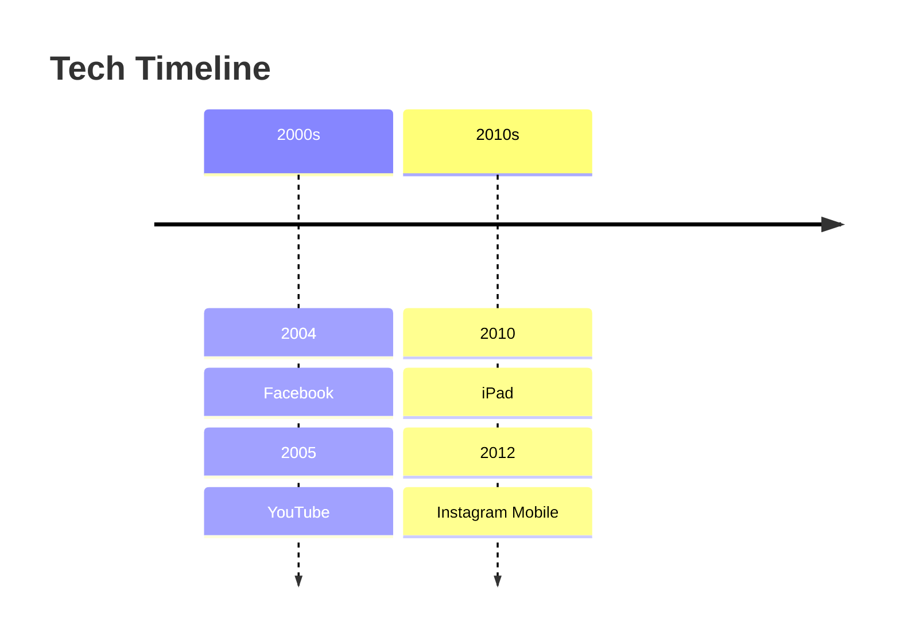
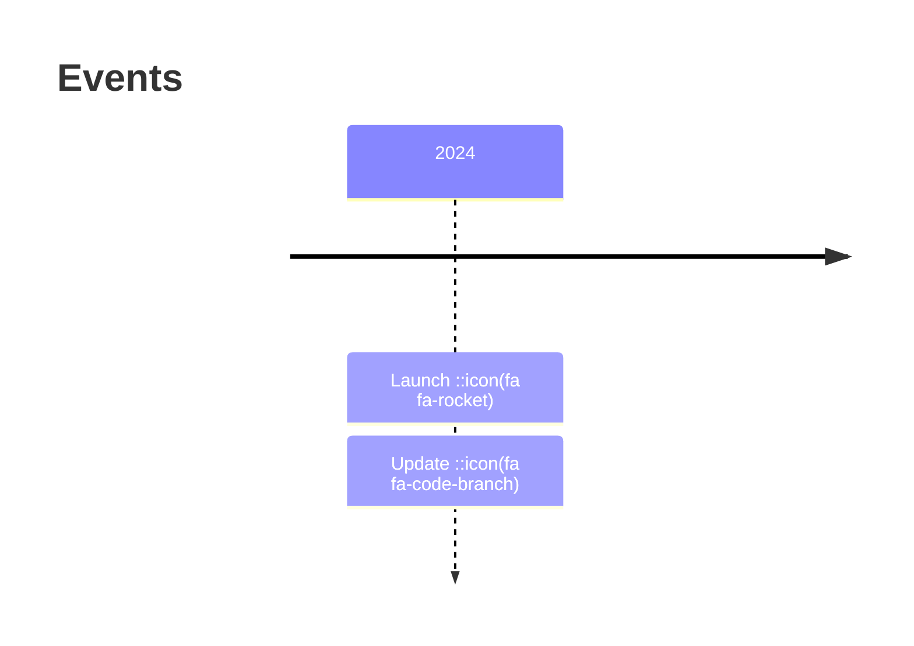

# Timeline Diagrams

Chronological event visualization with grouping and icons.

## Syntax



## Structure

- `timeline` keyword starts the diagram
- `title "Text"` sets the title (optional)
- Each line: `{time period} : {event}` or multiple events separated by `:`
- Empty time field (`: Event`) continues previous time period
- Supports icons via `::icon(fa fa-name)`

## Grouping



Indented blocks create visual groupings.

## Icons



## Text wrapping

Long text wraps automatically. Force breaks with `<br>`:

```
timeline
    2024 : Launch of the product<br>and subsequent updates
```

## Styling

Each section gets its own color scheme. Without sections, each time period (and its events) uses an individual color by default.

## Themes

Use standard Mermaid themes: `default`, `base`, `dark`, `forest`, `neutral`.
